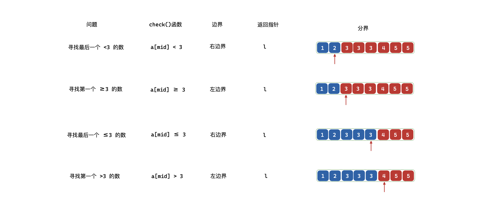
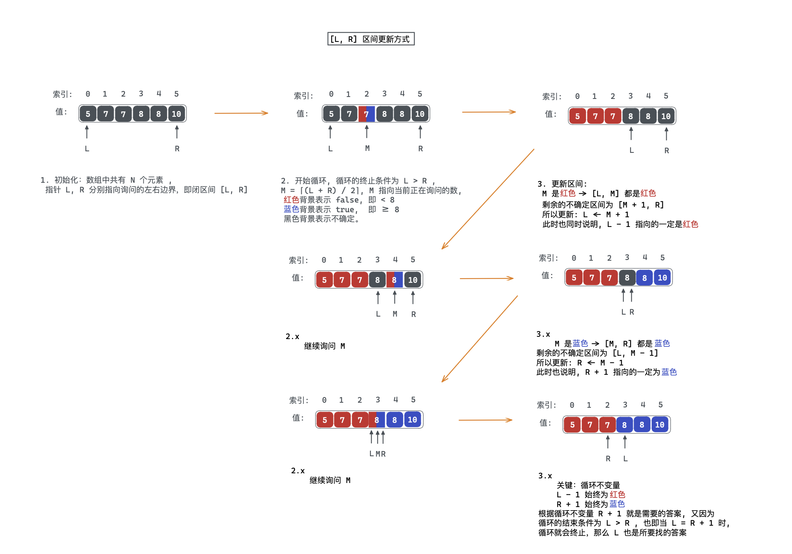
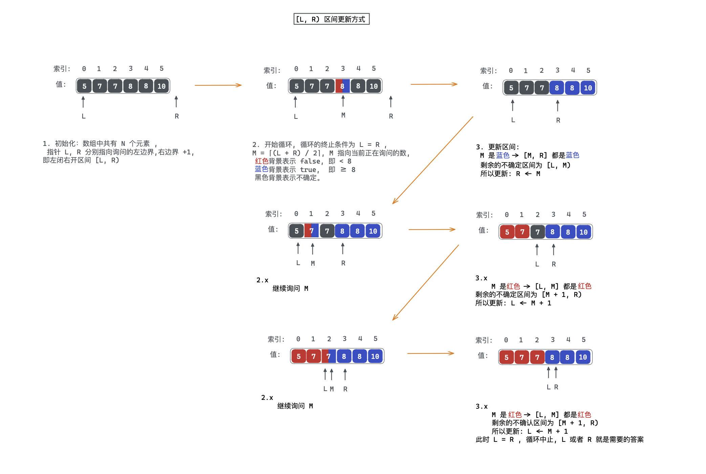
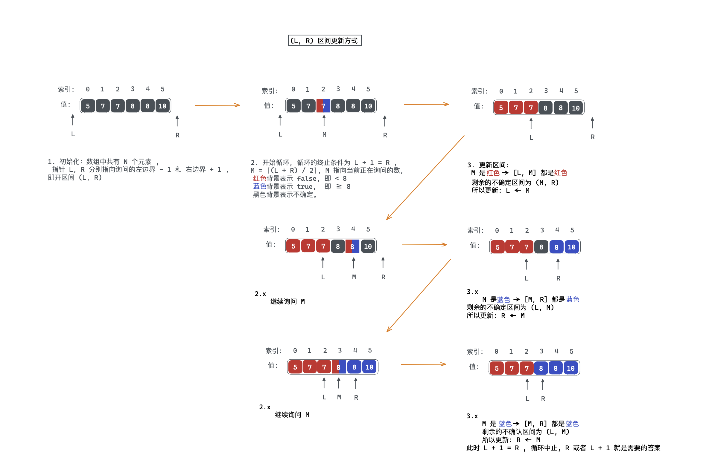

「二分」

<!-- more -->

「二分」常被用于在单调序列中查找需要的值。然而查找某个值只是二分的一个应用而已，并不是全部，「二分」通常有两大类：

1. 整数二分：用于寻找满足某个性质和不满足某个性质的**两个区间的边界**。
2. 浮点数二分：用于精度问题。

## 整数二分

二分使用的前提是问题具有「二段性」，也即可以根据某个特性将问题区间进行划分；对于具有「单调性」的问题，可以使用二分来解决。下面是一个经典问题：在一个单调序列中寻找满足对应条件下值：

1. 寻找最后一个 $<3$ 的数；
2. 寻找第一个 $\ge3$  的数；
3. 寻找最后一个 $\le3$ 的数；
4. 寻找第一个 $>3$ 的数。


在上面问题中，因为其序列是单调的，所以可以使用二分来做，例如在寻找最后一个 $\le 3$ 的数的过程中，当直接将区间划分为两段时，只需要判断 $mid$ 是否符合要求，而不必对 $[0, mid-1]$ 或者 $[mid, n]$ 的所有数都进行判断，下图为寻找最后一个 $\le 3$ 时二分最终划分出的两段区域：

- 蓝色区间满足的 $\le 3$ 的性质；
- 红色的区间不满足 $\le 3$ 的性质。


:::warning

当一个问题具有「单调性」的时候，可以使用二分来做，但是使用二分的前提**并不是**问题必须具有「单调性」，而是问题必须具有「二段性」。例如: [162. 寻找峰值](https://leetcode.cn/problems/find-peak-element/) 其序列并不具有单调性，但是也可以使用二分来做。

:::

「整数二分」的最终目的是查找**边界**，当问题有解时，整数二分总可以将整个区间划分为两段，此时边界是一个不存在于区间的值，如下图所示：


既然两段区间中真正的边界无法被表示，那么可以选择使用两段区间的边界来表示所谓的「边界」，如下图：

- $i$ 指针指向的是 $\le 3$ 区间上的「右边界」；
- $j$ 指针指向的是 $>3$ 区间上的「左边界」。


分析完上面问题后，得出「整数二分」的核心问题，寻找「左/右边界」；

### 1.分段实现

设有单调序列 $a$ ，要**确保最终答案的区间落在  $[l, r]$ 内**，**循环的终止条件以 $l=r$ 结束**，每次二分的中间值 $mid$ 会归属于左半段与右半段二者之一。

1. 将区间 $[l, r]$ 划分为 $[l, mid]$ 和 $[mid + 1, r]$ ，即寻找某个区间的「**左边界**」

:::code-tabs

@tab c++

```cpp
int left_bound(int l, int r) {
  while (l < r) {
    int mid = l + r >> 1;
    if (check(mid)) r = mid;
    else l = mid + 1;
  }
  return l;
}
```

:::

2. 将区间 $[l, r]$ 划分为 $[l, mid - 1]$ 和 $[mid, r]$ ，即寻找某个区间的「**右边界**」

:::code-tabs

@tab c++

```cpp
int right_bound(int l, int r) {
  while (l < r) {
    int mid = l + r + 1 >> 1;
    if (check(mid)) l = mid;
    else r = mid - 1;
  }
}
```

:::

:::info 

1. **为什么使用 `(l + r) >> 1` 而不使用 `(l + r) / 2` 呢** ？

因为整数除法是「向零取整」，而右移运算是「向下取整」，所以当二分值域内出现负数时可能无法正常工作。

2. **在寻找右边界时为什么是 `mid = (l + r + 1) >> 1` ，而不是 `mid = (l + r) >> 1` 呢** ？

在寻找右边界时，如果采用 `mid = (l + r) >> 1` ，那么当 `r - l = 1` 时，此时 `mid = (l + r) >> 1 = l` ，接下来可能会进入 `l = mid` 分支，那么就会造成死循环，进入 `r = mid - 1` 分支，可能会造成 `l > r` ，使得循环无法以 `l = r` 结束。

3. **无解情况如何处理** ？

在上面模板中，可以发现 `mid = (l + r) >> 1` 无法取到 `r` 边界，`mid = (l + r + 1) >> 1` 无法取到 `l` 边界，可以利用这一性质来处理无解的情况，将最初的二分区间 $[1, n]$ 分别扩为 $[1, n + 1]$ 和 $[0, n]$  ，将越界的下标包含进来，如果二分最终的结果落到越界的下标上，则无解；处理无解的是方式也可以在得到对应索引之后验证其值是否符合要求，若不符合，则无解。

:::

通过上面分析，寻找「整数二分」中左右边界的模板也被确认下来，那么此时的问题就来到了 `check(mid)` 函数，对 `check(mid)` 正确地建模是解决问题的关键，对于刚开始提到的四个问题中的 `check(mid)` 函数可分别建模如下：



:::details 代码

```cpp
#include <iostream>
using namespace std;
int a[] = {1, 2, 3, 3, 3, 4, 5, 5};
int n = 8;

// 寻找最后一个 > x 的数的索引 (右边界)
int b1(int x) {
    int l = 0, r = n - 1;
    while (l < r) {
        int mid = l + r + 1 >> 1;
        if (a[mid] < x) l = mid;
        else r = mid - 1;
    }
    return l;
}
// 寻找第一个 >= 3 的数的索引 (左边界)
int b2(int x) {
    int l = 0, r = n - 1;
    while (l < r) {
        int mid = l + r >> 1;
        if (a[mid] >= x) r = mid;
        else l = mid + 1;
    }
    return l;
}
// 寻找最后一个 <= 3 的数的索引 (右边界)
int b3(int x) {
    int l = 0, r = n - 1;
    while (l < r) {
        int mid = l + r + 1 >> 1;
        if (a[mid] <= x) l = mid;
        else r = mid - 1;
    }
    return l;
}
// 寻找第一个 > 3 的数的索引 (左边界)
int b4(int x) {
    int l = 0, r = n - 1;
    while (l < r) {
        int mid = l + r >> 1;
        if (a[mid] > x) r = mid;
        else l = mid + 1;
    }
    return l;
}
int main() {
    cout << b1(3) << endl;  // 1
    cout << b2(3) << endl;  // 2
    cout << b3(3) << endl;  // 4
    cout << b4(3) << endl;  // 5
    return 0;
}
```

:::

### 2.统一实现

在上述的分段实现中，其最终答案是落于 $[l, r]$ 之间的，这也意味着每次更新区间时，都是闭区间进行更新的，

#### 2.1. $[l, r]$ 范围的二分

:::code-tabs

@tab c++

```cpp
int bsearch(int a[], int n, int target) {
  int l = 0, r = n - 1;             // [l, r]
  while (l <= r) {
    int mid = l + r >> 1;           // l + (r - l) / 2  防溢出
    if (check(mid)) l = mid + 1;    // [mid + 1, r]
    else r = mid - 1;               // [l, mid - 1]
  }
  // 根据问题需求返回 l 或 r 或 处理过后的 l, r
  return tackle(l, r);
}
```

:::

:::details 细节说明

- **程序会不会陷入死循环？**

循环的条件是 $l \le r$ ，循环终止条件为 $l>r$ 时，当序列中只有一个元素时，$l = r = 0$ ，此时满足循环条件，$mid = 0$ ，若更新 $l$ ，则 $l=mid+1=1>r$ ，此时循环结束，若更新 $r=mid-1=-1<l$ ，此时循环也结束，所以不会陷入死循环。 

- **$mid$ 是否在有效值内？**

$mid_{min} = ⌈\frac{l_{min}+r_{min}}{2}⌉=⌈\frac{0+0}{2}⌉=0$，$mid_{max}=⌈\frac{l_{max}+r_{max}}{2}⌉=⌈\frac{(N-1)+(N-1)}{2}⌉=N-1$.

- **为什么 $l=mid+1$ 或 $r= mid-1$ ？**

因为每次更新都是闭区间，而在每次更新时，$mid$ 处的值已经被判断，所以不属于不确定区间以内，所以更新区间时为: $[l, r]$ -> $[l, mid-1]$ 或者 $[l, r]$ -> $[mid + 1, r]$ 。

:::

使用 $[l, r]$ 区间的更新方式求解有序数组中第一个 $\ge 8$ 的数流程：



#### 2.2. $[l, r)$ 范围的二分

:::code-tabs

@tab c++

```cpp
int bsearch(int a[], int n, int target) {
  int l = 0, r = n;                 // [l, r)
  while (l < r) { 
    int mid = l + r >> 1;           // l + (r - l) / 2  防溢出
    if (check(mid)) l = mid + 1;    // [mid + 1, r)
    else r = mid;                   // [l, mid)
  }
  // 根据问题需求返回 l 或 r 或 处理过后的 l, r
  return tackle(l, r);
}
```

:::

:::details 细节说明

- **程序会不会陷入死循环？**

循环的条件为 $l<r$ ，所以当 $l=r$ 时循环终止，当序列中只有一个元素时，$mid = ⌈\frac{0+1}{2}⌉=0$ 可更新区间为：$[0,0)$ 或者 $[1,1)$ ，更新区间之后，下次进入循环时，条件不满足就会结束循环。

- **$mid$ 是否在有效值之内？**

$mid_{min} = ⌈\frac{l_{min}+r_{min}}{2}⌉=⌈\frac{0+0}{2}⌉=0$ , $mid_{max}=⌈\frac{l_{max}+r_{max}}{2}⌉=⌈\frac{(N-1)+N}{2}⌉=N-1$.

- **为什么更新 $l=mid+1$ ，而 $r=mid$ 呢？**

这其实是为了保证每次询问完 $mid$ 之后，确保其被染色，例如在更新后的不确定区间为 $[l, mid)$ 或者 $[mid + 1, r)$ ，这两个区间中都不包含 $mid$ ，并且都是左开右闭。

:::

使用 $[l, r)$ 区间的更新方式求解有序数组中第一个 $\ge 8$ 的数流程：



#### 2.3. $(l, r)$ 范围的二分

:::code-tabs

@tab c++

```cpp
int bsearch(int a[], int n, int target) {
  int l = -1, r = n;           // (l, r)
  while (l + 1 < r) {
    int mid = l + r >> 1;      // l + (r - l) / 2  防溢出
    if (check(mid)) l = mid;   // (mid, r)
    else r = mid;              // (l, mid)
  }
  // 根据问题需求返回 l 或 r 或 处理过后的 l, r
  return tackle(l, r);
}
```

:::

:::details 细节说明

- **程序会不会陷入死循环？**

循环的条件是 $l+1<r$ ，其终止条件为 $l + 1 = r$ ，也即当 $l,r$ 相邻时循环结束。当序列中只有一个元素时，此时 $l=-1,r=1$ ，序列中那一个元素对应的索引为 $0$ ，然后询问 $mid = ⌈\frac{-1+1}{2}⌉=0$ ，刚好为序列中元素的索引，并且后续更新 $l$ 或 $r$ 之后，都会导致 $l,r$ 相邻，循环结束，而不会导致死循环。 

- **$mid$ 是否始终处于 $[0, N-1]$ 内，即 $a[mid]$ 是否是有效值？**

$mid_{min} = ⌈\frac{l_{min}+r_{min}}{2}⌉ = ⌈\frac{-1 + 1}{2}⌉ = 0$ ,$mid_{max} = ⌈\frac{l_{min}+r_{min}}{2}⌉ = ⌈ \frac{(N-2)+N}{2}⌉=N-1$.

- **使用开区间进行染色时，为什么不需要将 $l=mid + 1$ 或 $r=mid-1$ ？**

在每次拿到 $a[mid]$ 之后，需要对其进行判定(`check()` 函数)，满足条件时，染为蓝色，不满足时，染为红色；这样的染色就使的 $l=mid$ 或 $r=mid$ 所对应的不确定区间也变为 $(mid, r)$ 和 $(l, mid)$ ，可以看到，不确认区间是不包含 $mid$ 的，也即已经被染色。

:::

使用 $(l, r)$ 区间的更新方式求解有序数组中第一个 $\ge 8$ 的数流程：



### l 和 r 的选择

> 如何对于具体的问题选择最终的 l 或者 r

1. 在以上不同区间扩展模式写法中，最终 `l` 或者 `r` 的所在位置并不一致。

|   扩展方式   |                      $[l, r]$ 扩展模式                       |                      $[l, r)$ 扩展模式                       |                  $(l, r)$ 扩展模式                   |
| :----------: | :----------------------------------------------------------: | :----------------------------------------------------------: | :--------------------------------------------------: |
|   循环条件   |                           $l\le r$                           |                            $l<r$                             |                      $l + 1<r$                       |
| 循环结束条件 |                         $r + 1 = l$                          |                            $l=r$                             |                      $l + 1 =r$                      |
|   最终结果   | $r$ 在左区间的右边界位置, $l$ 在右区间的左边界位置, $r + 1=l$ | $l$ 和 $r$ 会指向同一点，其具体指向哪个边界由 `check()` 函数决定 | $l$ 在左区间的右边界, $r$ 在右区间的左边界 , $l+1=r$ |

2. 理清楚不同写法对应的结束条件之后，编写具体问题的 `check()` 函数

例如：在序列 $A = \{2, 4, 4, 5, 6, 7, 10\}$ 寻找 $\le 4$ 的最后一个数的索引。

可以将区间划分为两段 $\{2, 4, 4\}$ 和 $\{5, 6, 7, 10\}$ ，左半段满足 $\le 4$ ，右半段不满足。然后可编写 `check()` 函数为： $A[mid]$ 是否 $\le 4$ ，则对应的三种扩展方式分别返回为：

- $[l, r]$ 模式: 返回 $r$ ;
- $[l, r)$ 模式：返回 $l-1$ ;
- $(l, r)$ 模式：返回 $l$ ;


## 浮点数二分


## 二分答案


