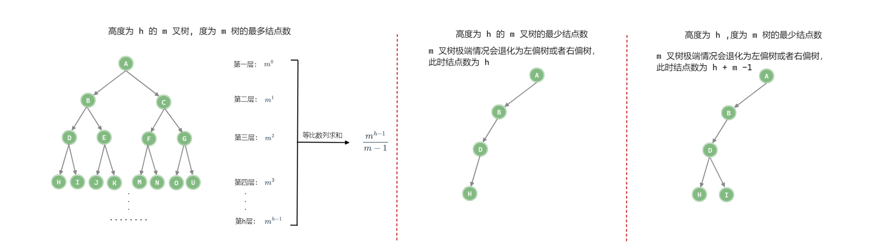

「树 Tree」

<!-- more -->

树是一种非线性数据结构，其是一种「**无环连通图**」—— 即: 树中的 边数 = 结点数 - $1$ .

**度为 $m$ 的树和 $m$ 叉树的区别**

|            度为 m 的树            |           m 叉树            |
| :-------------------------------: | :-------------------------: |
|        任意结点的度 $≤ m$         |     任意结点的度 $≤ m$      |
|     **至少有一个**结点度 $=m$     | **允许所有**结点的度都 $<m$ |
| 一定为非空数，至少有 $m+1$ 个结点 |         可以是空树          |

|                               |          度为 m 的树          |              m 叉树              |
| :---------------------------: | :---------------------------: | :------------------------------: |
|      第 $i$ 层结点数 $n$      |          $n≤m^{i-1}$          |           $n≤m^{i-1}$            |
|  高度为 $h$ 的树的结点数 $n$  | $h+m-1≤n≤\frac{m^{h}-1}{m-1}$ |    $h≤n≤\frac{m^{h}-1}{m-1}$     |
| 具有 $n$ 个结点的树的高度 $h$ |                               | $h≥⌈log_m(n(m-1)+1)⌉$ (最小高度) |

:::details

具有 $n$ 个结点的 $m$ 叉树的高度 $h$ 的最小高度推导过程：
$$
\frac{m^{h-1}-1}{m-1} < n ≤ \frac{m^{h}-1}{m-1}
$$

$$
m^{h-1}<n(m-1)+1≤m^h
$$

$$
h-1<log_m(n(m-1)+1)≤h
$$

$$
h_{min}=⌈log_m(n(m-1)+1)⌉
$$

:::

:::warning

这里的高度 $h$ 是指根结点到最远叶结点之间 “**结点**” 的数量。

:::

## 树形数据结构

### [二叉树](./2.md)

### [二叉搜索树](./3.md)

### [AVL树](./5.md)

### [红黑树](./4.md)

### [哈夫曼树](./6.md)

### [并查集](./7.md)

### [B树，B+树 ](./8.md)

