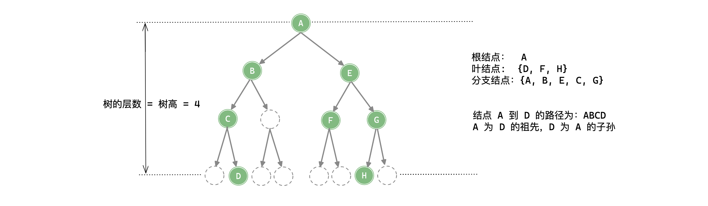

「树 Tree」

<!-- more -->

## 树的基本术语

- **结点的「度 Degree」，树的度**

结点的**度**是指结点的子结点数量，二叉树中度的范围是 $0, 1, 2$ ；树的「度」是指各结点度的最大值。

- **「叶结点 Leaf Node」(终端结点) 、「分支结点 Branch Node」(非终端结点)**

**叶结点**是度为 $0$ 的结点，也即没有子结点的结点，其指向子结点的指针都指向 `null` ；**分支结点**是度不为 $0$ 的结点。

- **「孩子结点 Child Node」，「双亲结点 Parent Node」，「兄弟结点 Brother Node」**

某结点子树的根结点叫做该结点的**孩子结点**；反之，该结点称为其孩子结点的**双亲结点**；具有同一个双亲结点的孩子结点互称为**兄弟结点**。

- **路径、路径长度**

如果树的结点序列 $n_1 \ n_2 \ ...n_k$ 满足结点 $n_i$ 是 $n_{i+1}$ 的双亲 $(1\le i\le k)$ ，则 $n_1 \ n_2 \ ...n_k$ 称为一条由 $n_1$ 到 $n_k$ 的**路径**，显然，**在树中的路径是唯一的**；路径上经过边的数量叫作**路径长度**。

- **祖先、子孙**

若从结点 $x$ 到结点 $y$ 有一条路径，则 $x$ 就是 $y$ 的祖先；反之， $y$ 就是 $x$ 的子孙。

- **「结点的层数 Leval」、树的「深度 Depth」 和 树的「高度 Height」**

规定根结点的层数为 $1$ ，也即根结点所在层数为第 $1$ 层，对于其他任何结点，某结点处于第 $k$ 层，则其子结点必须在第 $k+1$ 层；树中所有结点的最大层数称为树的**深度**；**高度**在数值上与深度一致；但两者表示的含义不同：高度是从叶结点到根结点，深度是从根结点到叶结点。

:::warning 高度和深度的定义

结点的高度和深度的定义有两种：

- 根结点到该结点路径上**边**的数量；也即上述术语中的树中根结点到各个结点的「路径长度」的最大值。
- 根结点到该结点路径上**结点**的数量；其是用**边**定义的树高 $+1$。

:::

**树的特性**

树是一种非线性数据结构，其是一种「**无环连通图**」—— 即: **树中的 边数(分支数) = 树中总结点数 - $1$ .**

设树中度为 $i$ 的结点数为 $n_i$ ，且数的度为 $m$ 则有：

- 树中「**总边数(分支数)**」为: $\sum_{i=1}^{m} i·n_i$

- 树中「**总结点总数**」为：$\sum_{i=0}^{m}n_i$ 或 $(\sum_{i=1}^{m}i·n_i)+1$

:::details 例子

树的度为 $4$ ,度为 $i\ \{i=0, 1, 2, 3, 4\}$ 的结点数为 $n_i$ ,则结点总数 :
$$
n = n_0 + n_1 + n_2 + n_3 + n_4 = 1 + n_1 + 2n_2 + 3n_3 + 4n_4
$$
:::

**度为 $m$ 的树和 $m$ 叉树的区别**

|            度为 m 的树            |             m 叉树             |
| :-------------------------------: | :----------------------------: |
|        任意结点的度 $≤ m$         |       任意结点的度 $≤ m$       |
|     **至少有一个**结点度 $=m$     | **允许所有**结点的度都 $\le m$ |
| 一定为非空数，至少有 $m+1$ 个结点 |           可以是空树           |

|                               |            度为 m 的树            |             m 叉树              |
| :---------------------------: | :-------------------------------: | :-----------------------------: |
|      第 $i$ 层结点数 $n$      |            $n≤m^{i-1}$            |           $n≤m^{i-1}$           |
|  高度为 $h$ 的树的结点数 $n$  |   $h+m-1≤n≤\frac{m^{h}-1}{m-1}$   |    $h≤n≤\frac{m^{h}-1}{m-1}$    |
| 具有 $n$ 个结点的树的高度 $h$ | $⌈log_m(n(m-1)+1)⌉\le h\le n-m+1$ | $⌈log_m(n(m-1)+1)⌉ \le h \le n$ |

:::details

具有 $n$ 个结点的 $m$ 叉树的高度 $h$ 的最小高度推导过程：
$$
\frac{m^{h-1}-1}{m-1} < n ≤ \frac{m^{h}-1}{m-1}
$$

$$
m^{h-1}<n(m-1)+1≤m^h
$$

$$
h-1<log_m(n(m-1)+1)≤h
$$

$$
h_{min}=⌈log_m(n(m-1)+1)⌉
$$

:::

:::warning

这里的高度 $h$ 是指根结点到最远叶结点之间 “**结点**” 的数量。

:::

## 树形数据结构

### [二叉树](./2.md)

### [二叉搜索树](./3.md)

### [AVL树](./5.md)

### [红黑树](./4.md)

### [哈夫曼树](./6.md)

### [并查集](./7.md)

### [B树，B+树 ](./8.md)

