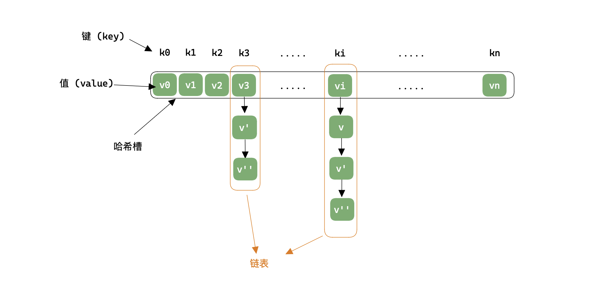
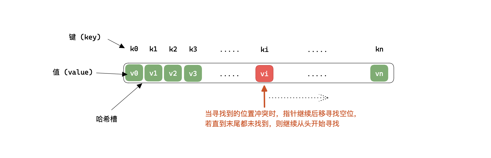

「哈希表 Hash 」

<!-- more -->

### 哈希表的基本术语

「哈希表 Hash」又称散列表；其思想与离散化类似，对于复杂信息的统计，可以使用 $Hash$ 函数将这些复杂信息映射到容易维护的值域内。然后由于值域变简单，范围变小，所以可能造成两个不同的原始信息被 $Hash$ 函数映射为相同的值，这被称为「哈希冲突」，所以需要解决冲突，常用的方法有两种

1. 拉链法
2. 开放寻址法

哈希表的基本操作：

1. 计算 $Hash$ 函数的值；
2. 根据处理冲突的策略执行与 $Hash$ 函数的值执行插入操作。
3. 查找操作
4. 删除操作

### Hash 函数的设计

#### 1.直接定址法

时关于「键」的线性函数，即：
$$
H(key)=a × key + b
$$
使用线性函数的好处是**不会产生冲突**，但是这只适用于「键」的分布，并且「键」的集合不是很大且连续的情况下使用较好。

#### 2.除留余数法

基本思想：选择某个适当的正整数 $p$ ，以「键」除以 $p$ 的余数作为哈希值。
$$
H(key) = key \mod  \ \ p
$$
可以看出这个哈希函数的关键在于 $p$ ，对 $p$ 的选择通常是**选择 $\le N$ 的最大质数(特别地，这不是 $2$ 的幂)**。($N$ 为需要哈希的数据量,也即哈希表的容量)。使用除留余数法时不需要已知「键」的分布；且其结构较为简单，是较为常用哈希函数。

:::warning

在运算规则中，任何数 $\bmod$ 正整数的结果都 $\ge 0$ 的，但是**在编码中，负数 $\bmod$ 正整数的结果可能为负数**，所以在编码中可做这样处理：
$$
K_{idx} = (V_{idx} \ \% \ p + p \ )\ \% \ p
$$
或者使用位运算直接将符号为屏蔽：(将一个 $32$ 位的整数变为一个 $31$ 的非负整数) 
$$
K_{idx} = (V_{idx} \ \ \& \ \ 0x7fffffff)\ \% \ p
$$
就可以保证键的索引非负了。

:::

> 哈希函数的启发式规则：越是随机，越是没有规律，就越是好的哈希函数。

:::info

在上述的哈希函数中，都对 「键 key」作数值计算，而在实际应用中，「键」不一定是数字，可能是字符串，也可能是一个类，在 rust 中提供了 `Hash trait` ， 在 java 中每个类都具有 `hashCode()` 方法，目的就是让每种数据都需要有相应的哈希函数，那么就需要对这些不规则的「键」进行转换，转换为数字，以便于哈希函数的计算。

:::

### 拉链法

首先对于哈希表来说，都需要一个「哈希槽」来存储 `(key, value)` 中的 `value`，即一个一维数组；而拉链法处理冲突的策略如下图：



将冲突的值存储在链表中，当通过 $Hash$ 函数计算后，若对应的值有冲突，则对所在链表再做一次查询即可。

:::code-tabs#language

@tab rust#rust

```rust

```

@tab java#java

```java

```

@tab c++#c++

```cpp
/*
	实际编码中，并不需要多个链表存储多个冲突，只需要一个链表即可，可通过设置不同的 "头节点" 来将其分成多个链表
*/
const int N = 100003;
// h[N] 存储各个链表的头结点,也即哈希槽; e[N] 存储链表的值; ne[i] 存储 e[i] 节点的下一结点的值
int h[N], e[N], ne[N], idx = 0;
/* 插入操作 O(1) */
void insert(int x) {
  int k = (x % N + N) % N;
  // 头插
  e[idx] = x;
  ne[idx] = h[k];
  h[k] = idx ++;
}
/* 查找操作 O(1)*/
bool find(int x) {
  int k = (x % N + N) % N;
  // 在链表中查找
  for (int i = h[k] ; i ; i = ne[i]) 
    if (e[i] == x)
      	return true;
 	return false;
}
```

:::


### 开放寻找法

开放寻址法的解决冲突的策略如下图：也即遇到冲突时继续向后寻找，若向后寻找过程一直有冲突，则寻找到末尾时，从头开始继续寻找；然后向后寻址的方式也有多种，例如线性探测，二次探测等等，下图为线性探测：



:::details 二次探测法
$$
(H(key) + d_i) \ \% \ m
$$
线性探测法中的 $d_i=1,2,3,...,N-1$ ；而二次探测法中的 $d_i=1^2,-1^2,2^2,-2^2,...,q^2,-q^2$ ，其 $q \le \sqrt{N}$。 

:::

:::code-tabs#language

@tab rust#rust

```rust
struct HashTable {
  h: Vec<isize>,
  hash_func: fn(&isize)->usize,
}

impl  HashTable  {
  /// 初始化
  pub fn new(m: usize,hash_func: fn(&isize)->usize) -> Self {
    Self { h: vec![isize::MAX; m], hash_func }
  }
  /// 寻找索引 O(1)
  pub fn find_idx(&mut self ,x: isize) -> usize {
    let mut idx = (self.hash_func)(&x);
    while self.h.get(idx) != Some(&x) && self.h.get(idx) != Some(&isize::MAX) {
      idx += 1;
      if idx == self.h.len() { idx = 0 }
    }
    idx
  }
  /// 插入元素 O(1)
  pub fn insert(&mut self , x: isize) {
    let idx = self.find_idx(x);
    self.h[idx] = x;
  }
  /// 寻找元素 O(1)
  pub fn find(&mut self, x: isize) -> bool {
    let idx = self.find_idx(x);
    if self.h[idx] != isize::MAX { true }
    else { false }
  }
}
```

@tab java#java

```java

```

@tab c++#c++

```cpp
/* 
	虽然线性探测到末尾时，可以调整从头开始寻找，但是从头开始的复杂度可能较高，
	所以在编码中可以用空间换时间，直接多开2倍空间的哈希槽
*/
const int N = 200003, null_value = 0x3f3f3f3f;
int h[N];
memset(h, 0x3f, sizeof h);

/* 查找操作 O(1) ， 同时当查找操作失败时，可是作为插入操作使用 */
int find(int x) {
  int k = (x % N + N) % N;
  while(h[k] != null_value && h[k] != x) {
    k ++;
    if (k == N) k = 0;  // 到达末尾，从头开始
  }
  return k;
}
```

:::

#### 删除操作

在开放寻址法处理冲突的情况下，若要进行删除操作，需注意：

1. 删除一个记录一定**不能影响**后续的查找操作；
2. 删除记录后的存储单元**能够为将来**的插入所使用。

所以较好的解决方式是采用懒惰删除，也即在被删除记录的位置上进行标记，比如使用 `bool` 变量标记等等。

### 散列查找

用开放寻址法处理冲突的散列表被称为**闭散列表**，用拉链法处理的被称为**开散列表**。

「堆积 mass」 ：是指在闭散列表中，可能会出现**不同散列值**的「值」对同一地址的争夺。显然，堆积明显降低了查找效率。

开散列表和闭散列表的区别：

|                       开散列表                       |                 闭散列表                 |
| :--------------------------------------------------: | :--------------------------------------: |
|                        拉链法                        |                开发寻址法                |
|                   不会产生「堆积」                   |             可能产生「堆积」             |
|                   各项操作易于实现                   |      删除操作不易实现，使用懒惰删除      |
|                   平均查找长度较短                   |             平均查找长度较长             |
|             需要附加指针，增加了存储开销             |         无需附加指针，空间效率高         |
| 由于链表是可以动态增长的，所以可以不确定散列表的容量 | 必须提前估计容量并分配固定大小容量的空间 |

#### 性能分析

使用散列表进行查找操作时，其时间效率几乎可以达到 $O(1)$ ，并且不需要排序或其他操作。影响散列查找的的三个关键因素如下：

1. **散列函数是否均匀**: 散列函数的是否均匀会直接影响产生冲突的效率，所以在选择散列函数时，需要尽可能地选择分布均匀的散列函数；
2. **处理冲突的方法**: 好的处理冲突的方法可以提高查找效率，不过没有万能的处理方式，只有在不同情况下选择不同的处理方法才是高效的；
3. **散列表的「装填因子 load factor」**:设填入散列表中的记录个数为 $n$ ，散列表长为 $m$ ，则装填因子 $\alpha=n / m$ 。其**标志着散列表的装满程度**，由于表长是定值，那么 $\alpha$ 就和填入散列表中的记录个数成正比。

「平均查找长度 ASL」是对散列表查找效率的度量，并且是装填因子 $\alpha$ 的函数，不同处理冲突的方法有不同的函数：

|            |          查找成功时的 ASL           |            查找失败时的 ASL             |
| :--------: | :---------------------------------: | :-------------------------------------: |
| 线性探测法 | $\frac{1}{2}(1+\frac{1}{1-\alpha})$ | $\frac{1}{2}(1+\frac{1}{(1-\alpha)^2})$ |
| 二次探测法 |   $-\frac{1}{\alpha}ln(1+\alpha)$   |          $\frac{1}{1-\alpha}$           |
|   拉链法   |        $1+\frac{\alpha}{2}$         |         $\alpha + e^{-\alpha}$          |

不管 $n$ 有多大，总可以选择一个合适的装填因子以将 $ASL$ 限定在一个范围内，也即其时间复杂度几乎是 $O(1)$。

:::warning

为保证空间效率，一般建议保持 $0.9> \alpha > 0.5$ ，也即散列表中半满的。

:::


