「堆 heap」

<!-- more -->

「堆」是一个限定条件下的[「完全二叉树」](./2.md),根据成立条件，堆主要分为两种类型：

- 「大根堆 Max Heap」, 任意结点的值 $\ge$ 其子结点的值
- 「小根堆 Min Heap」, 任意结点的值 $\le$ 其子结点的值

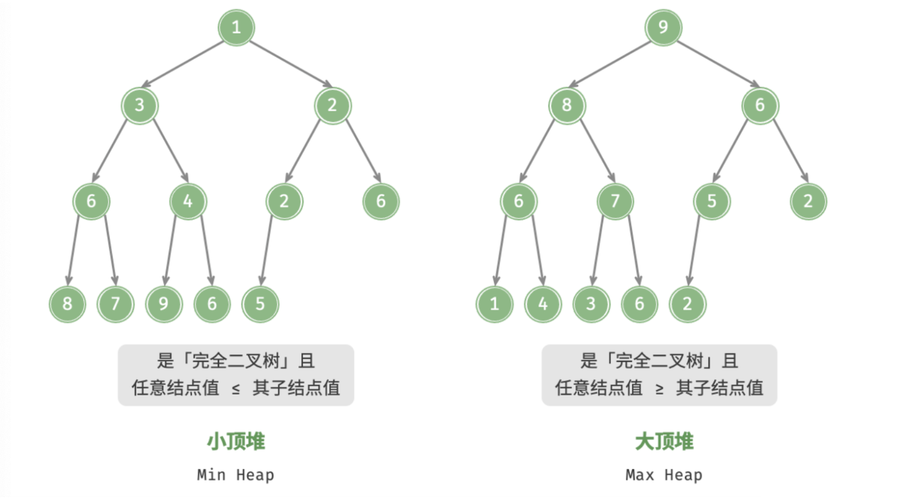

- 由于堆是完全二叉树，所以最后一层结点全部靠左填充，其他层都被填满；
- 完全二叉树的根结点的对应的「堆顶」，底层靠右元素对应的「堆底」；
- 「大根堆」中堆顶元素值最大
- 「小根堆」中堆顶元素值最小

:::info 

不管是什么堆，都是根据对应的「优先顺序」要在每次操作之后对堆进行调整以保持规定的优先顺序。

:::

## 堆的常用操作

「优先队列 Priority Queue」定义为具有队列优先级的队列，这与堆的操作逻辑一致，所以可将「优先队列」等价于「堆」，下表为常用操作：(以java为例)

|    方法     |         描述         |  时间复杂度  |
| :---------: | :------------------: | :----------: |
|   `add()`   |       元素入堆       | $O(log \ n)$ |
|  `poll()`   |     弹出堆顶元素     | $O(log \ n)$ |
|  `peek()`   | 查看堆顶元素(不弹出) |    $O(1)$    |
|  `size()`   |     堆中元素数量     |    $O(1)$    |
| `isEmpty()` |    判断堆是否为空    |    $O(1)$    |

### 标准库中的优先队列

|                                                              |                  小根堆                  |                大根堆                 |
| :----------------------------------------------------------: | :--------------------------------------: | :-----------------------------------: |
| [rust](https://rustwiki.org/zh-CN/std/collections/struct.BinaryHeap.html) |         `BinaryHeap<Reverse<T>>`         |            `BinaryHeap<T>`            |
| [java](https://docs.oracle.com/en/java/javase/17/docs/api/java.base/java/util/PriorityQueue.html) |            `PriorityQueue<T>`            |  `PriorityQueue<T>((a, b) -> b - a)`  |
| [c++](https://cplusplus.com/reference/queue/priority_queue/) | `priority_queue<T,vector<T>,greater<T>>` | `priority_queue<T,vector<T>,less<T>>` |

:::code-tabs#language

@tab rust#rust

```rust
// 小根堆
let mut min_heap = BinaryHeap::<Reverse<isize>>::from(
  								vec![Reverse(1), Reverse(1), Reverse(3)]);

// 大根堆
let mut min_heap = BinaryHeap::<isize>::new();

min_heap.push(10);                    // 元素入推
let heap_top = min_heap.peek();       // 查看堆顶元素 (不弹出堆顶元素)
min_heap.pop();                       // 直接弹出堆顶元素
let size = min_heap.len();            // 堆大小 (堆中元素个数)
let is_empty = min_heap.is_empty();   // 判断堆是否为空
```

@tab java#java

```java
// 初始化小根堆
PriorityQueue<Integer> minHeap = new PriorityQueue<>(Arrays.asList(1, 3, 2, 5, 4));

// 初始化大根堆（使用 lambda 表达式修改 Comparator 即可）
PriorityQueue<Integer> maxHeap = new PriorityQueue<>((a, b) -> b - a);

maxHeap.add(10);    									// 元素入堆
Integer heapTop = maxHeap.peek();     // 查看堆顶元素 (不弹出堆顶元素)
Integer heapTop = maxHeap.poll();     // 直接弹出堆顶元素
int size = maxHeap.size();            // 堆大小 (堆中元素个数)
boolean isEmpty = maxHeap.isEmpty();  // 判断堆是否为空
```

@tab c++#c++

```cpp
vector<int> v = {1, 2, 3, 4, 5};
// 小根堆
priority_queue<int, vector<int>, greater<int>> min_heap(v.begin(),v.end());

// 大根堆
priority_queue<int, vector<int>, less<int>> max_heap;

max_heap.push(10);                     // 元素入堆
int heap_top = max_heap.top();         // 查看堆顶元素 (不弹出堆顶元素)
max_heap.pop();                        // 弹出堆顶元素
int size = max_heap.size();            // 堆大小 (堆中元素个数)
bool is_empty = max_heap.empty();      // 判断是否为空
```

:::

## 堆的实现

### 1.堆的存储与表示

既然「堆」是一颗「完全二叉树」，那么只需实现完全二叉树即可，但是堆在进行操作之后需要进行调整，而如果使用二叉链表型的二叉树，这会使得调整操作极其复杂；而数组在存储完全二叉树时表现很好，其会将所有的空结点都存储在数组的末尾。所以采用「数组」存储「堆」.

使用数组表示二叉树时：

- 数组元素的值代表结点的值；
- **索引值**代表在二叉树中的位置 (存储顺序为完全二叉树的层序遍历)；

在层序遍历下通过索引值可以非常容易的找到某个结点的左右子结点：

例如：给定某结点的索引 $i$ ，其左子结点的索引为 $2i+1$，右子结点的索引为 $2i + 2$ ，父结点的索引为 $⌊\frac{i-1}{2}⌋$ ，当索引越界时，代表空结点或结点不存在。

下图为一大根堆及其存储形式：

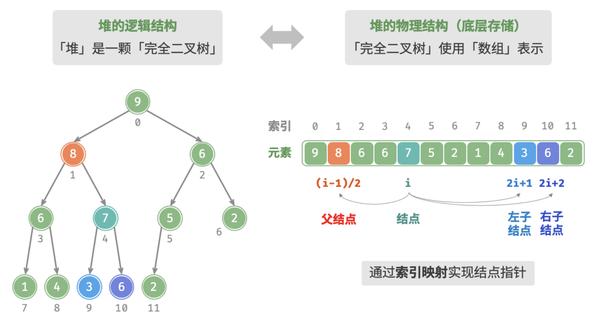

:::info

上面索引下标是从 $0$ 开始，也可以从 $1$ 开始，那么对应的索引 $i$ 的左子结点的索引就是 $2i$ ，右子结点的索引就是 $2i+1$ ，父结点的索引就是 $⌊\frac{i}{2}⌋$ 。

:::

:::code-tabs#language

@tab rust#rust

```rust
pub struct Heap<T: Default>{
  count: usize,                    // 堆中元素个数  
  items: Vec<T>,                   // 存储堆中元素的 Vec
  comparator: fn(&T, &T) -> bool,  // cmp 函数，自定义优先级
}
impl<T: Default> Heap<T> {
  /// 创建一个空堆
  pub fn new(comparator: fn(&T, &T) -> bool) -> Self {
      Self { count: 0, items: vec![T::default()], comparator }
  }
  /// 父结点索引
  fn parent_idx(&self, idx: usize) -> usize {
    idx / 2
  }
  /// 左子结点索引 
  fn left_child_idx(&self, idx: usize) -> usize {
    idx * 2
  }
  /// 右子结点索引
  fn right_child_idx(&self, idx: usize) -> usize {
    self.left_child_idx(idx) + 1
  }
}
impl<T: Default + Ord>  Heap<T> {
  /// 创建小根堆
  pub fn new_min() -> Heap<T> {
      Heap::new(|a, b| a < b)
  }
  /// 创建大根堆
  pub fn new_max() -> Heap<T> {
      Heap::new(|a, b| a > b)
  }
}
```

@tab java#java

```java
public class Heap<T>{
  private int count;                              // 堆中元素数量
  private Vector<T> items;                        // 一维数组存储结构
  private final Comparator<? super T> comparator; // 比较器

  public Heap(Comparator<? super T> comparator) {
    this.count = 0;
    this.items = new Vector<>();
    this.comparator = comparator;
  }

  /**
   * @param idx 结点索引
   * @return 左子结点的索引
   */
  private int leftChildIdx(int idx) {
    return idx * 2 + 1;
  }

  /**
   * @param idx 结点索引
   * @return 右子结点的索引
   */
  private int rightChildIdx(int idx) {
    return idx * 2 + 2;
  }

  /**
   * @param idx 结点索引
   * @return 父结点索引
   */
  private int parentIdx(int idx) {
    return (idx - 1) / 2;
  }
  /**
   * 交换两索引对象的元素
   * @param idx1 索引1
   * @param idx2 索引2
   */
  private void swap(int idx1, int idx2) {
    var tmp = items.get(idx1);
    items.set(idx1,items.get(idx2));
    items.set(idx2, tmp);
  }
}
```

@tab c++#c++

```cpp
template <typename T>
class Heap{
private:
  int count;                  // 堆中元素个数
  vector<T> items;            // 存储堆的一维数组
  function<bool(T, T)> cmp;   // 比较器

  /* 左子结点索引 */
  inline int left_child_idx(int idx) {
    return idx * 2 + 1;
  }

  /* 右子结点索引 */
  inline int right_child_idx(int idx) {
    return idx * 2 + 2;
  }

  /* 父结点索引 */
  inline int parent_idx(int idx) {
    return (idx - 1) / 2;
  }
public:
  explicit Heap(function<bool(T, T)> c) : count(0), cmp(std::move(c)) {}
}
```

:::

### 2.访问堆顶元素


:::code-tabs#language

@tab rust#rust

```rust
impl<T: Default> Heap<T> {
  /// 查看堆顶元素
  pub fn peek(&self) -> Option<&T> {
    self.items.get(1)
  }
}
```

@tab java#java

```java
/**
 * @return 堆顶元素
 */
public Optional<T> peek() {
  if (items.size() == 0) {
    return Optional.empty();
  }else {
    return Optional.ofNullable(this.items.get(0));
  }
}
```

@tab c++#c++

```cpp
/* 查看堆顶元素 */
T peek() {
  if (this->items.empty()) return 0;
  else return items[0];
}
```

:::

### 3.元素入堆

给定元素 `value` ，先将其添加到堆底。添加后，由于 `value` 的优先级可能高于堆中其它元素，此时堆的成立条件可能已经被破坏，**因此需要修复从插入结点到根结点这条路径上的各个结点**，该操作被称为「堆化 Heapify」。

考虑从入堆结点开始，**从底至顶执行堆化**。具体地，比较插入结点与其父结点的值，若插入结点的优先级更高则将它们交换；并循环以上操作，从底至顶地修复堆中的各个结点；直至越过根结点时结束，或当遇到无需交换的结点时提前结束。

步骤：

1. 加入末尾
2. 从底至上堆化

下图为在大根堆插入一个元素后堆化的过程：

:::tabs

@tab step1

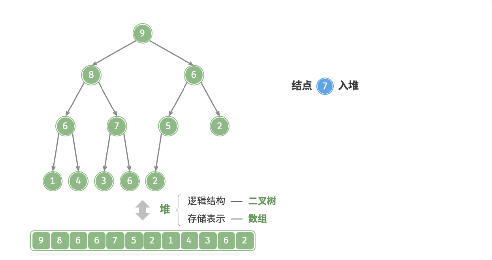

@tab step2

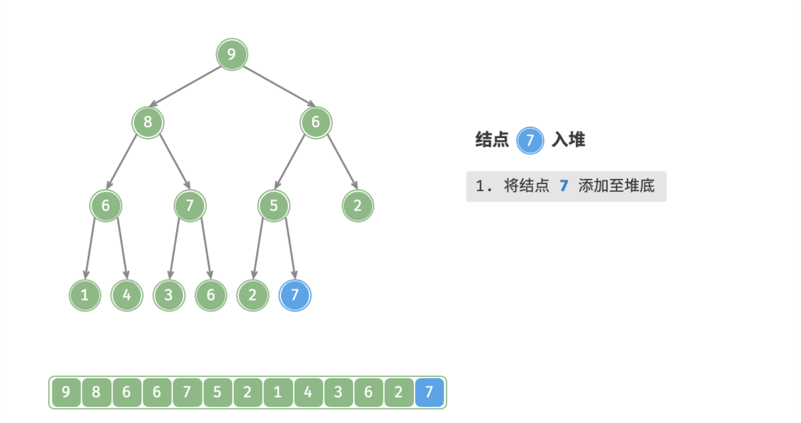

@tab step3

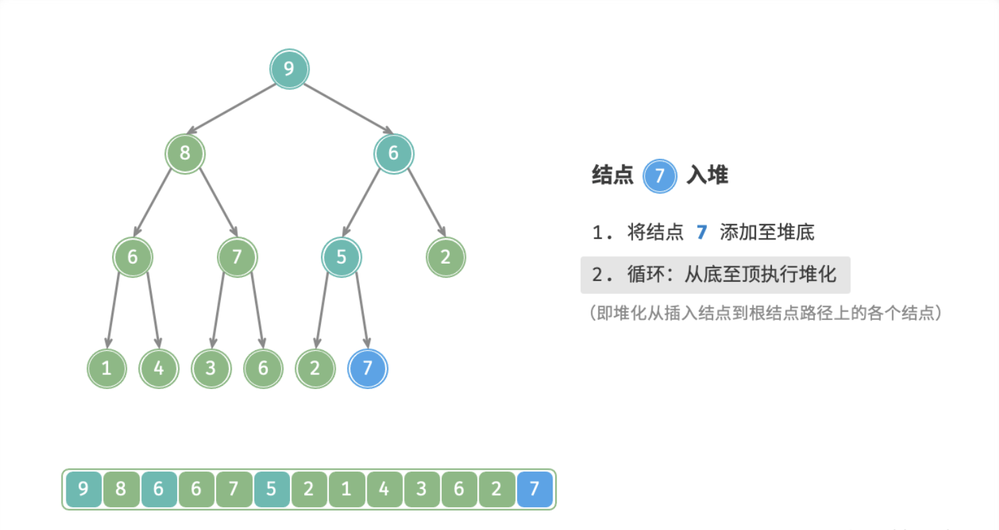

@tab step4

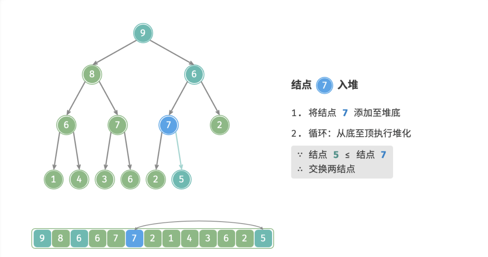

@tab step5

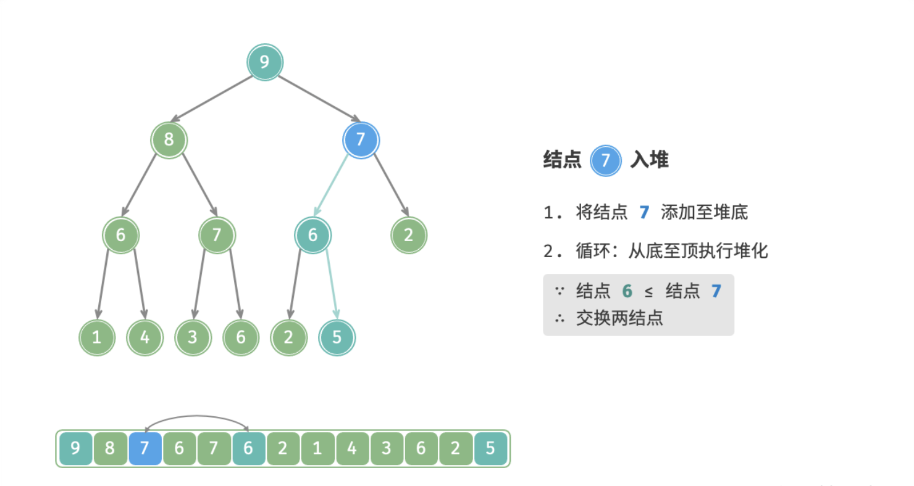

@tab step6

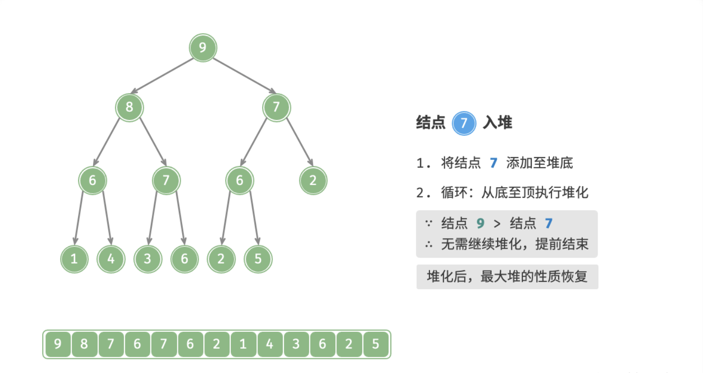

:::


:::code-tabs#language

@tab rust#rust

```rust
impl<T: Default> Heap<T> {
  /// 添加一个结点 O(logn)
  pub fn push(&mut self, value: T) {
    self.count += 1;
    // 1.先加到末尾
    self.items.push(value);
    let mut idx = self.count;
    // 2.然后从底向上调整
    self.up(&mut idx);
  }

  /// up 操作
  fn up(&mut self, idx: &mut usize) {
    // 判断结点是否有父结点
    while self.parent_idx(*idx) > 0 {
        let _idx = *idx;
        let pdx = self.parent_idx(_idx);
        // 根据堆的优先顺序进行调整
        if (self.comparator)(&self.items[_idx], &self.items[pdx]) {
          self.items.swap(_idx, pdx);
        }
        *idx = pdx;
      }
  }
}
```

@tab java#java

```java
/**
 * 堆化 (对优先级较高的元素进行上调)
 * @param idx 结点索引
 */
private void up(int idx) {
  // 判断是否存在父结点
  while (parentIdx(idx) >= 0) {
    int pdx = parentIdx(idx);
    if (idx == pdx) return;   // 特判索引 0
    // 比较子结点和父结点的优先级
    boolean isUp = comparator.compare(items.get(idx), items.get(pdx)) < 0;
    // 子结点优先级更高
    if (isUp) {
      swap(idx, pdx);
    }
    idx = pdx;
  }
}

/**
 * 元素入堆
 * @param value 元素值
 */
public void push(T value) {
  items.add(value);
  count += 1;
  int idx = items.size() - 1;
  up(idx);
}
```

@tab c++#c++

```cpp
/* 堆化 (将优先级更高的结点上移) */
void up(int idx) {
  while (parent_idx(idx) >= 0) {
    int pdx = parent_idx(idx);
    if (idx == pdx) return;
    if (cmp(items[idx], items[pdx])) {
      swap(items[idx], items[pdx]);
    }
    idx = pdx;
  }
}
/* 元素入堆 */
void push(T value) {
  this->items.emplace_back(value);
  this->count ++;
  int idx = items.size() - 1;
  up(idx);
}
```

:::


### 4.堆顶元素出堆

堆顶元素是二叉树根结点，即列表首元素，如果我们直接将首元素从列表中删除，则二叉树中所有结点都会随之发生移位（索引发生变化），这样后续使用堆化修复就很麻烦了。为了尽量减少元素索引变动，采取以下操作步骤：

1. 交换堆顶元素与堆底元素（即交换根结点与最右叶结点）；
2. 交换完成后，将堆底从列表中删除（注意，因为已经交换，实际上删除的是原来的堆顶元素）；
3. 从根结点开始，**从顶至底执行堆化**；

**从顶至底堆化的操作方向与从底至顶堆化相反**，比较根结点的值与其两个子结点的值，将优先级更高的子结点与根结点执行交换，并循环以上操作，直到越过叶结点时结束，或当遇到无需交换的结点时提前结束。

下图为大根堆删除堆顶的全过程：

:::tabs

@tab step1

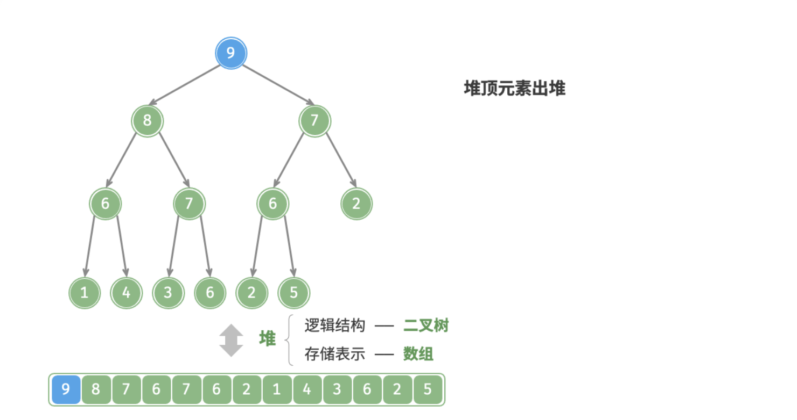

@tab step2

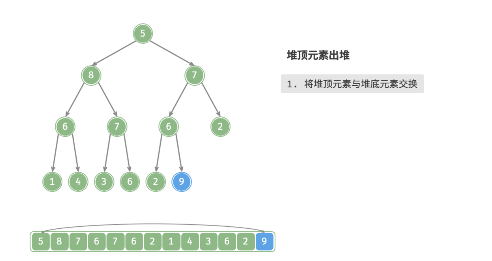

@tab step3

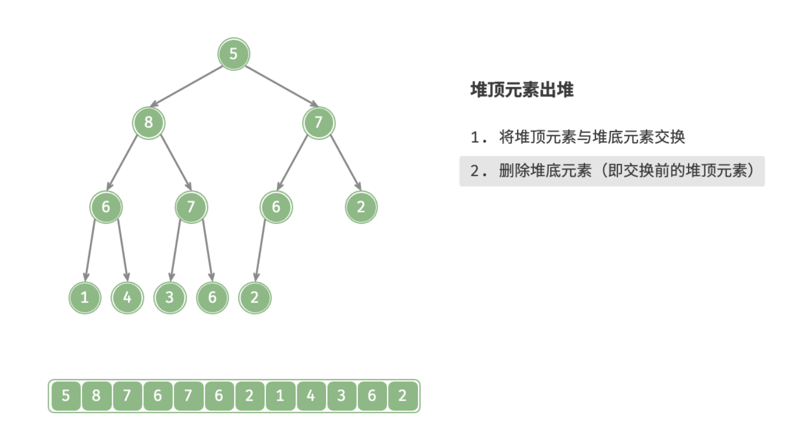

@tab step4

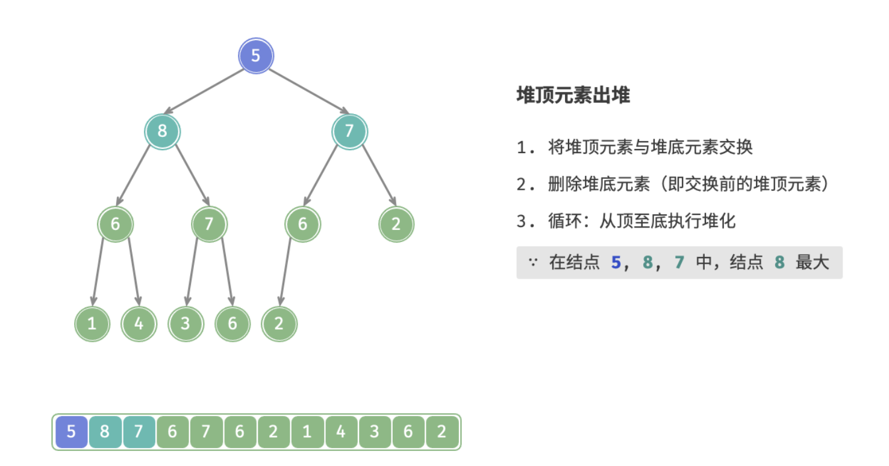

@tab step5

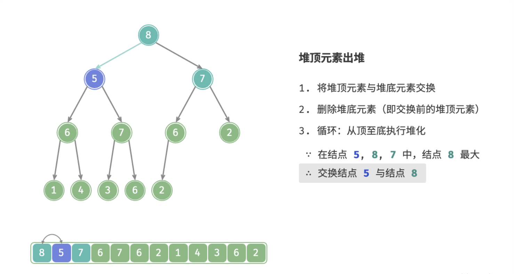

@tab step6

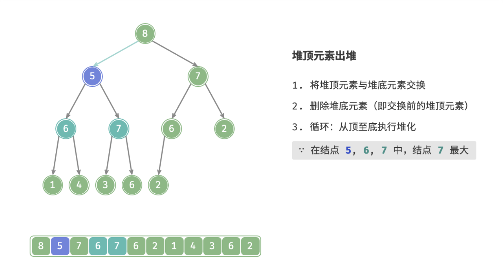

@tab step7

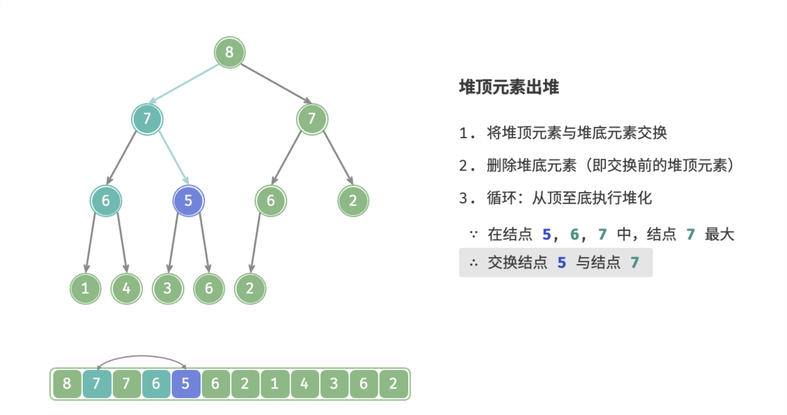

@tab step8

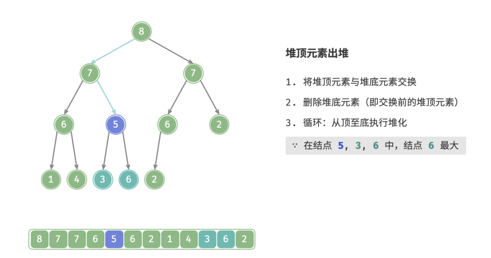

@tab step9

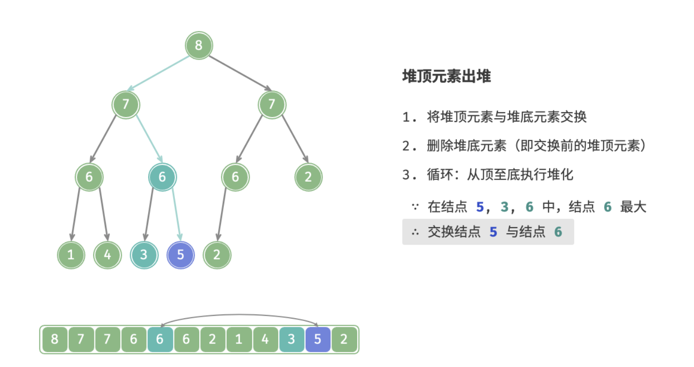

@tab step10

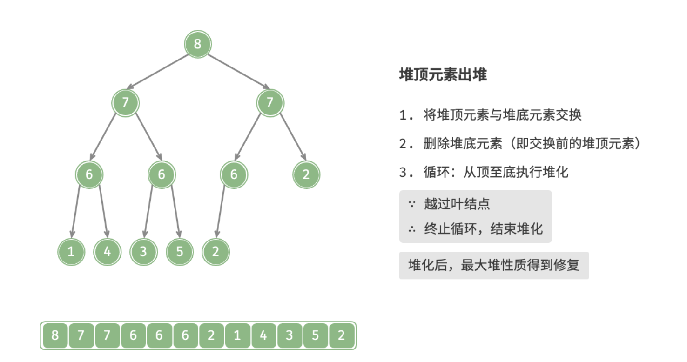

:::

:::code-tabs#language

@tab rust#rust

```rust
impl<T: Default> Heap<T> {
  /// down 操作
  fn down(&mut self, mut idx:usize) {
    // 当该结点存在子结点时
    while self.children_present(idx) {
      // 得出左右子结点中优先级更高的结点
      let cdx = self.smallest_child_idx(idx);
      // 子结点的优先级高于该结点的优先级
      if !(self.comparator)(&self.items[idx], &self.items[cdx]) {
        self.items.swap(idx, cdx);
      }
      idx = cdx;
    }
  }

  /// 弹出堆顶元素并返回弹出堆顶元素 O(logn)
  pub fn pop(&mut self) -> Option<T> {
    let mut tt: Option<T> = None;
    if let Some(top) = self.items.get(1) {
      // 删除堆顶元素 
      // swap_remove 会在删除该元素后将 vec 中的最后一个元素填补到这个空位
      tt = Some(self.items.swap_remove(1));
      self.count -= 1;
      // 调整堆
      if self.count > 0 {
        let mut idx = 1;
        self.down(idx);
      }
    }
    tt
  }
}
```

@tab java#java

```java
/**
 * @param idx 索引
 * @return 返回左右子结点中优先级较高的结点的索引
 */
private int smallestChild(int idx) {
  // 当右子结点索引越界时直接返回左子索引结点
  if (rightChildIdx(idx) >= count) {
    return leftChildIdx(idx);
  }else {
    int ldx = leftChildIdx(idx);
    int rdx = rightChildIdx(idx);
    boolean flag = comparator.compare(items.get(ldx), items.get(rdx)) < 0;
    return flag ? ldx : rdx;
  }
}


/**
 * 反向堆化 (对优先级较低的元素进行下调)
 * @param idx 索引
 */
private void down(int idx) {
  while (leftChildIdx(idx) < count) {
      int childIdx = smallestChild(idx);
      boolean isDown = comparator.compare(items.get(idx),items.get(childIdx)) < 0;
      if (!isDown) {
        swap(idx, childIdx);
      }
      idx = childIdx;
  }
}

/**
 * 弹出堆顶元素
 * @return 返回弹出的堆顶元素
 */
public Optional<T> pop() {
  Optional<T> ans = peek();
  // 1. 使用最后一个元素覆盖堆顶元素
  items.set(0, items.get(items.size() - 1));
  items.remove(items.size() - 1);
  count -= 1;
  // 2. 反向堆化
  down(0);
  return ans;
}
```

@tab c++#c++

```cpp
/* 反向堆化 (将优先级更低的结点下移) */
void down(int idx) {
  // 判断结点是否有子结点点
  auto present_child = [=](int idx) {
    return left_child_idx(idx) <= count;
  };
  // 获取左右子结点中优先级较高的子结点
  auto smallest_child_idx = [=](int idx) {
   if (right_child_idx(idx) >= count) {
     return left_child_idx(idx);
   } else {
     int ldx = left_child_idx(idx);
     int rdx = right_child_idx(idx);
     if (cmp(items[ldx], items[rdx])) {
       return ldx;
     }else {
       return rdx;
     }
   }
  };
  while (present_child(idx)) {
    int cdx = smallest_child_idx(idx);
    if (!cmp(items[idx], items[cdx])) {
      swap(items[idx], items[cdx]);
    }
    idx = cdx;
  }
}

/* 弹出堆顶元素并返回 */
T pop() {
  T ans = peek();
  items[0] = items[items.size() - 1];
  items.pop_back();
  this->count --;
  down(0);
  return ans;
}
```

:::

### 5.优化建堆

如果直接输入一个列表并将其建堆，考虑使用「元素入堆」方法，将列表元素依次入堆。元素入堆的时间复杂度为 $O(log⁡n)$ ，而平均长度为 $n/2$ ，因此该方法的总体时间复杂度为 $O(nlog⁡n)$ 。

然而，存在一种更加高效的建堆方法。设结点数量为 $n$ ，先将列表所有元素原封不动添加进堆，**然后迭代地对各个结点执行「从顶至底堆化」**。当然，**无需对叶结点执行堆化**，因为其没有子结点。

:::code-tabs#language

@tab rust#rust

```rust
impl<T: Default> Heap<T> {
  /// 从 vec 中构建 heap , O(n)
  pub fn from(items: Vec<T>, comparator: fn(&T, &T) -> bool) -> Self {
    let mut count = items.len() - 1; 
    let mut h = Heap { 
      count,
      items, 
      comparator
    };
    let mut i = count / 2;  // count / 2 是最后一个元素父结点的索引
    while i > 0 {
      h.down(i);
      i -= 1;
    }
    h
  }
}
```

@tab java#java

```java
/**
 * 优化建堆方式
 * @param v 要放入堆中的元素集合
 * @param comparator 比较器
 */
public Heap(Vector<T> v, Comparator<? super T> comparator) {
  this.items = new Vector<>();
  items.addAll(v);
  this.comparator = comparator;
  this.count = items.size() - 1;
  for (int i = parentIdx(this.count); i >= 0 ; i-- )
    down(i);
}
```

@tab c++#c++

```cpp
/* 优化建堆方式 */
Heap(vector<T> v, function<bool(T, T)> c) {
  this->items = v;
  this->cmp = c;
  this->count = v.size() - 1;
  for (int i = parent_idx(count) ; i >= 0 ; i--)
    down(i);
}
```

:::

时间复杂度推算：

- 完全二叉树中，设结点总数为 $n$ ，则叶结点数量为 $⌊\frac{n+1}{2}⌋$ 。因此在排除叶结点后，需要堆化结点数量为 $⌊\frac{n-1}{2}⌋$ ，即为 $O(n)$ ；
- 从顶至底堆化中，每个结点最多堆化至叶结点，因此最大迭代次数为二叉树高度 $O(log⁡n)$；

将上述两者相乘，可得时间复杂度为 $O(nlog⁡n)$ 。然而，该估算结果仍不够准确，因为没有考虑到 **二叉树底层结点远多于顶层结点** 。下面来展开计算。为了减小计算难度，我们假设树是一个「完美二叉树」，该假设不会影响计算结果的正确性。设二叉树（即堆）结点数量为 $n$ ，树高度为 $h$ 。上文提到，**结点堆化最大迭代次数等于该结点到叶结点的距离，而这正是“结点高度”**。因此，我们将各层的“结点数量 × 结点高度”求和，即可得到所有结点的堆化的迭代次数总和。
$$
T(h)=2^{0} \times h+2^{1}\times(h-1)+2^{2}\times(h-2)+\cdots+2^{(h-1)} \times 1
$$
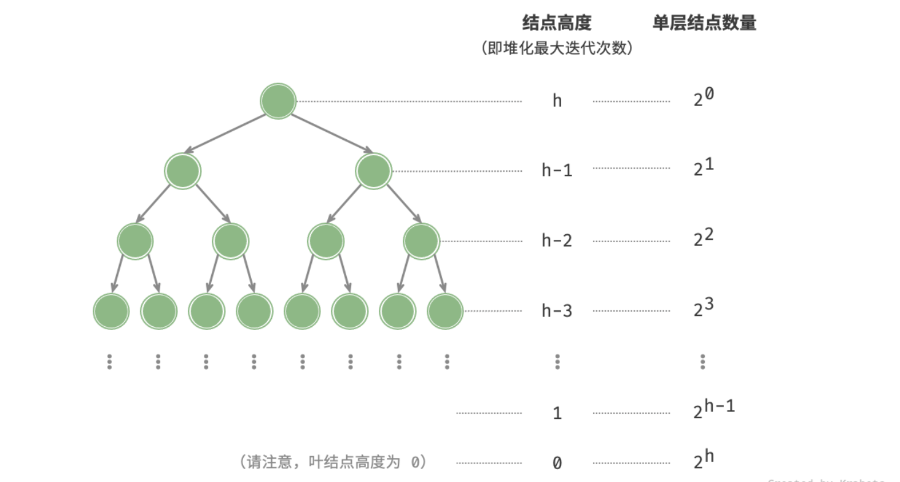
$$
\begin{aligned}
T(h) & =2^{0} \times h+2^{1}\times (h-1)+2^{2}\times (h-2)+\cdots+2^{h-1} \times 1 && (1)\\
2 T(h) & =2^{1} \times h+2^{2}\times(h-1)+2^{3}\times (h-2)+\cdots+2^{h} \times 1 && (2)
\end{aligned}
$$
使用错位相减,让 $(2) - (1)$ ,得到：
$$
2T(h)-T(h)=T(h)=-2^{0} \times h+2^{1}+2^{2}+\cdots+2^{h-1}+2^{h}
$$
观察上式，$T(h)$ 是一个等比数列，可直接使用求和公式，得到时间复杂度为
$$
\begin{aligned}
T(h) & =2 \frac{1-2^{h}}{1-2}-h \\
& =2^{h+1}-h \\
& =O\left(2^{h}\right)
\end{aligned}
$$
进一步地，高度为 $h$ 的完美二叉树的结点数量为 $n=2^{h+1}−1$ ，易得复杂度为 $O(2^h)=O(n)$。以上推算表明，**输入列表并建堆的时间复杂度为 $O(n)$ ，非常高效**。

## 整体代码实现

:::code-tabs#language

@tab rust#rust

```rust
#![allow(unused)]
/// 堆
pub struct Heap<T: Default>{
  count: usize,                    // 堆中元素个数  
  items: Vec<T>,                   // 存储堆中元素的 Vec
  comparator: fn(&T, &T) -> bool,  // cmp 函数，自定义优先级
}
impl<T: Default> Heap<T> {
  /// 创建一个空堆
  pub fn new(comparator: fn(&T, &T) -> bool) -> Self {
      Self { count: 0, items: vec![T::default()], comparator }
  }
  /// 从 vec 中构建 heap , O(n)
  pub fn from(items: Vec<T>, comparator: fn(&T, &T) -> bool) -> Self {
    let mut count = items.len() - 1; 
    let mut h = Heap { 
      count,
      items, 
      comparator
    };
    let mut i = count / 2;
    while i > 0 {
      h.down(i);
      i -= 1;
    }
    h
  }
  /// 堆中结点个数
  pub fn len(&self) -> usize {
    self.count
  }
  /// 判断结点是否为空
  pub fn is_empty(&self) -> bool {
    self.len() == 0
  }
  /// 查看堆顶元素
  pub fn peek(&self) -> Option<&T> {
    self.items.get(1)
  }
  /// 添加一个结点 O(logn)
  pub fn push(&mut self, value: T) {
    self.count += 1;
    // 1.先加到末尾
    self.items.push(value);
    let mut idx = self.count;
    // 2.然后从底向上调整
    self.up(&mut idx);
  }
  /// up 操作
  fn up(&mut self, idx: &mut usize) {
    // 判断结点是否有父结点
    while self.parent_idx(*idx) > 0 {
        let _idx = *idx;
        let pdx = self.parent_idx(_idx);
        // 根据堆的优先顺序进行调整
        if (self.comparator)(&self.items[_idx], &self.items[pdx]) {
          self.items.swap(_idx, pdx);
        }
        *idx = pdx;
      }
  }
  /// 获取左右子结点中优先级更大的结点的索引
  fn smallest_child_idx(&self, idx: usize) -> usize {
    // 右子结点越界时，直接返回左子结点
    if self.right_child_idx(idx) > self.count {
      self.left_child_idx(idx)
    }else {
      let ldx = self.left_child_idx(idx);
      let rdx = self.right_child_idx(idx);
      // 返回优先级更高的子结点
      if (self.comparator)(&self.items[ldx], &self.items[rdx]) {
        ldx
      } else {
        rdx
      }
    }
  }
  /// down 操作
  fn down(&mut self, mut idx:usize) {
    // 当该结点存在子结点时
    while self.children_present(idx) {
      // 得出左右子结点中优先级更高的结点
      let cdx = self.smallest_child_idx(idx);
      // 子结点的优先级高于该结点的优先级
      if !(self.comparator)(&self.items[idx], &self.items[cdx]) {
        self.items.swap(idx, cdx);
      }
      idx = cdx;
    }
  }
  /// 弹出堆顶元素并返回弹出堆顶元素 O(logn)
  pub fn pop(&mut self) -> Option<T> {
    let mut tt: Option<T> = None;
    if let Some(top) = self.items.get(1) {
      // 删除堆顶元素 
      // swap_remove 会在删除该元素后将 vec 中的最后一个元素填补到这个空位
      tt = Some(self.items.swap_remove(1));
      self.count -= 1;
      // 调整堆
      if self.count > 0 {
        let mut idx = 1;
        self.down(idx);
      }
    }
    tt
  }
  /// 父结点索引
  fn parent_idx(&self, idx: usize) -> usize {
    idx / 2
  }
  /// 判断该结点是否存在子结点
  fn children_present(&self, idx: usize) -> bool {
    // 当左子结点索引都越界时，该结点也一定没有右子结点
    self.left_child_idx(idx) <= self.count
  }
  /// 左子结点索引 
  fn left_child_idx(&self, idx: usize) -> usize {
    idx * 2
  }
  /// 右子结点索引
  fn right_child_idx(&self, idx: usize) -> usize {
    self.left_child_idx(idx) + 1
  }
}
impl<T: Default + Ord>  Heap<T> {
  /// 创建小根堆
  pub fn new_min() -> Heap<T> {
      Heap::new(|a, b| a < b)
  }
  /// 创建大根堆
  pub fn new_max() -> Heap<T> {
      Heap::new(|a, b| a > b)
  }
}
#[cfg(test)]
pub mod test_heap {
  use crate::Heap;
  #[test]
  fn heap_options() {
    let mut heap = Heap::<isize>::new_min();
    heap.push(-3);
    heap.push(10);
    heap.push(3);
    heap.push(6);
    assert_eq!(4, heap.len());
    assert_eq!(-3, *heap.peek().unwrap());
    assert_eq!(-3, heap.pop().unwrap());
    assert_eq!(false, heap.is_empty());
  }   
  #[test]
  fn test_from_vec() {
    let mut heap = Heap::from(vec![0, 4, 2, 11, 9], |a, b| a > b);
    assert_eq!(11, heap.pop().unwrap());
    assert_eq!(9, heap.pop().unwrap());
    assert_eq!(4, heap.pop().unwrap());
    assert_eq!(2, heap.pop().unwrap());
  }
  struct Point(/* x: */ i32, /* y: */ i32);
  impl Default for Point {
    fn default() -> Self {
      Self(0 , 0)
    }
  }
  #[test]
  fn test_custom_priority() {
    let mut heap = Heap::<Point>::new(|a, b| a.0 < b.0);
    heap.push(Point(-2, 1));
    heap.push(Point(3, 4));
    heap.push(Point(9, -2));
    heap.push(Point(11, 6));
    assert_eq!(4, heap.len());
    assert_eq!(-2, heap.peek().unwrap().0);
  }
}
```

@tab java#java

```java
public class Heap<T>{
  private int count;                              // 堆中元素数量
  private Vector<T> items;                        // 一维数组存储结构
  private final Comparator<? super T> comparator; // 比较器

  public Heap(Comparator<? super T> comparator) {
    this.count = 0;
    this.items = new Vector<>();
    this.comparator = comparator;
  }
  
  /**
   * 优化建堆方式
   * @param v 要放入堆中的元素集合
   * @param comparator 比较器
   */
  public Heap(Vector<T> v, Comparator<? super T> comparator) {
    this.items = new Vector<>();
    items.addAll(v);
    this.comparator = comparator;
    this.count = items.size() - 1;
    for (int i = parentIdx(this.count); i >= 0 ; i-- )
      down(i);
  }

  /**
   * @param idx 结点索引
   * @return 左子结点的索引
   */
  private int leftChildIdx(int idx) {
    return idx * 2 + 1;
  }

  /**
   * @param idx 结点索引
   * @return 右子结点的索引
   */
  private int rightChildIdx(int idx) {
    return idx * 2 + 2;
  }

  /**
   * @param idx 结点索引
   * @return 父结点索引
   */
  private int parentIdx(int idx) {
    return (idx - 1) / 2;
  }

  /**
   * @return 堆顶元素
   */
  public Optional<T> peek() {
    if (items.size() == 0) {
      return Optional.empty();
    }else {
      return Optional.ofNullable(this.items.get(0));
    }
  }

  /**
   * 交换两索引对象的元素
   * @param idx1 索引1
   * @param idx2 索引2
   */
  private void swap(int idx1, int idx2) {
    var tmp = items.get(idx1);
    items.set(idx1,items.get(idx2));
    items.set(idx2, tmp);
  }

  /**
   * 堆化 (对优先级较高的元素进行上调)
   * @param idx 结点索引
   */
  private void up(int idx) {
    // 判断是否存在父结点
    while (parentIdx(idx) >= 0) {
      int pdx = parentIdx(idx);
      if (idx == pdx) return;   // 特判索引 0
      // 比较子结点和父结点的优先级
      boolean isUp = comparator.compare(items.get(idx), items.get(pdx)) < 0;
      // 子结点优先级更高
      if (isUp) {
        swap(idx, pdx);
      }
      idx = pdx;
    }
  }

  /**
   * 元素入堆
   * @param value 元素值
   */
  public void push(T value) {
    items.add(value);
    count += 1;
    int idx = items.size() - 1;
    up(idx);
  }

  /**
   * @param idx 索引
   * @return 返回左右子结点中优先级较高的结点的索引
   */
  private int smallestChild(int idx) {
    // 当右子结点索引越界时直接返回左子索引结点
    if (rightChildIdx(idx) >= count) {
      return leftChildIdx(idx);
    }else {
      int ldx = leftChildIdx(idx);
      int rdx = rightChildIdx(idx);
      boolean flag = comparator.compare(items.get(ldx), items.get(rdx)) < 0;
      return flag ? ldx : rdx;
    }
  }


  /**
   * 反向堆化 (对优先级较低的元素进行下调)
   * @param idx 索引
   */
  private void down(int idx) {
    while (leftChildIdx(idx) <= count) {
        int childIdx = smallestChild(idx);
        boolean isDown = comparator.compare(items.get(idx),items.get(childIdx)) < 0;
        if (!isDown) {
          swap(idx, childIdx);
        }
        idx = childIdx;
    }
  }

  /**
   * 弹出堆顶元素
   * @return 返回弹出的堆顶元素
   */
  public Optional<T> pop() {
    Optional<T> ans = peek();
    // 1. 使用最后一个元素覆盖堆顶元素
    items.set(0, items.get(items.size() - 1));
    items.remove(items.size() - 1);
    count -= 1;
    // 2. 反向堆化
    down(0);
    return ans;
  }
  /**
   * @return 堆是否为空
   */
  public boolean isEmpty() {
    return items.isEmpty();
  }
}
```

@tab c++#c++

```cpp
#include <iostream>
#include <vector>
#include <functional>
using namespace std;

template <typename T>
class Heap{
private:
  int count;                  // 堆中元素个数
  vector<T> items;            // 存储堆的一维数组
  function<bool(T, T)> cmp;   // 比较器

  /* 左子结点索引 */
  inline int left_child_idx(int idx) {
    return idx * 2 + 1;
  }

  /* 右子结点索引 */
  inline int right_child_idx(int idx) {
    return idx * 2 + 2;
  }

  /* 父结点索引 */
  inline int parent_idx(int idx) {
    return (idx - 1) / 2;
  }

  /* 堆化 (将优先级更高的结点上移) */
  void up(int idx) {
    while (parent_idx(idx) >= 0) {
      int pdx = parent_idx(idx);
      if (idx == pdx) return;
      if (cmp(items[idx], items[pdx])) {
        swap(items[idx], items[pdx]);
      }
      idx = pdx;
    }
  }
  /* 反向堆化 (将优先级更低的结点下移) */
  void down(int idx) {
    // 判断结点是否有子结点点
    auto present_child = [=](int idx) {
      return left_child_idx(idx) <= count;
    };
    // 获取左右子结点中优先级较高的子结点
    auto smallest_child_idx = [=](int idx) {
     if (right_child_idx(idx) >= count) {
       return left_child_idx(idx);
     } else {
       int ldx = left_child_idx(idx);
       int rdx = right_child_idx(idx);
       if (cmp(items[ldx], items[rdx])) {
         return ldx;
       }else {
         return rdx;
       }
     }
    };
    while (present_child(idx)) {
      int cdx = smallest_child_idx(idx);
      if (!cmp(items[idx], items[cdx])) {
        swap(items[idx], items[cdx]);
      }
      idx = cdx;
    }
  }

public:

  explicit Heap(function<bool(T, T)> c) : count(0), cmp(std::move(c)) {}
  /* 优化建堆方式 */
  Heap(vector<T> v, function<bool(T, T)> c) {
    this->items = v;
    this->cmp = c;
    this->count = v.size() - 1;
    for (int i = parent_idx(count) ; i >= 0 ; i--)
      down(i);
  }

  /* 查看堆顶元素 */
  T peek() {
    if (this->items.empty()) return 0;
    else return items[0];
  }

  /* 元素入堆 */
  void push(T value) {
    this->items.emplace_back(value);
    this->count ++;
    int idx = items.size() - 1;
    up(idx);
  }

  /* 弹出堆顶元素并返回 */
  T pop() {
    T ans = peek();
    items[0] = items[items.size() - 1];
    items.pop_back();
    this->count --;
    down(0);
    return ans;
  }

  /* 返回堆是否为空 */
  inline bool empty() {
    return items.empty();
  }

  /* 堆中元素个数 */
  inline int size() {
    return items.size();
  }
};
```

:::


