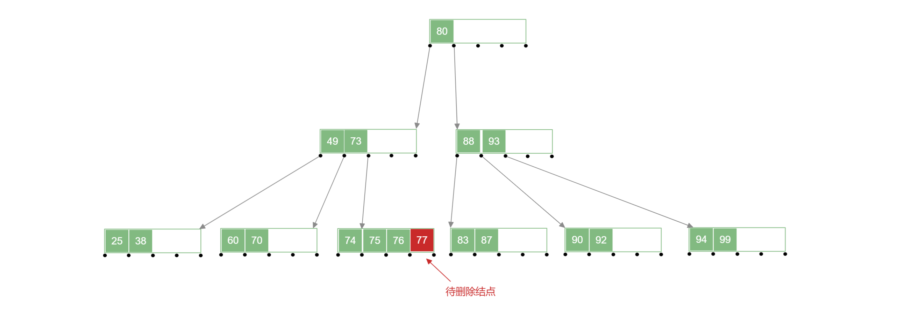
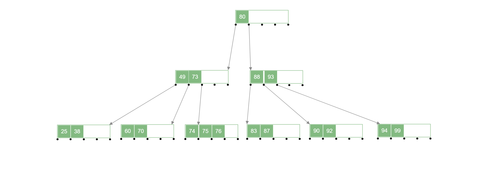
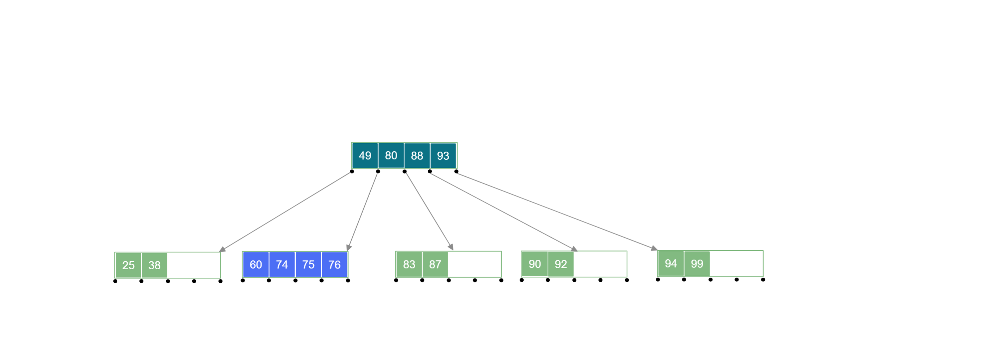
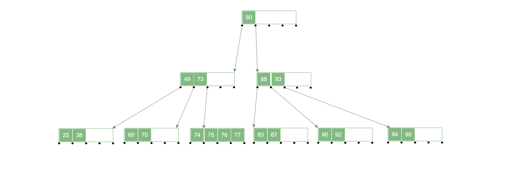
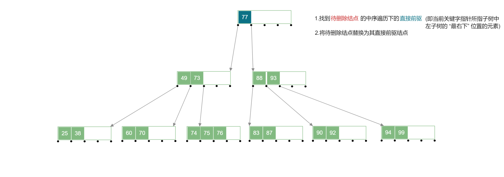
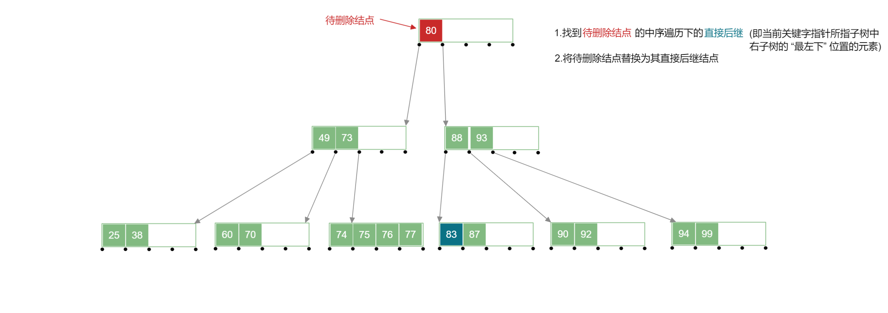
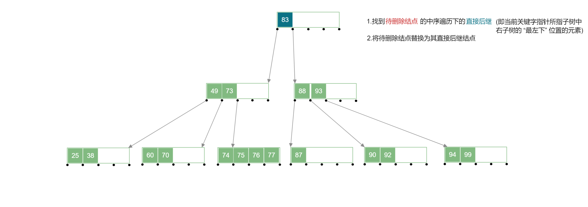

## b树的删除操作

在 b Tree 中进行删除操作需要在删除结点后仍然符合 b Tree 的性质，b Tree 特性的关键为：

1. 对于 $m$ 阶 b Tree ——除根结点外，结点中关键字个数为 $⌈\frac{m}{2}⌉-1≤n≤m-1$ ；
2. b Tree 也是一个 “排序树” ，子树 0 < 关键字 1 < 子树 1 < 关键字 2 …

### 1.删除终端关键字

#### 1.1. 含有的关键字的个数在 $(⌈\frac{m}{2}⌉-1,m-1]$ 区间内

此时直接删除该终端关键字即可，例如下面 b Tree 中删除 $77$ 号关键字.

:::tabs

@tab step1

@tab step2

:::

#### 1.2.含有的关键字的个数 $=⌈\frac{m}{2}⌉-1$ 

此时如果删除其中某个关键字，将会导致该结点不符合 b Tree 的性质，此时需要该关键字所在结点的**父结点**和**兄弟结点**来修复，此时的**兄弟结点中的关键字要够借**才行，左兄弟或者右兄弟中关键字个数需要 $>⌈\frac{m}{2}⌉-1$ 才行

例如：删除下面 b Tree 中的 $70$ 号关键字:

:::tabs

@tab step1

@tab step2

@tab step3

:::

#### 1.3.兄弟结点中关键字不够借

左右兄弟结点含有的关键字的个数 $=⌈\frac{m}{2}⌉-1$ ，此时他们不够借，因为他们借出自己的结点的话会导致自己不满足 b Tree 的性质，此时需要另一种解决方案；

删除待删除关键字后，将其所在结点与 左 (或右) 兄弟结点及双亲结点中的关键字进行合并，合并后需要对下放关键字的双亲结点进行判断，若不满足 b Tree 性质，递归地进行合并操作即可。

例如：删除下面 b Tree 中的 $73$ 号关键字:

:::tabs

@tab step1

@tab step2

@tab step3

@tab step4

:::

### 2.删除非终端关键字

首先通过寻找其中序遍历的直接前驱关键字或者直接后继关键字来进行替代，因为直接前驱或者直接后继关键字都在 “终端结点层” ，所以也就转换为 “终端结点” 中关键字的删除，再按照对应操作进行即可。

【**转换过程**】

在下列 b Tree 中删除 $80$ 号关键字：

- 使用直接前驱结点代替被删除的结点

:::tabs

@tab step1

@tab step2

@tab step3

:::

在下列 b Tree 中删除 $80$ 号关键字：

- 使用直接后继结点代替被删除的结点

:::tabs

@tab step1

@tab step2

@tab step3

:::

