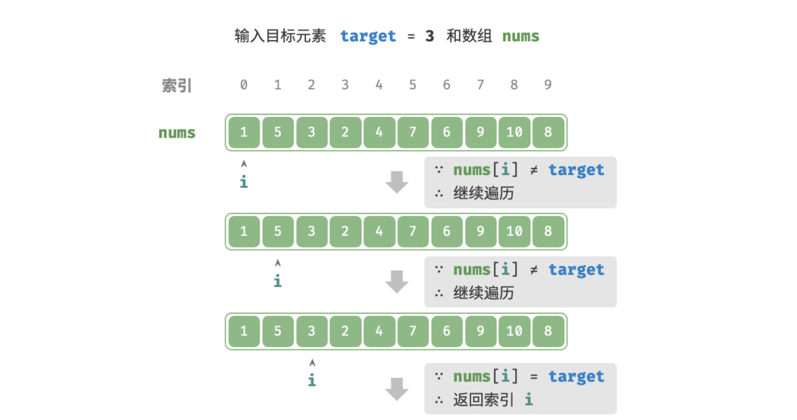
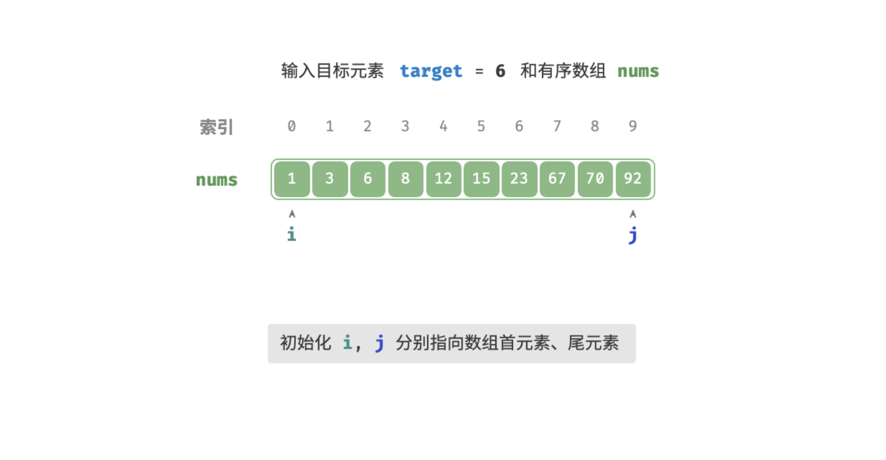
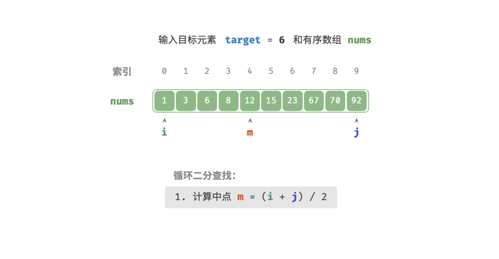
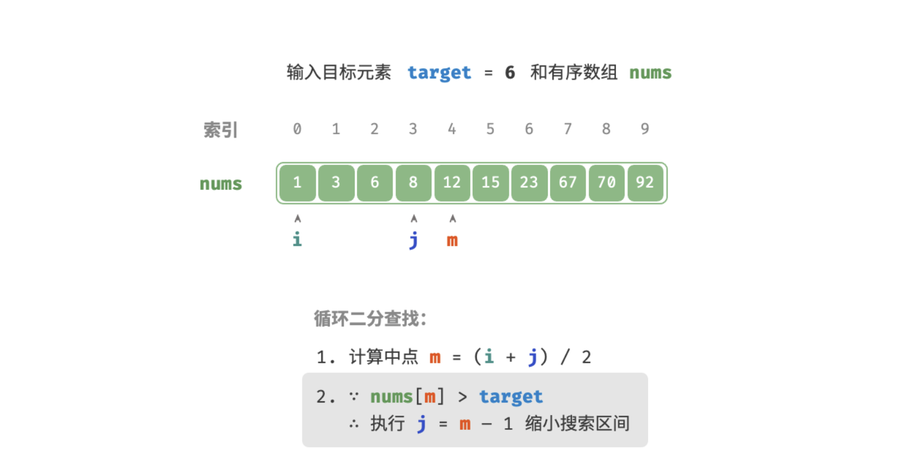
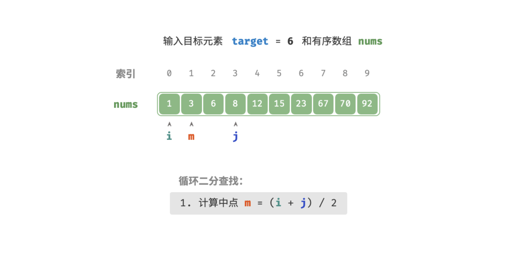
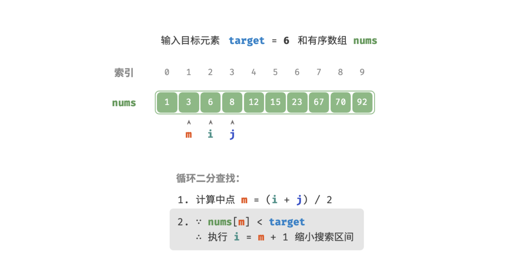
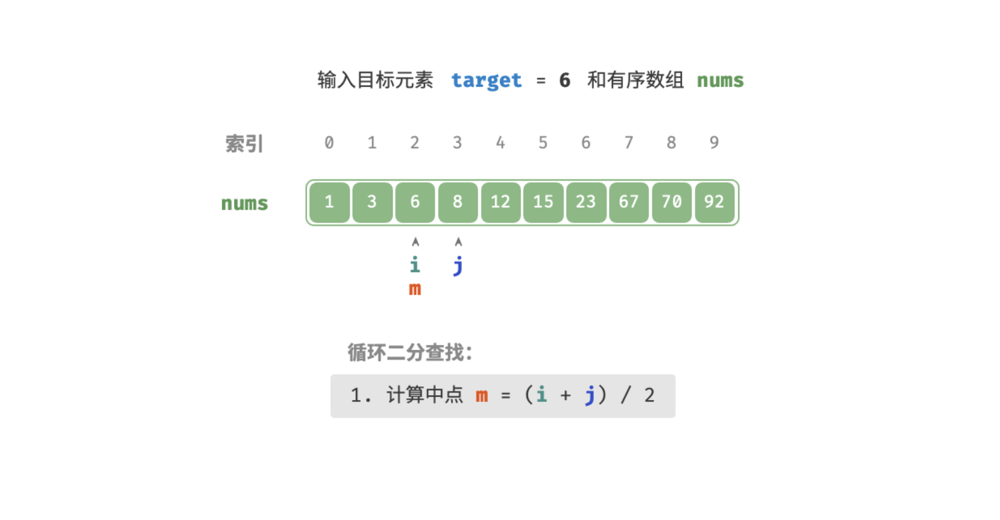
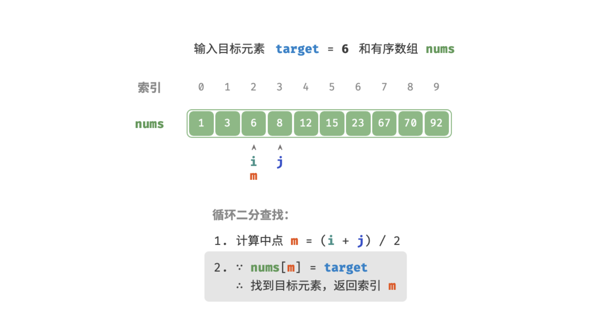
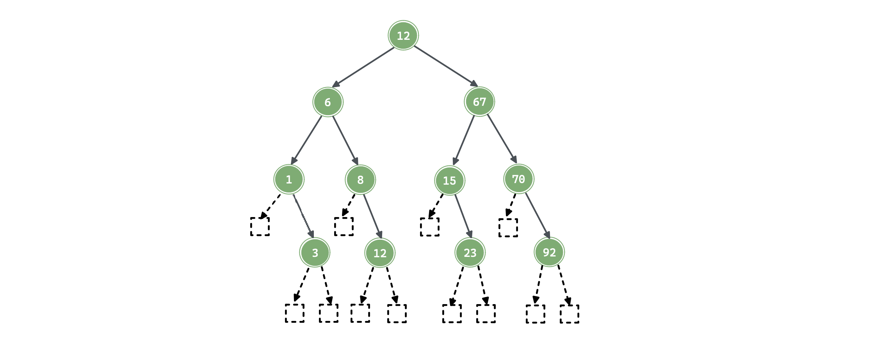
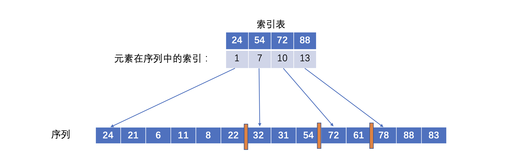

「查找技术」

<!-- more -->

查找是指在数据集合中查找符合某种条件的元素的过程。查找可根据查找过程中的操作分为两类：

1. **静态查找**：查找不成功时，只返回一个不成功的标志，查找的结果不会改变查找集合，也即查找过后不涉及插入或者删除操作；
2. **动态查找**：查找不成功时，需要被将查找的「记录」插入到集合中，所有插入过程可能会改变集合。

> 查找技术中的常用查找结构：

1. 线性表：适用于静态查找，主要采用线性表进行顺序查找，二分查找；
2. 树表：适用于动态查找，主要采用[二叉搜索树](./3.md) ，[AVL树](./5.md)，[B树](./8.md) 等；

3. 散列表：静态查找和动态查找都是适用，主要采用 [哈希表(散列表)](./14.md) 等。

除了上述常用查找技术，还有「索引查找」

1. 分块查找
2. [B+ 树](./8.md)


### 查找中的一些术语

- 「记录 record」是指查找集合中的数据元素；
- 「关键码 key」可以用于标识查找集合中的某个记录；(关键码可能不唯一，也可以有组合关键类，类似于双关键字排序)

### 查找算法的性能

查找算法的基本操作通常是将「记录」和给定值进行比较，所以通常以记录的**平均比较次数**来度量查找算法的平均时间性能，称为：「平均查找长度 ASL」：

- 对于**查找成功**的情况，计算公式如下：

$$
ASL = \sum_{i=1}^{n}p_i \ c_i
$$

$n$ 为问题规模；$p_i$ 为查找出第 $i$ 个记录的概率；$c_i$ 为查找出第 $i$ 个记录所需的比较次数；其中 $p_i$ 与查找的元素是否存在有关，与查找算法无关，而 $c_i$ 与算法有关；若 $p_i$ 已知，则 $ASL$ 就是关于问题规模 $n$ 的函数。

- 对于**查找不成功**的情况，$ASL$ 就是查找失败时的**比较次数**。 

### 线性查找

「线性查找 Linear Search」是一种最基础的查找方法，其从使用的线性数据结构的某一端开始，依次访问每个元素，直到另一端后停止。常用作线性查找的数据结构为：

- 线性表(数组)
- 链表

#### 算法实现

算法也很简单，就是遍历数据结构的同时判断即可，例如：在 `nums` 中查找目标元素 `target` 的对应索引，如下图：



时间复杂度为：$O(n)$

:::code-tabs#language

@tab rust#rust

```rust

```

@tab java#java

```java
/* 线性查找（数组） */
int linearSearchArray(int[] nums, int target) {
  // 遍历数组
  for (int i = 0; i < nums.length; i++) {
    // 找到目标元素，返回其索引
    if (nums[i] == target)
      return i;
  }
  // 未找到目标元素，返回 -1
  return -1;
}
```

@tab c++#c++

```cpp
/* 线性查找（数组） */
int linearSearchArray(vector<int>& nums, int target) {
  // 遍历数组
  for (int i = 0; i < nums.size(); i++) {
    // 找到目标元素，返回其索引
    if (nums[i] == target)
      return i;
  }
  // 未找到目标元素，返回 -1
  return -1;
}
```

:::

当然也可以使用链表进行线性查找：

:::code-tabs#language

@tab rust#rust

```rust

```

@tab java#java

```java
/* 线性查找（链表） */
ListNode linearSearchLinkedList(ListNode head, int target) {
  // 遍历链表
  while (head != null) {
    // 找到目标结点，返回之
    if (head.val == target)
      return head;
    head = head.next;
  }
  // 未找到目标结点，返回 null
  return null;
}
```

@tab c++#c++

```cpp
/* 线性查找（链表） */
ListNode* linearSearchLinkedList(ListNode* head, int target) {
  // 遍历链表
  while (head != nullptr) {
    // 找到目标结点，返回之
    if (head->val == target)
      return head;
    head = head->next;
  }
  // 未找到目标结点，返回 nullptr
  return nullptr;
}
```

:::

#### 性能分析

> 无序线性表下的线性查找

对于 $n$ 个元素的表，给定值 $key$ 与表中第 $i$ 个元素相等，那么定位第 $i$ 个元素的时候，需要进行 $n-i+1$ 次关键字的比较，即 $c_i=n-i+1$；但是如果表中无此元素，则与各关键字的比较次数为 $n-1$ 次。即：

- 查找成功时，$ASL=\sum_{i=1}^{n}p_i(n-i+1)$ ；
- 查找失败时，$ASL = n+1$ 。

**当每个元素的查找概率相等时**：(即 $p_i = \frac{1}{n}$)

- 查找成功时，$ASL=\sum_{i=1}^{n}p_i(n-i+1)=\frac{1}{n}(1+2+...+n-1+n)=\frac{1}{n}\frac{n(n+1)}{2}=\frac{n+1}{2}$;
- 查找失败时，$ASL = n+1$ 。(与 $n$ 个元素比较之后都没找到)

:::info

如果已知每个记录的查找概率，那么就可以根据查找概率对数据进行重排，以得到更好的 $ASL$.

:::

> 有序线性表下的线性查找

- 查找成功时，与无序时一致。
- 查找失败时，并且每个元素的查找概率相等，$ASL=\sum_{j=1}^{n}q_j(l_j-1)=\frac{1+2+...+n+n}{n+1}=\frac{n}{2}+\frac{n}{n+1}$ 。

其中 $q_j$ 表示到达第 $j$ 个失败结点的概率，在相等查找概率的情况下，$q_j=\frac{1}{n+1}$，$l_j$ 表示第 $j$ 个失败结点所在的索引值(从1开始)。例如：当 $n=6$ 时，$ASL_{failure}=\frac{6}{2}+\frac{6}{7}=3.86$ 。

### 二分查找

「二分查找 Binary Search」利用数据有序性，通过每轮缩小一半搜索区间来查找目标元素。

使用二分查找的前置条件：

- **要求输入数据是有序的** (并不严谨)，这样才可以通过判断大小关系来排除一半的搜索区间；
- **二分查找仅适用于数组**，因为在二分查找中需要跳跃式(非连续地)访问元素，而数组支持索引访问，这很合适，但是链表不支持索引访问，所以使用链表效率会很低。

关于使用二分时真正需要满足的条件：「[二段性](../base/4.md)」

#### 算法实现

给定一个长度为 $n$ 的排序数组 `nums` ，元素从小到大排列。数组的索引取值范围为 $0, 1, 2,...,n-1$ .使用「区间」来表示这个取值范围的方法主要有两种：

1. **双闭区间 $[0, n-1]$** :即两个边界都包含自身；此表示下，区间 $[0, 0]$ 仍包含一个元素；
2. **左闭右开 $[0, n)$** : 即左边界包含自身、右边界不包含自身；此表示下，区间 $[0,0]$ 为空。

##### “双闭区间” 实现

查找过程如下图：

:::tabs

@tab Step1



@tab Step2



@tab Step3



@tab Step4



@tab Step5



@tab Step6



@tab Step7



:::

:::code-tabs#language

@tab rust#rust

```rust

```

@tab java#java

```java
/* 二分查找（双闭区间） */
int binarySearch(int[] nums, int target) {
  // 初始化双闭区间 [0, n-1] ，即 l, r 分别指向数组首元素、尾元素
  int l = 0, r = nums.length - 1;
  // 循环，当搜索区间为空时跳出（当 l > r 时为空）
  while (l <= r) {
    int m = (l + r) / 2;       // 计算中点索引 m
    if (nums[m] < target)      // 此情况说明 target 在区间 [m+1, r] 中
        l = m + 1;
    else if (nums[m] > target) // 此情况说明 target 在区间 [l, m-1] 中
        r = m - 1;
    else                       // 找到目标元素，返回其索引
        return m;
  }
  // 未找到目标元素，返回 -1
  return -1;
}
```

@tab c++#c++

```cpp
/* 二分查找（双闭区间） */
int binarySearch(vector<int>& nums, int target) {
  // 初始化双闭区间 [0, n-1] ，即 l, r 分别指向数组首元素、尾元素
  int l = 0, r = nums.size() - 1;
  // 循环，当搜索区间为空时跳出（当 l > r 时为空）
  while (l <= r) {
    int m = (l + r) / 2;       // 计算中点索引 m
    if (nums[m] < target)      // 此情况说明 target 在区间 [m+1, r] 中
        l = m + 1;
    else if (nums[m] > target) // 此情况说明 target 在区间 [l, m-1] 中
        r = m - 1;
    else                       // 找到目标元素，返回其索引
        return m;
  }
  // 未找到目标元素，返回 -1
  return -1;
}
```

:::


##### “左闭右开” 实现

使用“左闭右开”的表示方法，写出相同功能的二分查找代码。

:::code-tabs#language

@tab rust#rust

```rust

```

@tab java#java

```java
/* 二分查找（左闭右开） */
int binarySearch1(int[] nums, int target) {
  // 初始化左闭右开 [0, n) ，即 r, r 分别指向数组首元素、尾元素+1
  int l = 0, r = nums.length;
  // 循环，当搜索区间为空时跳出（当 l = r 时为空）
  while (l < r) {
    int m = (i + j) / 2;       // 计算中点索引 m
    if (nums[m] < target)      // 此情况说明 target 在区间 [m+1, r) 中
      l = m + 1;
    else if (nums[m] > target) // 此情况说明 target 在区间 [l, m) 中
      r = m;
    else                       // 找到目标元素，返回其索引
      return m;
  }
  // 未找到目标元素，返回 -1
  return -1;
}
```

@tab c++#c++

```cpp
/* 二分查找（左闭右开） */
int binarySearch1(vector<int>& nums, int target) {
  // 初始化左闭右开 [0, n) ，即 l, r 分别指向数组首元素、尾元素+1
  int l = 0, r = nums.size();
  // 循环，当搜索区间为空时跳出（当 l = r 时为空）
  while (l < r) {
    int m = (l + r) / 2;       // 计算中点索引 m
    if (nums[m] < target)      // 此情况说明 target 在区间 [m+1, r) 中
      l = m + 1;
    else if (nums[m] > target) // 此情况说明 target 在区间 [l, m) 中
      r = m;
    else                       // 找到目标元素，返回其索引
      return m;
  }
  // 未找到目标元素，返回 -1
  return -1;
}
```

:::

上面两种表示方法的对比：

|      表示方法      | 初始化指针  |   缩小区间    | 循环终止条件 |
| :----------------: | :---------: | :-----------: | :----------: |
| 双闭区间 $[0,n-1]$ | $l=0,r=n-1$ | $l=m+1,r=m-1$ |    $l>r$     |
| 左闭右开 $[0, n)$  |  $l=0,r=n$  |  $l=m+1,r=m$  |    $l=r$     |

:::info 大数越界问题

当数组长度很大时，加法 $l+r$ 的结果有可能会超出 `int` 类型的取值范围。在此情况下，需要换一种计算中点的写法。

```cpp
// (i + j) 有可能超出 int 的取值范围
int m = (l + r) / 2;
// 更换为此写法则不会越界
int m = l + (r - l) / 2;
```

:::

【优缺点】

二分查找效率很高，体现在：

- **二分查找时间复杂度低**。对数阶在数据量很大时具有巨大优势，例如，当数据大小 $n=2^{20}$ 时，线性查找需要 $2^{20}=1048576$ 轮循环，而二分查找仅需要 $log_2⁡2^{20}=20$ 轮循环。
- **二分查找不需要额外空间**。相对于借助额外数据结构来实现查找的算法来说，其更加节约空间使用。

但并不意味着所有情况下都应使用二分查找，这是因为：

- **二分查找仅适用于有序数据**。如果输入数据是无序的，为了使用二分查找而专门执行数据排序，那么是得不偿失的，因为排序算法的时间复杂度一般为 $O(nlog⁡n)$ ，比线性查找和二分查找都更差。再例如，对于频繁插入元素的场景，为了保持数组的有序性，需要将元素插入到特定位置，时间复杂度为 $O(n)$ ，也是非常昂贵的。
- **二分查找仅适用于数组**。由于在二分查找中，访问索引是 “非连续” 的，因此链表或者基于链表实现的数据结构都无法使用。
- **在小数据量下，线性查找的性能更好**。在线性查找中，每轮只需要 1 次判断操作；而在二分查找中，需要 1 次加法、1 次除法、1 ~ 3 次判断操作、1 次加法（减法），共 4 ~ 6 个单元操作；因此，在数据量 n 较小时，线性查找反而比二分查找更快。

#### 性能分析

二分查找的过程中可以使用 [平衡的二叉搜索树(AVL)](./5.md) 来表示，下面的二叉搜索树为双闭区间构建过程，需要注意的是：

- 对于一个有序序列，**二叉搜索树并不唯一**，只需要满足其中序遍历即可；
- 二分查找的过程，其构建的是 **二分判定树** ，其本身就是一颗平衡的二叉搜索树，**并且其表示法唯一**。其唯一性是因为其构建过程中的 `mid` 一直是向下取整这一种策略。



可以看到，使用二分查找给定值时的比较次数最多不会超过树的「层数 h」，在查找每个元素的概率相等时：

- 查找成功时：$ASL=\frac{1}{n}(1×1+2×2+...+h×2^{h-1})=\frac{n+1}{n}log_2(n+1)≈log_2(n+1)-1$；
- 查找失败时：$ASL=\frac{1}{n+1}(\sum_{i=2}^{h}(h_i-1)×d_i)$ ，其中 $d_i$ 表示第 $h_i-1$ 层中查找不成功的结点个数。

如上图中：

- 查找成功时：$ASL=\frac{1}{11}(1×1+2×2+3×4+4×4) = \frac{28}{11}$;
- 查找失败时：$ASL = \frac{1}{12}(3×4+4×8)=\frac{11}{3}$  

:::info

当元素为 $n$ 个时，二分查找所得到的二分判定树的「层数 h」为: $⌈ log_2(n+1)⌉$ 。

:::


:::details 各种二分实现方式

```cpp
#include <iostream>
using namespace std;

int n = 7;
int a[] = {1, 4, 5, 9, 23, 23, 89, 100};

// 双闭区间 [l, r] 查找某个值是否存在
bool bsearch(int x) {
    int l = 0, r = n - 1;
    while (l <= r) {
        int mid = (l + r) >> 1;
        if (a[mid] == x) return true;
        else if (a[mid] > x) r = mid - 1;
        else l = mid + 1;
    }
    return false;
}

// 双闭区间 [l, r] 查找某个值是否存在 (递归写法)
bool rec_bsearch(int x, int l, int r) {
    if (l > r) return false;
    int mid = (l + r) >> 1;
    if (a[mid] == x) return true;
    else if (a[mid] > x) rec_bsearch(x, l, mid - 1);
    else rec_bsearch(x, mid + 1, r);
}

// 左闭右闭区间 [l, r] 寻找 >= x 的最小值的索引
int bsearch1(int x) {
    int l = 0, r = n - 1;
    while (l <= r) {
        int mid = l + r >> 1;
        if (a[mid] >= x) r = mid - 1;
        else l = mid + 1;
    }
    return l;
} 

// 左开右闭区间 [l, r) 寻找 >= x 的最小值的索引
int bsearch2(int x) {
    int l = 0, r = n;
    while (l < r) {
        int mid = l + r >> 1;
        if (a[mid] >= x) r = mid;
        else l = mid + 1;
    }
    return l;
} 

// 左开右开区间 (l, r) 寻找 >= x 的最小值的索引
int bsearch3(int x) {
    int l = -1, r = n;
    while (l + 1 < r) {
        int mid = l + r >> 1;
        if (a[mid] >= x) r = mid;
        else l = mid;
    }
    return r;
}

int main() {
    int x = 9;
    cout << bsearch(x) << endl;
    cout << rec_bsearch(x, 0, n - 1) << endl;
    cout << bsearch1(x) << endl;
    cout << bsearch2(x) << endl;
    cout << bsearch3(x) << endl;
    return 0;
}
```

:::


### 分块查找

分块查找又称为「索引顺序查找」，其集合了顺序查找和二分查找各自的优点，既有动态结构，又适用于快速查找。

【基本思想】

- 将查找表分为若干块，块内元素可以**无序**，但是块**之间是有序**的。
- 块之间有序是指每个块的选出的代表组成的「索引序列」是有序的。
- 每个块的代表可以时该块中的「最小值」或者「最大值」，一般选择最大值作为代表。

【查找过程】

1. 查找索引序列，确定元素所在的块；(可以使用顺序查找，也可以使用折半查找)
2. 然后在块内顺序查找。(由于块内无序，所以只能用顺序查找)

例如：对序列 $\{24, 21, 6, 11, 8, 22, 32, 31, 54, 72, 61, 78, 88, 83 \}$ 建立索引表，索引表中存储每个块的【**最大元素以及该块内第一个元素的索引值**】。




