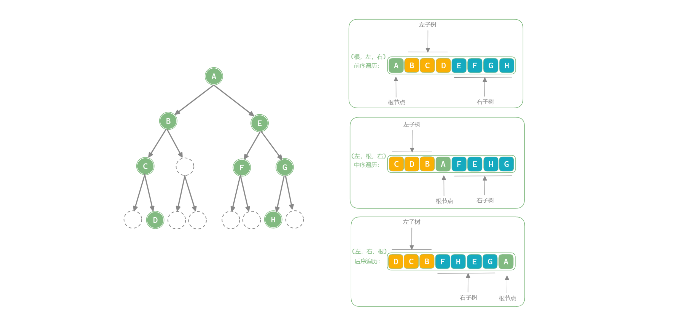

「二叉树 Binary Tree」

<!--more-->

#### 二叉树的定义及主要特征

二叉树是一种特殊的树型结构，其特点有：

- 每个结点**至多有两颗子树** ( 即不存在度大于 $2$ 的结点 )
- 二叉树的子树有左右之分，其次序是不能任意颠倒。( 若将二叉树的左、右子树颠倒，其会变为另一颗二叉树 )

:::warning 区分二叉树与度为 2 的树

- 二叉树并不是度为 $2$ 的树，二叉树上的结点的度可以是 $0,1,2$ 。

:::

## 二叉树常用术语

- 「根结点 Root Node」：二叉树最顶层的结点，其没有父结点；
- 「叶结点 Leaf Node」：没有子结点的结点，其两个指针都指向 `null` ；
- 结点所处「层 Level」：从顶置底依次增加，根结点所处层为 $1$ ；
- 结点「度 Degree」：结点的子结点数量，二叉树中度的范围是 $0, 1, 2$ ；
- 「边 Edge」：连接两个结点的边，即结点指针；
- 二叉树「高度 、深度」：二叉树中根结点到最远叶结点走过**边**的数量；(根 — 叶)
- 结点「深度 Depth」 ：根结点到该结点走过边的数量；(根 — 结点)
- 结点「高度 Height」：最远叶结点到该结点走过边的数量；(结点 — 叶)


:::info 高度和深度的定义

高度和深度的定义并不只有 **“边”** 的定义，也有以 **“节点个数”** 定义的，所以当以节点个数作为定义时，需要在以边为标准的基础上 + 1.

:::

## 常见二叉树

### 完美二叉树（满二叉树）

​		「完美二叉树 Perfect Binary Tree」的所有层的结点都被完全填满。在完美二叉树中，所有结点的度 = 2 ；若树高度 = $h$ ，则结点总数 = $2^{h+1}-1$ ，呈标准的指数级关系。


### 完全二叉树

「完全二叉树 Complete Binary Tree」只有最底层的结点未被填满，且最底层结点尽量靠左填充。


**完全二叉树非常适合用数组来表示**。如果按照**层序遍历**序列的顺序来存储，那么空结点 `null` 一定全部出现在序列的尾部，因此我们就可以不用存储这些 `null` 了。

### 完满二叉树

「完满二叉树 Full Binary Tree」除了叶结点之外，其余所有结点都有两个子结点。


### 平衡二叉树

「平衡二叉树 Balanced Binary Tree」中任意结点的左子树和右子树的高度之差的绝对值 $≤1$ 。


## 二叉树的退化

当二叉树的每层的结点都被填满时，达到「完美二叉树」；而当所有结点都偏向一边时，二叉树退化为「链表」。

- 完美二叉树是一个二叉树的“最佳状态”，可以完全发挥出二叉树“分治”的优势；
- 链表则是另一个极端，各项操作都变为线性操作，时间复杂度退化至 $O(n)$ ；


完美二叉树和退化为链表的二叉树的叶结点数量、结点总数、高度等达到极大或极小值。

|                                   |    完美二叉树    | 链表  |
| :-------------------------------: | :--------------: | :---: |
|       **第 $i$ 层**结点数量       |    $2^{i-1}$     |  $1$  |
| 树的高度为 $h$ 时**叶节点**的数量 |      $2^h$       |  $1$  |
|  树的高度为 $h$ 时**节点**的数量  |   $2^{h+1}-1$    | $h+1$ |
|  树的结点总数为 $n$ 时的**深度**  | $⌊log_2(n+1)⌋-1$ | $n-1$ |

## 二叉树的基本特征

二叉树也是树，而树是 **无环连通图** ，所以有 $n$ 个结点的树，其边的数量 $B = n-1$ . 

1. 非空二叉树上的叶子结点数等于度为 $2$ 的结点数加 $1$ ，即 $n_0 = n_2 + 1$.
2. 对一颗具有 $n$ 个结点的完全二叉树中的结点从 $1$ 开始按层序编号，则对于任意的编号为 $i(1≤i≤n)$ 的结点有：
   - 如果 $i>1$ ，则结点 $i$ 的双亲的编号为 $⌊\frac{i}{2}⌋$ ；否则结点 $i$ 为根节点.
   - 如果 $2i ≤ n$ ，则结点 $i$ 的左孩子的编号为 $2i$ ，否则结点 $i$ 无左孩子.
   - 如果 $2i+1≤ n$ ，则结点 $i$ 的右孩子的编号为 $2i+1$ ，否则结点 $i$ 无右孩子.
   - 结点所在的深度为 $⌊log_2(i+1)⌋+1$ .


::: details 对性质的推导

- 性质 1 的证明：

一颗二叉树的结点总数 $n = n_0+n_1+n_2$ ，边的总数 $B = n -1 = n_1 + 2n_2$ ，所以得：$n_0+n_1+n_2=n_1+2n_2+1$ . 即：$n_0=n_2+1$.


:::


## 二叉树的表示方式

### 1.数组表示

使用普通数组存储二叉树时，不能直接在结点中存储结点之间的关系，需要推导父结点索引与子结点索引的「映射公式」：**设结点的索引为 $i$ ，则该结点的左子结点索引为 $2i+1$ 、右子结点索引为 $2i+2$** 。

例如数组存储满二叉树：


但是满二叉树的并不常见，要想使用使用数组存储其他类型的二叉树，就必然存在 `null` 值，即需要将一颗不是满二叉树的二叉树用**空结点**填充为一颗满二叉树。如下图：


对于**完全二叉树**来说，其虽然有**空结点**，但是由于使用层序遍历的顺序存储的原因，这些空结点都在数组的结尾，这使得可以直接不对其进行存储，所以使用数组表示完全二叉树更加合适。


### 2.链表表示


## 二叉树的遍历

### 层序遍历

「层序遍历 Hierarchical-Order Traversal」从顶至底、一层一层地遍历二叉树，并在每层中按照从左到右的顺序访问结点。层序遍历本质上是「广度优先遍历 Breadth-First Traversal」.


:::code-tabs#language

@tab rust#rust

```

```

@tab java#java

```

```

@tab c++#c++

```

```

:::

### 前序、中序、后序遍历

相对地，前、中、后序遍历皆属于「深度优先遍历 Depth-First Traversal」，即每次搜索会直接搜索到叶子结点，然后再回溯去搜索其他的结点。

如下图所示，左侧是深度优先遍历的的示意图，右上方是对应的递归实现代码。深度优先遍历就像是绕着整个二叉树的外围“走”一圈，走的过程中，在每个结点都会遇到三个位置(即是向下继续搜索左子结点、右子结点或是回溯到父结点)，分别对应前序遍历、中序遍历、后序遍历。


|    位置    |                 含义                 |      此处访问结点时对应       |
| :--------: | :----------------------------------: | :---------------------------: |
| 橙色圆圈处 | 刚进入此节点，即将访问该结点的左子树 | 前序遍历 Pre-Order Traversal  |
| 蓝色圆圈处 |    已访问完左子树，即将访问右子树    |  中序遍历 In-Order Traversal  |
| 紫色圆圈处 |   已访问完左子树和右子树，即将返回   | 后序遍历 Post-Order Traversal |

#### 由遍历序列确认二叉树

- 前序 / 后序遍历和中序遍历可以唯一确定一颗二叉树
- 前序遍历和后序遍历**不能**唯一确定一颗二叉树



【求解一颗二叉树某一遍历顺序序列】

这三种序列都是从根节点开始的深搜序列，根据其选择的优先级顺序，例如前序遍历为 `(根,左,右)` (这是根，左，右是相对而言的，不是整颗树的)，思考过程如下：

1. 首先是到 `A` (根)结点，是 “根” ，入序列，然后根据 `(根,左,右)` 原则遍历该 “根结点” 的 “左” 结点，
2. 来到左节点 `B` , 是 “左” ，入序列，因为是深度优先，所以继续根据 `(根,左,右)` 原则向下遍历以 `B` 为 “根” 的子树，直至以 `B` 为 “根” 的子树遍历完毕，
3. 对于 `A` (根)结点来说，`(根,左)` 已经遍历完毕，然后继续遍历 “右” ，即来到 `E` ,是 “右” ，入序列，然后继续前序遍历原则直接所有结点遍历结束.

【根据前序 / 后序遍历和中序遍历唯一确定一颗二叉树】


:::code-tabs#language

@tab rust#rust

```

```

@tab java#java

```java {5,15,24}
/* 前序遍历 */
void preOrder(TreeNode root) {
    if (root == null) return;
    // 访问优先级：根结点 -> 左子树 -> 右子树
    list.add(root.val);
    preOrder(root.left);
    preOrder(root.right);
}

/* 中序遍历 */
void inOrder(TreeNode root) {
    if (root == null) return;
    // 访问优先级：左子树 -> 根结点 -> 右子树
    inOrder(root.left);
    list.add(root.val);
    inOrder(root.right);
}

/* 后序遍历 */
void postOrder(TreeNode root) {
    if (root == null) return;
    // 访问优先级：左子树 -> 右子树 -> 根结点
    postOrder(root.left);
    postOrder(root.right);
    list.add(root.val);
}
```

@tab c++#c++

```cpp {5,15,24}
/* 前序遍历 */
void preOrder(TreeNode* root) {
    if (root == nullptr) return;
    // 访问优先级：根结点 -> 左子树 -> 右子树
    vec.push_back(root->val);
    preOrder(root->left);
    preOrder(root->right);
}

/* 中序遍历 */
void inOrder(TreeNode* root) {
    if (root == nullptr) return;
    // 访问优先级：左子树 -> 根结点 -> 右子树
    inOrder(root->left);
    vec.push_back(root->val);
    inOrder(root->right);
}

/* 后序遍历 */
void postOrder(TreeNode* root) {
    if (root == nullptr) return;
    // 访问优先级：左子树 -> 右子树 -> 根结点
    postOrder(root->left);
    postOrder(root->right);
    vec.push_back(root->val);
}
```

:::


## 线索二叉树

「线索二叉树 Thread Binary Tree」利用二叉树中未被利用的指针表示某种遍历序列中前驱和后序信息的二叉树。

一般的链表存储二叉树时只存储结点之间的父子关系，对于 $n$ 个结点的二叉树来说，每个结点都有左右两个指针，共有 $2n$ 个，而父子关系 (二叉树中的边) 共有 $n-1$ ，所以还剩 $n+1$ 的指针没有表示任何关系 (未被利用)，所以引入线索二叉树的原因是加快查找某种遍历序列下结点的前驱和后继，从而通过某种遍历顺序下结点的前驱和后继直接进行某种顺序的遍历。

线索二叉树的结点表示信息如下：


### 中序线索二叉树


### 前序线索二叉树


### 后序线索二叉树


### 层序线索二叉树


