「二叉搜索树 Binary Search Tree」

<!-- more -->

「二叉搜索树 Binary Search Tree」满足以下特点：

1. 对于根结点，左子树中所有结点的值 < 根结点的值 < 右子树中所有结点的值；
2. 任意结点的左子树和右子树也是二叉搜索树，即也满足条件 `1.` ；
3. 对于某个序列，其构建的二叉搜索树并不唯一；只需满足中序遍历有序即可。

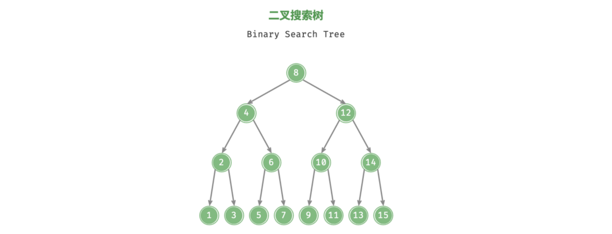

:::code-tabs#language

@tab rust#rust

```rust
/// 二叉搜索树结点
#[derive(Debug)]
pub struct TreeNode<T: Ord + Clone>{
	value: T,
	left: Option<Box<TreeNode<T>>>,
	right: Option<Box<TreeNode<T>>>,
}
impl<T: Ord + Clone> TreeNode<T> {
	/// 创建一个新结点
	pub fn new(val: T) -> Self {
		TreeNode { value: val, left: None, right: None }	
	}
}

/// 二叉搜索树
#[derive(Debug)]
pub struct BinarySearchTree<T: Ord + Clone> {
	/// 二叉搜索树根结点
	root: Option<Box<TreeNode<T>>>,
}

impl<T: Ord + Clone> BinarySearchTree<T>{
  /// 创建一颗空的二叉搜索树
	pub fn new() -> Self {
		BinarySearchTree { root: None }
	}
	/// 从结点值数组构建二叉搜索树
	pub fn from(&mut self,nodes: &mut Vec<Option<T>>) {
		nodes.sort();
		self.root = build_tree(nodes, 0, (nodes.len() - 1) as isize);
	}
}
/// 递归地构建二叉搜索树
fn build_tree<T: Ord + Clone>( nodes: &mut Vec<Option<T>>,l: isize, r: isize) -> Option<Box<TreeNode<T>>>{
	if l > r { return None; }    // 递归边界
  let mut mid = l + r >> 1;
  let mut cur_root = Some(Box::new(TreeNode::new(nodes[mid as usize].clone())));
  let mut native_root = cur_root.as_mut().unwrap();
  native_root.left = Self::build_tree(nodes, l, mid - 1);    // 递归构建左子树
  native_root.right = Self::build_tree(nodes, mid + 1, r);   // 递归构建右子树
  return cur_root;
}
```

@tab java#java

```java
// 二叉搜索树结点
class TreeNode<T extends Comparable<T>> {
  public T value;             // 结点值
  public TreeNode<T> left;    // 左子结点
  public TreeNode<T> right;   // 右子结点

  public TreeNode(T value) {
    this.value = value;  
  }
}

class BinarySearchTree<T extends Comparable<T>> {
  private TreeNode<T> root;
  /**
   * 构建二叉搜索树
   * @param nodes 原始无序数组 (存储的是结点中的 值 ,即 TreeNode.value )
   */
  public BinarySearchTree(T[] nodes) {
    Arrays.sort(nodes);
    this.root = buildTree(nodes, 0, nodes.length - 1);
  }

  /**
   * @return 二叉树的根结点
   */
  public TreeNode<T> getRoot() {
    return this.root;
  }

  /**
   * 根据有序数组构建二叉树搜索树
   * @param nodes 有序的结点数组
   * @param begin 结点数组起始索引
   * @param end   结点数组末尾索引
   * @return 二叉搜索树的根结点
   */
  public TreeNode<T> buildTree(T[] nodes, int begin, int end) {
    if (begin > end) return null;
    // nodes[mid] 作为根结点
    int mid = (begin + end) / 2;
    TreeNode<T> root = new TreeNode<>(nodes[mid]);
    // 递归构建左子树和右子树
    root.left = buildTree(nodes, begin, mid - 1);
    root.right = buildTree(nodes, mid + 1, end);
    return root;
  }
}
```

@tab c++#c++

```cpp
// 二叉搜索树结点
template <typename T>
struct TreeNode {
  T value;            // 结点值
  TreeNode<T> *left;  // 左子结点
  TreeNode<T> *right; // 右子结点
  TreeNode() = default;
  explicit TreeNode(T x, TreeNode<T> *left = nullptr, TreeNode<T> *right = nullptr)
    : value(x), left(left), right(right) {}
};
// 二叉搜索树
template<typename T>
class BinarySearchTree {
public:
  TreeNode<T> *root;// 二叉搜索树根结点
 
  /**
   * @brief 从数组中构建一颗二叉搜索树
   * @param nodes 结点数组
   */
  explicit BinarySearchTree(vector<T> nodes) {
    sort(nodes.begin(), nodes.end());
    root = buildTree(nodes, 0, nodes.size() - 1);
  }
  /**
   * @brief 递归地构建二叉搜索树
   * @param nodes 排好序的数组
   * @param begin 开始索引
   * @param end   结束索引
   * @return TreeNode<T>* 相对 “根结点”
   */
  TreeNode<T> *buildTree(vector<T> nodes, int begin, int end) {
    if (begin > end) return nullptr;
    int mid = (begin + end) / 2;
    auto *root = new TreeNode<T>(nodes[mid]);
    root->left = buildTree(nodes, begin, mid - 1);
    root->right = buildTree(nodes, mid + 1, end);
    return root;
  }

  TreeNode<T> *getRoot() {
    return this->root;
  }
}
```

:::

## 二叉搜索树的操作

### 查找结点

给定目标结点 `node` ，可以根据二叉搜索树的性质来查找。声明一个结点 `cur` ，从二叉树的根结点 `root` 出发，循环比较结点值 `cur.value` 和 `node.value` 之间的大小关系.

- 若 `cur.value < node.value` ，说明目标结点在 `cur` 的右子树中，因此执行 `cur = cur.right` ；
- 若 `cur.value > node.value` ，说明目标结点在 `cur` 的左子树中，因此执行 `cur = cur.left` ；
- 若 `cur.value = node.value` ，说明找到目标结点，跳出循环并返回该结点即可；

:::tabs

@tab step1

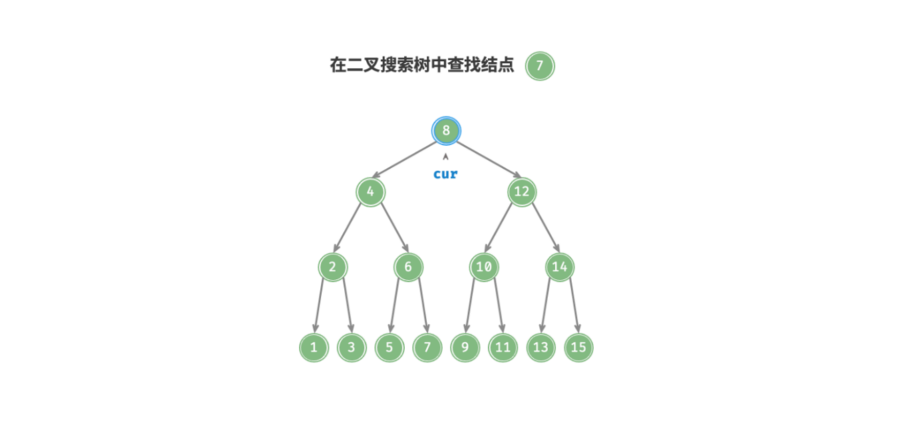

@tab step2

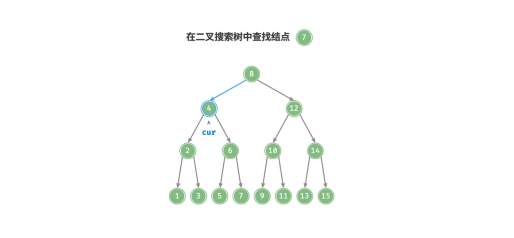

@tab step3

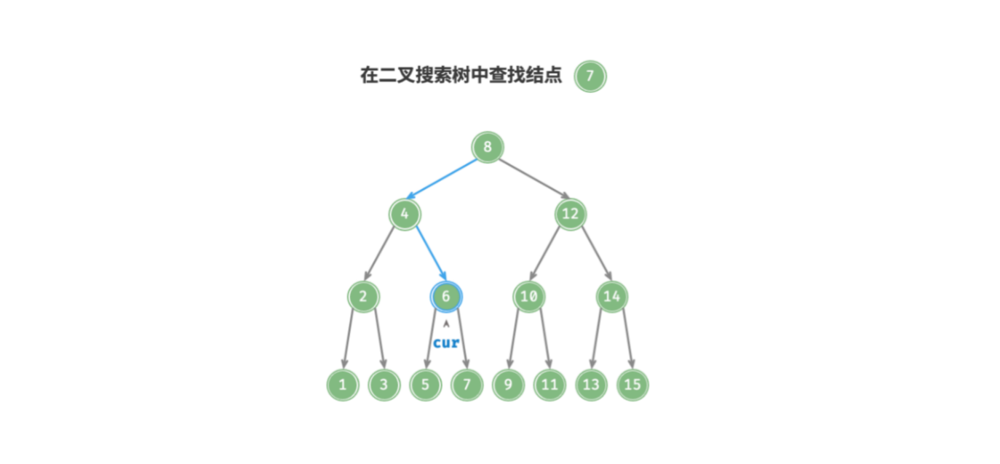

@tab step4

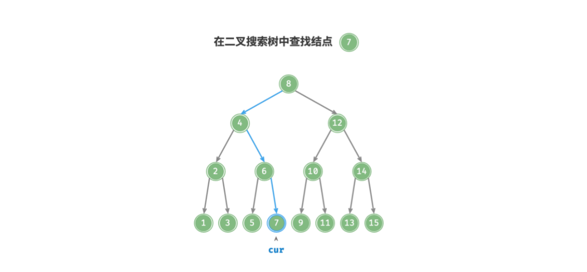

:::

二叉搜索树的查找操作就像二分查找一样，每次折半。循环次数最多为二叉树的高度，**当二叉树平衡时**，时间复杂度为 $O(log \ n)$ .

:::code-tabs#language

@tab rust#rust

```rust
impl<T: Ord + Clone> BinarySearchTree<T>{
  /// 查找结点值,
  pub fn search(&mut self, value: &T) -> bool {
    let mut cur = &self.root;
    while let Some(node) = cur {
      cur = match value.cmp(&node.value) {
        Ordering::Equal => return true,     // 已找到
        Ordering::Less => &node.left,       // 左子树中
        Ordering::Greater => &node.right,   // 右子树中
      }
    }
    false
  }
}
```

@tab java#java

```java
/**
 * 查找结点
 * @param node 查找的目标结点
 * @return 是否找到
 */
public boolean search(TreeNode<T> node) {
  if (root == null) return false;
  TreeNode<T> cur = root;
  while (cur != null && node != null) {
    if (cur.value.compareTo(node.value) < 0)      // 目标结点的值大于根结点的值, 在右子树中
      cur = cur.right;
    else if (cur.value.compareTo(node.value) > 0) // 目标结点的值小于根结点的值, 在左子树中
      cur = cur.left;
    else           // 找到目标结点, 跳出循环
      return true;
  }
  return false;
}
```

@tab c++#c++

```cpp
/**
 * @brief 查找结点
 * @param value 被查找的结点值
 * @return 是否找到
 */
bool search(T value) {
  if (root == nullptr) return false;
  TreeNode<T> *cur = root;
  while (cur != nullptr) {
    if (value > cur->value) cur = cur->right;
    else if (value < cur->value) cur = cur->left;
    else return true;
  }
  return false;
}

/* 递归查找某个结点 */
bool search_rec(TreeNode<T>* cur, T value) {
  if (cur == nullptr) return false;
  if (value > cur->value) return search_rec(cur->right, value);
  else if (value < cur->value) return search_rec(cur->left, value);
  else return true;
}
```

:::


### 插入结点

给定一个待插入结点 `node` ，为了保持二叉搜索树 “左子树 < 根结点 < 右子树” 的性质，插入操作分为两步：

1. **查找插入位置：** 与查找操作类似，从根结点出发，根据当前结点值和 `node.value` 的大小关系循环向下搜索，直到越过叶结点（遍历到 $null$）时跳出循环；
2. **在该位置插入结点：** 将该结点放到查到的 $null$ 位置 ；

二叉搜索树不允许存在重复结点，否则将会违背其定义。因此若待插入结点在树中已经存在，则不执行插入，直接返回即可.

【寻找结点的有两种策略】：

1. 「非递归」: 如果使用非递归，那么需要借助 **辅助结点 `pre`** 保存上一轮循环的结点，这样在遍历到 $null$ 时，也可以获取到其父结点，然后将该结点插入到其父结点上，从而完成结点插入操作。

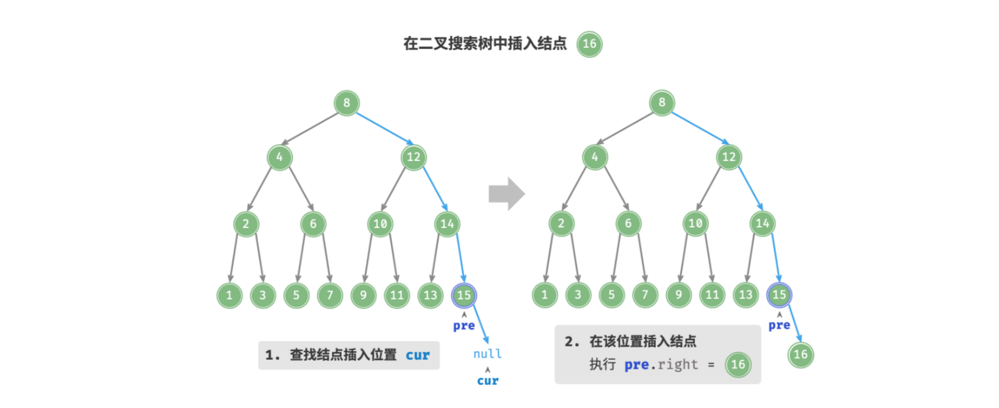

2. 「递归」: 若使用的递归的话，每次进入函数的都是树中的结点或者 $null$ 结点，此时该层递归的上一层的结点就是当前层结点的父结点，所以**不再需要记录父结点**；在递归到符合条件为 $null$ 结点时；直接对其进行赋值即可。

与查找结点相同，**当二叉树平衡时**，插入结点的时间复杂度为: $O(log \ n)$.

:::code-tabs#language

@tab rust#rust

```rust
impl<T: Ord + Clone> BinarySearchTree<T>{
  /// 插入结点值
  pub fn insert(&mut self, value: T) -> bool{
    insert_helper(&mut self.root, value)
  }
}
/// 插入辅助函数 (递归插入)
fn insert_helper<T: Ord + Clone>(tree: &mut Option<Box<TreeNode<T>>>, value:T ) -> bool {
  if let Some(node) = tree {
    let inserted = match value.cmp(&node.value) {
      Ordering::Equal => false,         // 结点已存在
      Ordering::Less => insert_helper(&mut node.left, value),    // 应插入左子树
      Ordering::Greater => insert_helper(&mut node.right, value),// 应插入右子树
    };
    inserted
  }else {                                  // 找到待插入结点的位置,将其插入
    *tree = Some(Box::new(TreeNode{
      value,
      left: None,
      right: None,
    }));
    true
  }
}
```

@tab java#java

```java
/**
 * 插入结点
 * @param node 需要被插入的结点
 * @return 插入是否成功
 */
public boolean insert(TreeNode<T> node) {
  if (this.root == null) {
  	root = node;
    return true;
  }
  TreeNode<T> cur = this.root;
  TreeNode<T> pre = null;
  // 查找结点位置
  while (cur != null) {
    if (cur.value.compareTo(node.value) == 0) // 结点已经存在, 直接返回
      return false;
    pre = cur;                  // 记录当前结点, 便于后序的插入
    if (cur.value.compareTo(node.value) < 0)  // 插入位置在当前结点的右子树
      cur = cur.right;
    else                                      // 插入位置在当前结点的左子树
      cur = cur.left;
  }
  // 插入该结点
  if (pre.value.compareTo(node.value) < 0)
    pre.right = node;
  else
    pre.left = node;
  return true;
}
```

@tab c++#c++

```cpp
/**
 * @brief 插入一个结点 (非递归)
 * @param value 结点值
 * @return 插入是否成功
 */
bool insert(T value) {
  if (root == nullptr) {
    root = new TreeNode(value);
    return true;
  };
  TreeNode<T> *cur = root;
  TreeNode<T> *pre = nullptr;
  // 查找结点位置
  while (cur != nullptr) {
    if (cur->value == value) return false;
    pre = cur;                 // 记录上一结点,便于插入
    if (cur->value > value) cur = cur->left;
    else cur = cur->right;
  }
  // 插入结点
  TreeNode<T> *node = new TreeNode<T>(value);
  if (pre->value < value) pre->right = node;
  else pre->left = node;
  return true;
}
/* 递归地插入结点 */
bool insert_rec(TreeNode<T>*& cur, T value) {
    // 找到待插入结点应该插入的位置
    if (cur == nullptr) {
      cur = new TreeNode<T>(value);
      return true;
    }
    if (value > cur->value) return insert_rec(cur->right, value);
    else if (value < cur->value) return insert_rec(cur->left, value);
    else return false;          // 结点已存在
}
```

:::


### 删除结点

【基本思路】

与插入结点一样，需要在删除操作后维持二叉搜索树的 “左子树 < 根结点 < 右子树” 的性质。首先，在二叉树中执行查找操作，获取待删除结点。根据待删除结点的**子结点数量**，删除操作需要分为三种情况：

1. **待删除结点的子结点数量 = $0$ .** 表明待删除结点是叶结点，直接删除即可。

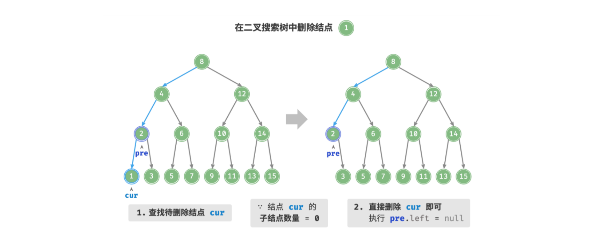

2. **待删除结点的子结点数量 = $1$ .** 将待删除结点替换为其子结点。

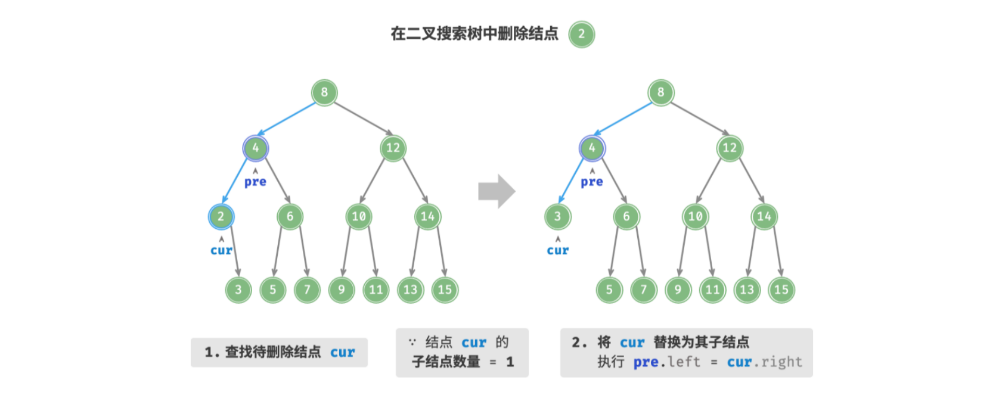

3. **待删除结点的子结点数量 = $2$ .** 删除操作分为三步：
   1. 找到待删除结点在 **中序遍历序列** 中的下一个结点，记为 `next` ；
   2. 中序后继一定没有左子结点， 可视其为「情况2.」；所以在树中递归删除结点 `next` 即可；
   3. 使用 `next` 替换待删除结点；

:::tabs

@tab setp1

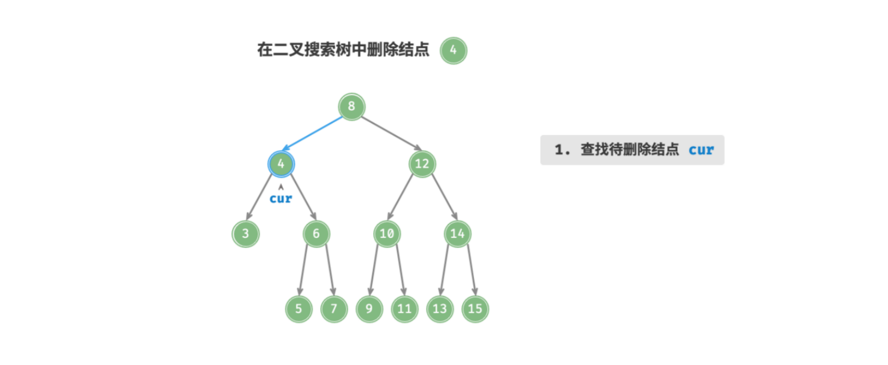

@tab setp2

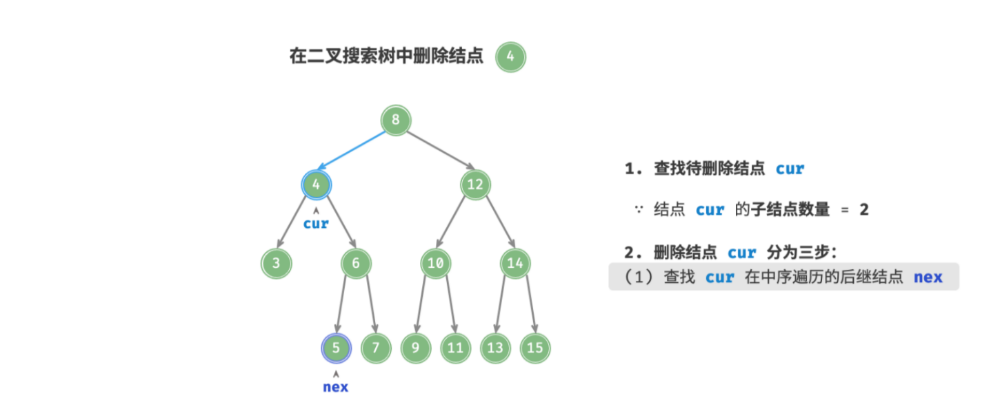

@tab setp3

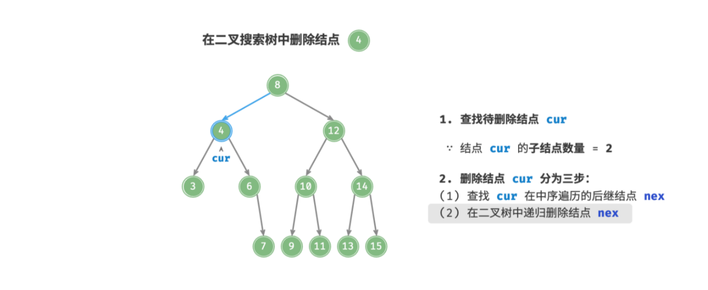

@tab setp4

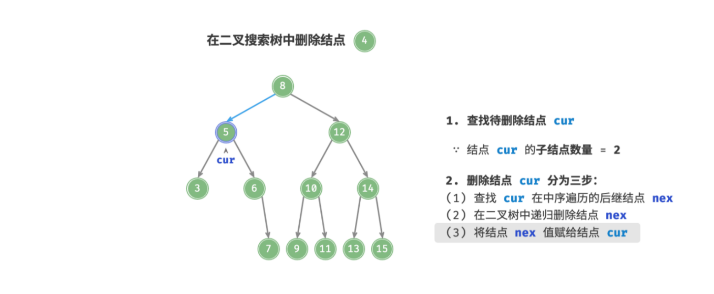

:::

:::details 使用“引用”的另一种思路

- 上面方法缺陷：在获取到中序后继之后；直接对其在 “整颗树” 的基础上进行删除；此时又需要对整颗树进行遍历；

可以使用引用避免这种递归操作；也即寻找到左右子结点都存在待删除结点后；在寻找中序后续的过程中完成对 “后继结点的删除”(删除需要保证中序后继的子树不被删除)；这里**保证中序后继的子树不被删除的思路就是使用引用**；下面中的 `tree` 结点就是可变引用；通过对其的修改可直接影响到 “原树”。

整体的删除过程如下：实现代码为 「rust」语言中实现的删除。

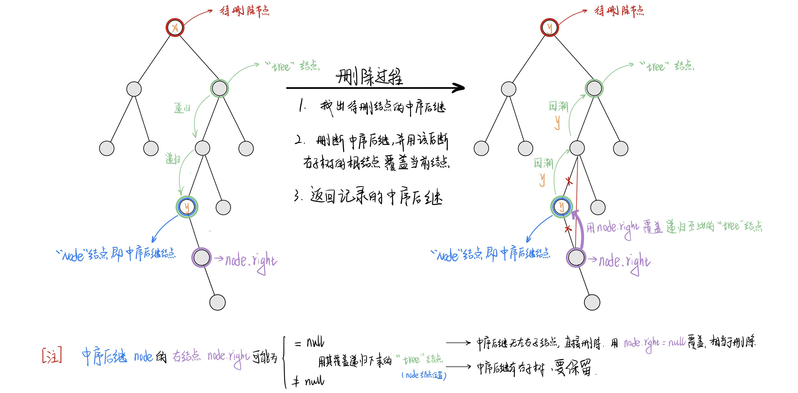

:::


:::code-tabs#language

@tab rust#rust

```rust
impl<T: Ord + Clone> BinarySearchTree<T>{
  /// 删除结点
  pub fn remove(&mut self, value: &T) -> bool {
    remove_helper(&mut self.root, value)
  }
}
/// 删除辅助函数
fn remove_helper<T: Ord + Clone>(tree: &mut Option<Box<TreeNode<T>>>, value: &T) -> bool {
  if let Some(node) = tree {
    let removed = match value.cmp(&node.value) {
      Ordering::Less => remove_helper(&mut node.left, value),
      Ordering::Greater => remove_helper(&mut node.right, value),
      Ordering::Equal => {                                       // 找到了需要删除的结点
        // 找到待删除结点位置；然后根据其左右子结点的存在性对待删除结点的子树进行修改
        *tree = match (node.left.take(), node.right.take()) {
          // 0 个子结点；待删除结点为叶子结点；直接删除，即置该结点为 None
          (None, None) => None,                     
          // 1 个子结点；使用其子结点覆盖当前结点来完成删除
          (Some(b) , None) | (None, Some(b)) => Some(b),         
          // 2 个子结点；使用中序后续替换当前结点，并对中序后续的子树作处理
          (Some(left), Some(right)) => Some(merge(left, right)), 
        };
        return true;
      }
    };
    removed
  }else {
    false
  }
}
/// 将待删除的结点替换为它的中序遍历前驱结点, 返回该结点
fn merge<T: Ord + Clone>(left: Box<TreeNode<T>>, right: Box<TreeNode<T>>) -> Box<TreeNode<T>> {
  let mut op_right = Some(right);
  let mut root = take_min(&mut op_right).unwrap();
  root.left = Some(left);
  root.right = op_right;
  root
}
/**
 * 获取最小值
 * tree   : 待删除结点右子结点； 这里 tree 为 &mut ；
 *      	需要在遍历过程中对其进行修改来完成 “对去替换待删除结点的中序后续的子树的处理”
 * return : 待删除结点的中序后继结点 
 */
fn take_min<T: Ord + Clone >(tree: &mut Option<Box<TreeNode<T>>>) -> Option<Box<TreeNode<T>>> {
  if let Some(mut node) = tree.take() {
    // 例如删除 4 , 6 的左子树不为空，此时 4 的中序后继为右子结点的左子树中的最左结点, 即 5
    //         4
    //       /   \
    //      2     6
    //     / \   / \
    //    1  3  5   7
    if let Some(min) = take_min(&mut node.left) {
      *tree = Some(node);
      Some(min)
    }
    // 例如删除 4 , 6 的左子树为空，此时4 的中序后续为右子结点 6 
    //         4                 4 
    //       /   \             /   \
    //      2     6           2     6
    //     / \     \         / \     \
    //    1  3      8       1   3    None
    else {                 
      // node 就是中序后继结点；也即上图中的 6
      // tree 是递归下来的结点，在 node 位置
      // 使用 node.right 对递归到当前位置的 tree 进行覆盖
      *tree = node.right.take();  
      Some(node)
    }
  } else {
    None
  }
}
```

@tab java#java

```java
/**
 * 删除结点
 * @param node 需要被删除的结点
 * @return 被删除的结点的信息
 */
public TreeNode<T> remove(TreeNode<T> node) {
  if (this.root == null) return null;        // 树为空,直接返回
  TreeNode<T> cur = this.root;
  TreeNode<T> pre = null;
  while (cur != null) {
    if (cur.value == node.value)             // 找到待删除结点,跳出循环
      break;
    pre = cur;                               // 记录当前结点,便于后续删除
    if (cur.value.compareTo(node.value) < 0) // 待删除结点在当前结点的右子树中
      cur = cur.right;
    else                                     // 待删除结点在当前结点的左子树中
      cur = cur.left;
  }
  if (cur == null) return null;              // 待删除结点不存在
  // 待删除结点的 子结点数量 = 0 或 1
  if (cur.left == null || cur.right == null) {
    // 当子结点数量 = 0 / 1 时， child = null / 该子结点
    TreeNode<T> child = cur.left != null ? cur.left : cur.right;
    if (pre.left == cur) pre.left = child;
    else pre.right = child;
  }
  // 待删除结点数量 = 2
  else {
    // 获取中序遍历下 cur 的后继结点 next
    TreeNode<T> next = take_min(cur.right);
    T tmp = next.value;
    // 删除 next 结点
    remove(next);
    // 将 next 结点的值赋给待删除结点
    cur.value = tmp;
  }
  return cur;
}

/**
 * @param node
 * @return 获取中序后继
 */
public TreeNode<T> take_min(TreeNode<T> node) {
  if (node == null) return null;
  while (node.left != null) {
    node = node.left;
  }
  return node;
}
```

@tab c++#c++

```cpp
/**
 * @brief 删除结点
 * @param value 结点值
 * @return 是否删除成功
 */
bool remove(T value) {
  if (root == nullptr) return false;
  TreeNode<T> *cur = root;
  TreeNode<T> *pre = nullptr;
  // 查找待删除的结点
  while (cur != nullptr) {
    if (cur->value == value) break;
    pre = cur;
    if (cur->value > value) cur = cur->left;
    else cur = cur->right;
  }
  if (cur == nullptr) return false;
  // 子结点数量为 0 or 1
  if (cur->left == nullptr || cur->right == nullptr) {
    // 当子结点数量 = 0 / 1 时， child = nullptr / 该子结点
    TreeNode<T> *child = cur->left != nullptr ? cur->left : cur->right;
    if (pre->left == cur) pre->left = child;
    else pre->right = child;
  }
  // 子结点数量 = 2
  else {
    TreeNode<T> *next = take_min(cur->right);
    int tmp = next->value;
    remove(next->value);
    cur->value = tmp;
  }
  return true;
}

/**
 * @brief 获取 当前结点 的中序后继
 * @param root 当前结点的右子结点
 * @return 当前结点的中序后继
 */
TreeNode<T> *take_min(TreeNode<T> *root) {
  if (root == nullptr) return root;
  // 循环访问左子结点，直到叶结点时为最小结点返回
  while (root->left != nullptr) {
    root = root->left;
  }
  return root;
}
```

:::

## 二叉搜索树的优势

|                     | 无序数组 | 有序数组  | 二叉搜索树 (平衡时) |
| :-----------------: | :------: | :-------: | :-----------------: |
|    查找指定元素     |  $O(n)$  | $O(logn)$ |      $O(logn)$      |
|      插入元素       |  $O(1)$  |  $O(n)$   |      $O(logn)$      |
|      删除元素       |  $O(n)$  |  $O(n)$   |      $O(logn)$      |
| 获取最小 / 最大元素 |  $O(n)$  |  $O(1)$   |      $O(logn)$      |

:::warning

虽然在平衡时二叉搜索树的各项效率较好，但是这仅限平衡时，而对于一般的二叉树，如果对其进行动态维护，那么二叉搜索树就会退化。

:::

## 二叉搜索树的退化

理想状态下的，希望二叉搜索树是 “左右平衡” 的，此时可以在 $O(log_n)$ 的时间复杂度下查找任意结点。

但是如果**动态**的在二叉搜索树中插入与删除结点，则可能导致二叉树退化为链表，此时**各种操作**的时间复杂度都会退化为 $O(n)$

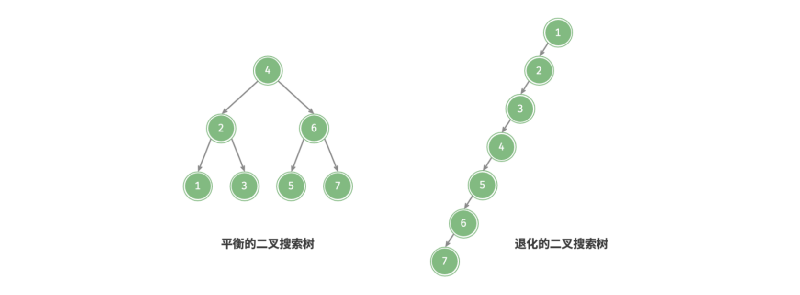

如下图所示，执行两步删除结点后，该二叉搜索树就会退化为链表。

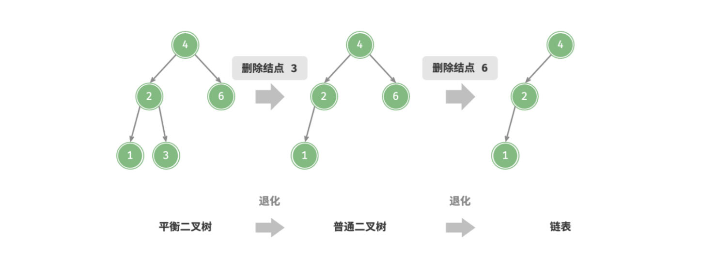

再比如，在以下完美二叉树中插入两个结点后，树严重向左偏斜，查找操作的时间复杂度也随之发生劣化。

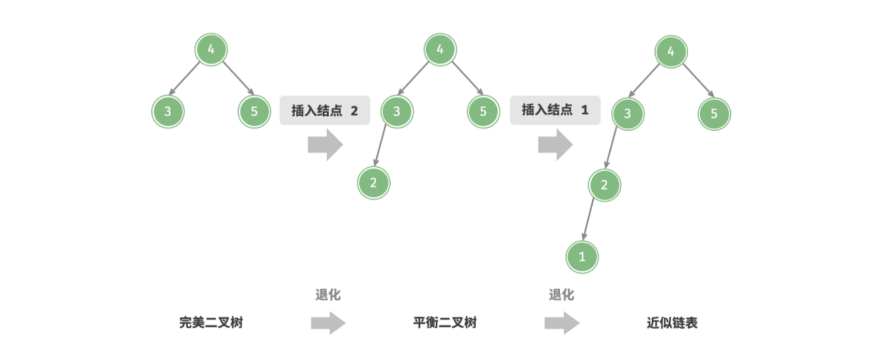


从动态维护二叉搜索树的退化来看，“平衡” 操作尤为重要。

## 二叉搜索树的性能分析

二叉搜索树的查找效率取决于「树的高度」, 根据上面两种形态的二叉搜索树可以看出，当：
- 二叉搜索树为[平衡二叉树](./5.md)时，时间复杂度为 $O(log \ n)$, 且此时的 $ASL$ 与二分搜索形成的[二叉判定树](./17.md#性能分析)一致。
- 二叉树退化为链表时，时间复杂度为 $O(n)$, 此时的 ASL 与[线性查找](./17.md#线性查找)一致。 

【如何选择使用二叉树搜索树进行查找操作】

相较于二分查找，二叉搜索树更适合「动态查找」，其可以在 $O(log \ n)$ 的时间内完成「插入」和「删除」操作；而在二分查找的静态查找表中，其插入和删除操作都是 $O(n)$。

- 当有序表是「静态查找表」，适合使用「顺序表」来存储，再使用二分查找进行查找操作
- 当有序表是「动态查找表」，适合使用「二叉搜索树」来存储，然后使用在二叉搜索树进行动态的插入和删除操作。


#### 二叉搜索树的打印

:::code-tabs#language

@tab rust#rust

```rust
#![allow(unused)]

use super::bst::TreeNode;
use std::{fmt::Debug};

#[derive(Clone, PartialEq, PartialOrd)]
struct Trunk {
  pub prev: Option<Box<Trunk>>,
  pub s: Option<String>
}
impl Trunk {
  pub fn new(prev:Option<Box<Trunk>>, s: Option<String>) -> Self {
    Trunk { prev, s }
  }
  pub fn set_s(&mut self, s: Option<String>) {
    if let Some(s) = s {
      self.s = Some(s);
    }
  }
}

pub fn print_tree<T: Ord + Clone + Debug>(root: &Option<Box<TreeNode<T>>>) {
  print_tree_helper(root, &mut None, false);
}

fn print_tree_helper<T: Ord + Clone + Debug>(root: &Option<Box<TreeNode<T>>>, prev: &mut Option<Box<Trunk>>, isleft: bool) {
  if root.is_none() { return; }

  let mut prev_str = String::from("     ");
  let mut trunk = Trunk::new(prev.clone(), Some(prev_str.to_owned()));

  print_tree_helper(&root.as_ref().unwrap().right, &mut Some(Box::new(trunk.clone())), true);

  if prev.is_none() {
    trunk.set_s(Some(String::from("———")));
  }else if isleft {
    trunk.set_s(Some(String::from(" /———")));
  }else {
    trunk.set_s(Some(String::from(r" \———")));
  }

  show_trunk(&Some(Box::new(trunk.clone())));
  println!(" {:?}", root.as_deref().unwrap().value);

  if prev.is_some() {
    prev.take().as_mut().unwrap().set_s(Some(String::from("    |") ));
  }
  trunk.set_s(Some(String::from("     ")));
  print_tree_helper(&root.as_ref().unwrap().left, &mut Some(Box::new(trunk.clone())), false);
}


fn show_trunk(trunk: &Option<Box<Trunk>>) {
  if trunk.is_none() {
    return;
  }
  show_trunk(&trunk.as_ref().unwrap().prev);
  print!("{}",trunk.clone().unwrap().s.unwrap());
}
```

@tab java#java

```java
class Trunk {
  Trunk prev;
  String str;

  Trunk(Trunk prev, String str) {
    this.prev = prev;
    this.str = str;
  }
};
public class PrintUnitT<T extends Comparable<T>> {
  public void printTree(TreeNode<T> root) {
    printTree(root, null, false);
  }

  public void printTree(TreeNode<T> root, Trunk prev, boolean isLeft) {
    if (root == null) {
      return;
    }

    String prev_str = "    ";
    Trunk trunk = new Trunk(prev, prev_str);

    printTree(root.right, trunk, true);

    if (prev == null) {
      trunk.str = "———";
    } else if (isLeft) {
      trunk.str = "/———";
      prev_str = "   |";
    } else {
      trunk.str = "\\———";
      prev.str = prev_str;
    }

    showTrunks(trunk);
    System.out.println(" " + root.value);

    if (prev != null) {
      prev.str = prev_str;
    }
    trunk.str = "   |";

    printTree(root.left, trunk, false);
  }

  public static void showTrunks(Trunk p) {
    if (p == null) {
      return;
    }

    showTrunks(p.prev);
    System.out.print(p.str);
  }
}
```

@tab c++#c++

```cpp
template<typename T>
class PrintUtilT {
public:
  struct Trunk {
    Trunk *prev;
    string str;
    Trunk(Trunk *prev, string str) {
      this->prev = prev;
      this->str = str;
    }
  };

  static void showTrunks(Trunk *p) {
    if (p == nullptr) {
      return;
    }

    showTrunks(p->prev);
    cout << p->str;
  }

  static void printTree(TreeNode<T> *root) { printTree(root, nullptr, false); }

  static void printTree(TreeNode<T> *root, Trunk *prev, bool isLeft) {
    if (root == nullptr) {
      return;
    }

    string prev_str = "    ";
    Trunk *trunk = new Trunk(prev, prev_str);

    printTree(root->right, trunk, true);

    if (!prev) {
      trunk->str = "———";
    } else if (isLeft) {
      trunk->str = "/———";
      prev_str = "   |";
    } else {
      trunk->str = "\\———";
      prev->str = prev_str;
    }

    showTrunks(trunk);
    cout << " " << root->value << endl;

    if (prev) {
      prev->str = prev_str;
    }
    trunk->str = "   |";

    printTree(root->left, trunk, false);
  }
};
```

:::


