「红黑树 Red Black Tree」

<!-- more -->

「红黑树 Red Black Tree」是在 「二叉搜索树 」的基础上对二叉树进行平衡操作的一种数据结构，这些平衡操作可以使得红黑树在动态维护当中仍然保持 $O(logn)$ 的时间复杂度。

##  红黑树的定义

「定义」

1. 结点是红色或者黑色
2. 根结点是黑色
3. 所有叶结点是黑色 (即值为 `null` 的结点 )
4. 每个红色结点的两个子结点必须是黑色。(从每个叶子结点到根的所有路径上不能有连续的红色结点)
5. 从任一结点到其子树的每个叶子结点的所有路径都包含相同数目的黑色结点

「性质」

- 从根结点到叶子结点的最长的可能的路径不能多于最短的可能路径的两倍长

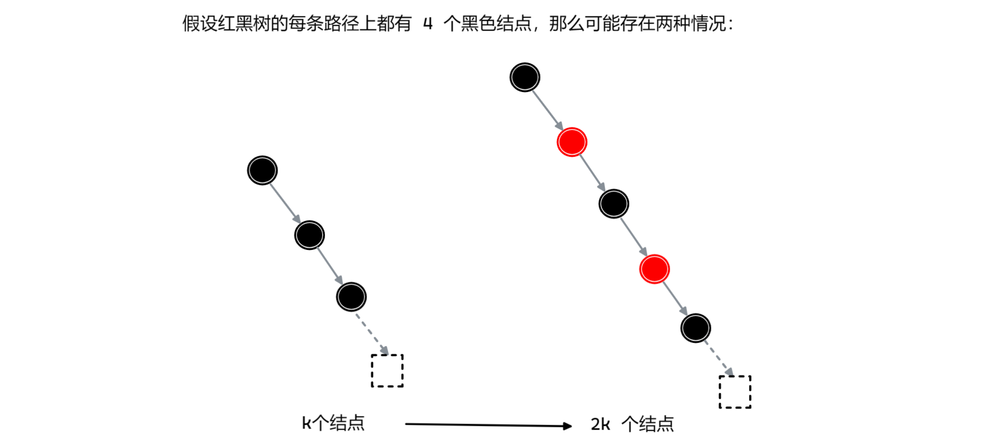

:::info

从该性质中也可以看出红黑树避免的原始二叉搜索数据退化为链表，保证了时间复杂度.

:::

:::warning

红黑树同样是一颗二叉搜索树，所以其操作都在是二叉搜索树的操作基础之上，在下面插入和删除操作中的各种情况图均是红黑树的某个子树，而非整个红黑树.

:::

## 插入操作

### 1. 树为空

直接将结点插入作为根结点并染成黑色即可

### 2. 待插入结点的父结点为黑色

当父结点为黑色时，插入位置可能会出现以下四种情况：

所需操作：

- 直接插入该结点，并将其染为红色.

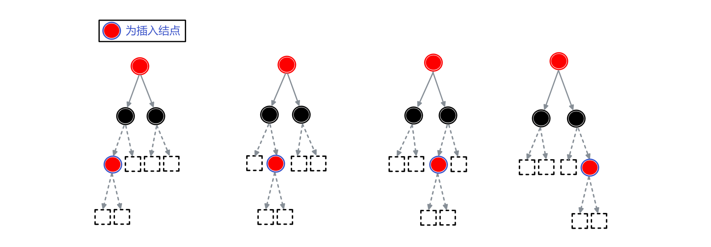

实例，如下图：

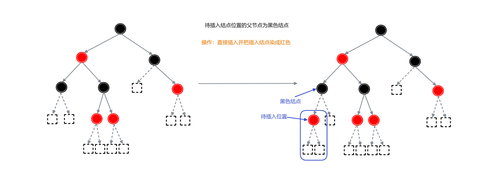

### 3. 待插入结点的父结点为红色

根据待插入结点叔叔结点的不同又可以分为两种情况：

1. 待插入结点的叔叔结点是红色

所需操作：【**变色**】

1. 将 “父结点” 变为黑色
2. 将 “叔叔结点” 变为黑色
3. 将祖父结点变为红色
4. 以祖父结点作为 “当前结点” 继续进行后续操作 (此时整棵树还不是红黑树)

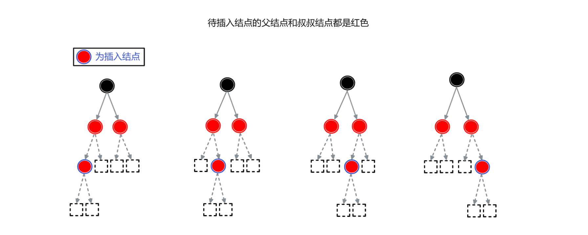

2. 待插入结点的叔叔结点是黑色

所需操作：【**旋转 + 变色**】

当为中间两种情况时，可分别通过以 “父结点” 为原点进行**左旋 (次左侧的情况)** 或 **右旋 (次右侧的情况)** 变为最两侧的情况，然后进行以下操作：

1. 将 “父结点” 变为黑色
2. 将 “祖父结点” 变为红色
3. 以 “祖父结点” 为原点进行**右旋 (最左侧的情况时)** 或 **左旋 (最右侧的情况时)**

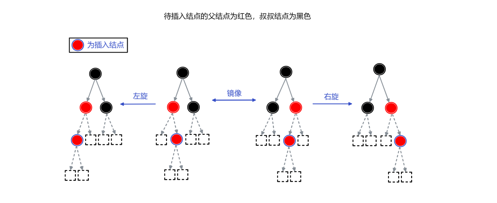

实例：一次完整的插入操作：

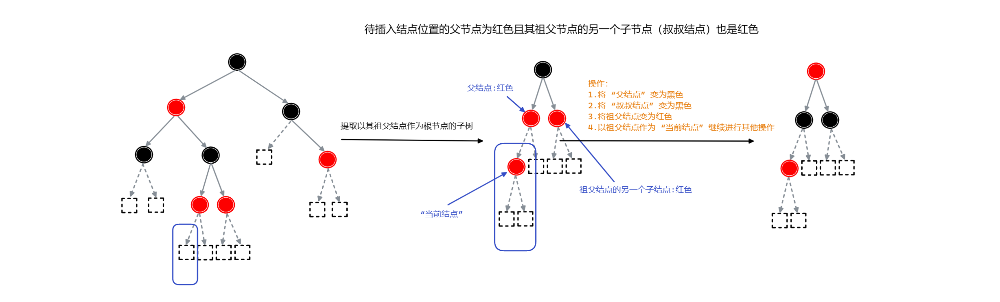

将变色好的子树还原到原树中，发现整颗树现在并不是红黑树，在其中存在需要【变色 + 旋转】的子树结构，根据对应操作对红黑树进行变形，如下图所示：

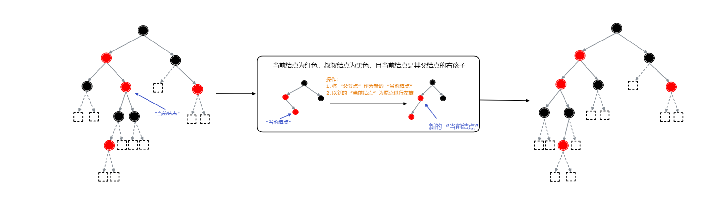

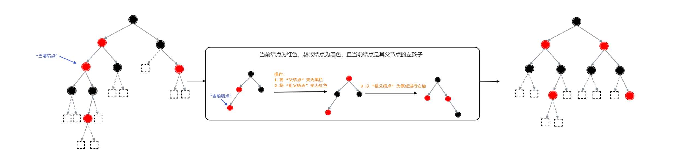

## 删除操作

相较于插入操作，删除操作更多种类，具体分为以下几类：

1. 删除红色结点
2. 删除黑色结点
   1. 有两个红色子结点的黑色结点
   2. 有一个红色子结点的黑色结点
3. 删除黑色叶子结点 (不为 `null` 的叶子结点)
   1. 删除结点为根结点
   2. 待删除结点的兄弟结点为黑色
      1. 兄弟结点有红色叶子结点
      2. 兄弟结点没有红色子结点
   3. 待删除结点的兄弟结点为红色

 对于删除红色结点，直接删除即可.而黑色结点需要进行相关操作。

### 1.删除黑色结点时，其有一个红色子结点的情况

下图为可能出现的各种情况： 

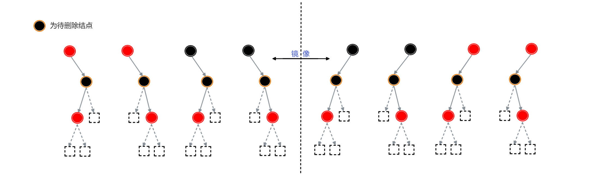

需要进行的操作：

1. 断开其与父结点和子结点的连接
2. 其父结点连接到其唯一的红色子结点
3. 将其子结点染为黑色

如下图： 

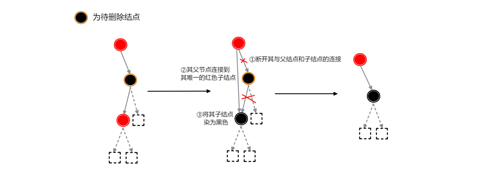

:::info

当删除结点有两个红色子结点时，可以忽略其中一个红色子结点，这样就可以看作有一个红色子结点的情况来进行操作

:::

### 2.待删除结点为黑色叶子结点(非 `null` 值结点)

#### 2.1.待删除结点的兄弟结点为黑色且其兄弟结点有红色子结点

有如下三种情况：

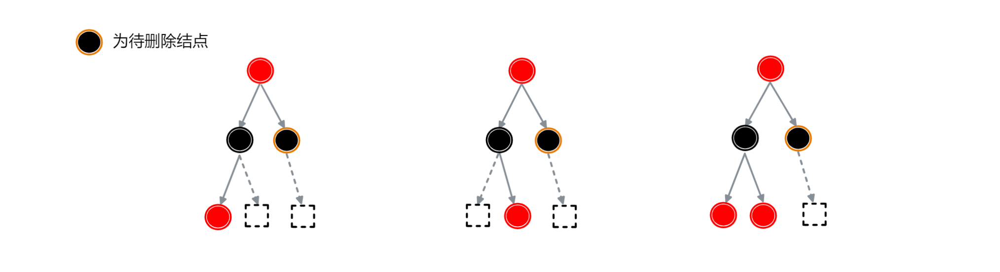

红色子结点为兄弟结点的**左子结点**时，操作如下：【**单旋 + 变色**】

1. 删除待删除的叶子结点

2. 以待删除结点的父结点为原点右旋

3. 将父结点及兄弟结点的子结点染为黑色，兄弟结点染为红色

如下图：

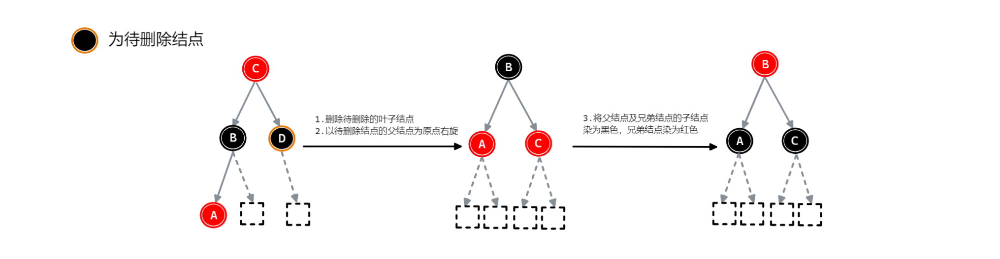

红色子结点为兄弟结点的**右子结点**时，操作如下：【**双旋 + 变色**】

1. 删除待删除的叶子结点

2. 以兄弟结点为原点左旋
3. 再以父结点为原点右旋

3. 最后父结点染为黑色

如下图：

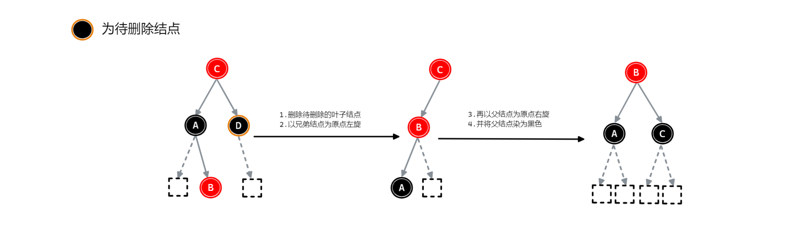

:::info

而当兄弟结点有两个红色子结点时，选择上述操作中的一种即可。

:::

#### 2.2.待删除结点的兄弟结点为黑色且其兄弟结点没有红色子结点

有两种情况：

这两种情况的都需要进行变色，但是也有不同。

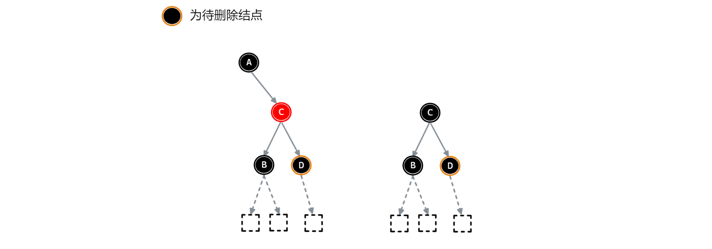

当待删除结点的父结点为**红色**时，则需如下操作：【变色】

1. 父结点变为黑色
2. 兄弟结点变为红色

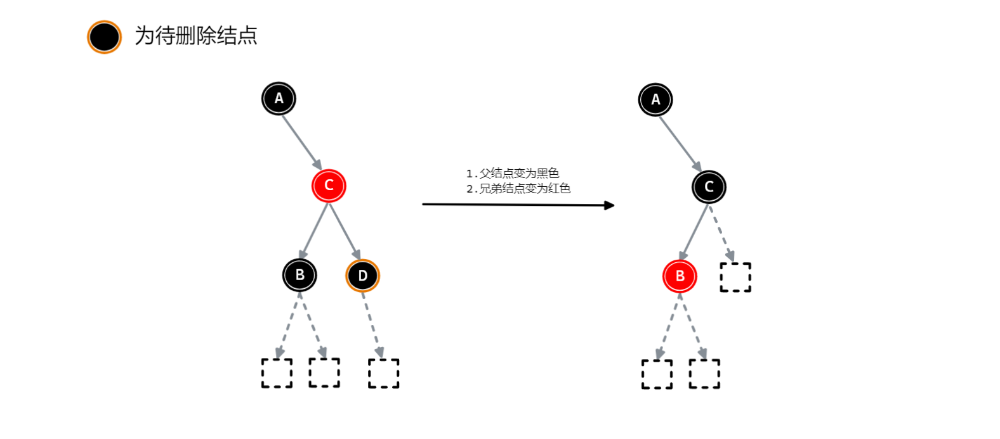

当待删除结点的父结点为**黑色**是，则需如下操作：【**变色 + 递归**】

1. 父结点变为黑色
2. 兄弟结点变为红色
3. 将父结点当作 “待删除的黑色叶子结点” 一样处理

将父结点看作待删除的黑色叶子结点，则需要进行的后续操作如下：

1. 父结点变 "黑色"
2. 兄弟结点变 "红色"
3. 再将父结点作为 ”待删除的黑色叶子结点“ 
     进行操作. (也即递归操作下去直至整颗树满足红黑树的性质即可)

:::warning

这里的只是对其他结点进行 “删除操作”中的变色，而不直接删除父结点.

:::

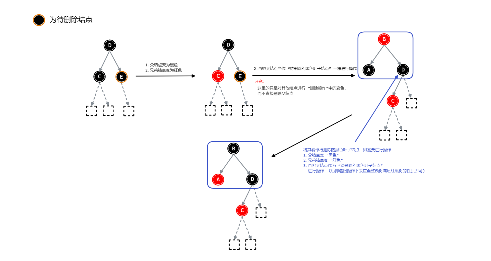

 

#### 3.待删除结点的兄弟结点为红色

待删除结点的兄弟结点为红色时有下面几种情况，需要进行一些操作将其转化为【待删除结点的兄弟结点为**黑色**】的情况，然后调用相关的操作即可.

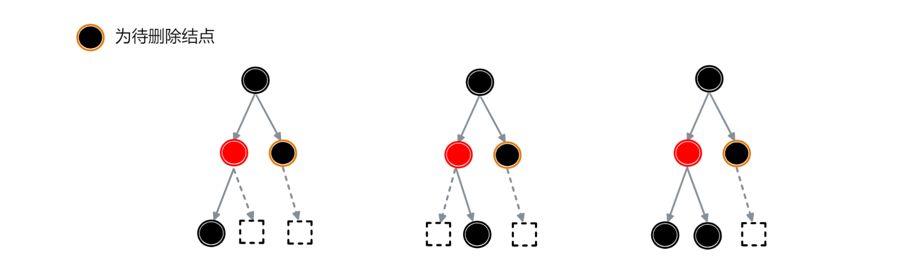

所需操作如下：

1. 以其父结点为原点右旋
2. 父结点染为红色
3. 祖父结点染为黑色

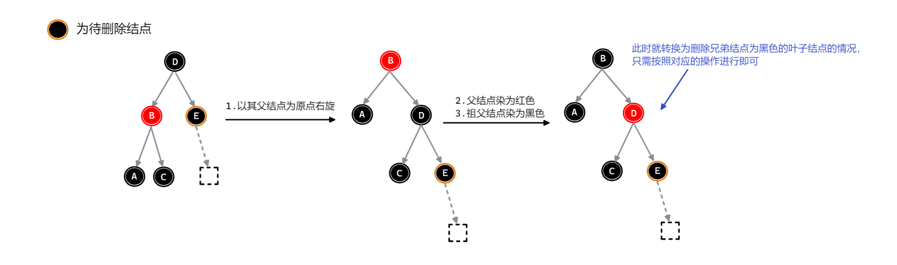

经过上述操作之后，就完成了响应转换，再进行【待删除结点的兄弟结点为**黑色**】情况的操作即可.

