「AVL 树」

<!-- more -->

在「[二叉搜索树 - 二叉搜索树的退化](./3.md)」中，可见二叉搜索树在动态维护中效率并不高。

G. M. Adelson-Velsky 和 E. M. Landis 在其 1962 年发表的论文 "An algorithm for the organization of information" 中提出了「AVL 树」。**论文中描述了一系列操作，使得在不断添加与删除结点后，AVL 树仍然不会发生退化**，进而使得各种操作的时间复杂度均能保持在 $O(log \ ⁡n)$ 级别。

换言之，在频繁增删查改的使用场景中，AVL 树可始终保持很高的数据增删查改效率，具有很好的应用价值。

## AVL 树常见术语

「AVL 树」既是「二叉搜索树」又是「平衡二叉树」，同时满足这两种二叉树的所有性质，因此又被称为「平衡二叉搜索树」.

### 结点高度

在 AVL 树的操作中，需要获取结点「高度 Height」，所以给 AVL 树的结点类添加 `height` 变量。

:::code-tabs#language

@tab rust#rust

```rust {4}
// AVL 树的结点
pub struct AVLNode<T: Ord + Clone> {
  pub value: T,                       // 结点值
  height: usize,                      // 结点高度
  pub left: Option<Box<AVLNode<T>>>,  // 左子结点
  pub right: Option<Box<AVLNode<T>>>, // 右子结点
}
// AVLNode 的左子树或右子树
#[derive(Clone, Copy)]
pub enum Side {
  Left,
  Right,
}
impl<T: Ord + Clone> AVLNode<T> {
  /// 返回 左 / 右 子结点的不可变引用
  pub fn child(&self, side: Side) -> &Option<Box<AVLNode<T>>> {
    match side {
      Side::Left => &self.left,
      Side::Right => &self.right,
    }
  }

  /// 返回 左 / 右 子结点的可变引用
  pub fn child_mut(&mut self, side: Side) -> &mut Option<Box<AVLNode<T>>> {
    match side {
      Side::Left => &mut self.left,
      Side::Right => &mut self.right,
    }
  }
}
// 为 Side 实现 ! 操作符
impl Not for Side {
  type Output = Side;
  fn not(self) -> Self::Output {
    match self {
      Side::Left => Side::Right,
      Side::Right => Side::Left,
    }
  }
}
```

@tab java#java

```java {4}
// AVL 树的结点
public class TreeNode<T extends Comparable<T>> {
  public T value;             // 结点值
  public int height;          // 结点高度
  public TreeNode<T> left;    // 左子结点
  public TreeNode<T> right;   // 右子结点
  
  public TreeNode(T value) {
    this.value = value;
  }
}
```

@tab c++#c++

```cpp {7}
// AVL 树中的结点
template <typename T>
struct TreeNode {
  T value;            // 结点值
  TreeNode<T> *left;  // 左子结点
  TreeNode<T> *right; // 右子结点
  int height = 0;     // 结点高度
  TreeNode() = default;
  explicit TreeNode(T x, TreeNode<T> *left = nullptr, TreeNode<T> *right = nullptr)
      : value(x), left(left), right(right) {}
};
```

:::

「结点高度」是最远叶结点到该结点的距离，即走过的「边」的数量。需要特别注意，**叶结点的高度为 0 ，空结点的高度为 -1** 。封装两个工具函数，分别用于获取与更新结点的高度。

:::code-tabs#language

@tab rust#rust

```rust
impl<T: Ord + Clone> AVLNode<T> {
  /// 返回 左 / 右 子树高度
  pub fn height(&self, side: Side) -> usize {
    // None(叶子结点) 时高度为 0
    self.child(side).as_ref().map_or(0, |n| n.height)
  }

  /// 更新结点的高度
  pub fn update_height(&mut self) {
    // 左，右子树高度的最大值 + 1
    self.height = std::cmp::max(self.height(Side::Left), self.height(Side::Right)) + 1;
  }
}
```

@tab java#java

```java
class AVLTree<T extends Comparable<T>> {
  TreeNode<T> root;

  /**
   * 获取结点高度
   * @param node 结点信息
   * @return 结点高度
   */
  public int height(TreeNode<T> node) {
    // 空结点高度为 -1 ，叶结点高度为 0
    return node == null ? -1 : node.height;
  }

  /**
   * 更新结点高度
   * @param node
   */
  private void updateHeight(TreeNode<T> node) {
    // 结点高度等于最高子树高度 + 1
    node.height = Math.max(height(node.left), height(node.right)) + 1;
  }
}
```

@tab c++#c++

```cpp
template <typename T>
class AVLTree {
private:
  TreeNode<T>* root;
  /**
   * 获取结点高度
   * @param node 结点
   * @return 结点的高度
   */
  int height(const TreeNode<T>* node){
    // 空结点高度为 -1, 叶节点高度为 0
    return node == nullptr ? -1 : node->height;
  }
  /**
   * 更新结点高度
   * @param node 结点
   */
  void update_height(TreeNode<T>* node){
    node->height = max(height(node->right), height(node->left)) + 1;
  }

public:
  AVLTree() = default;
  explicit AVLTree(TreeNode<T> *node) : root(node) {};
  
  TreeNode<T> * get_root() {
    return this->root;
  }
}
```

:::

### 结点平衡因子

结点的「平衡因子 Balance Factor」是 **结点的左子树高度减去右子树高度**，并定义空结点的平衡因子为 0 。同样地，将获取结点平衡因子封装成函数，以便后续使用。

:::code-tabs#language

@tab rust#rust

```rust
impl<T: Ord + Clone> AVLNode<T> {
  /// 返回该结点的平衡因子
  pub fn balance_factor(&self) -> i8 {
    // 结点的左，右子树高度
    let (left, right) = (self.height(Side::Left), self.height(Side::Right));
    if left < right {
      // 右子树高
      (right - left) as i8
    } else {
      // 左子树高
      -((right - left) as i8)
    }
  }
}
```

@tab java#java

```java
/**
 * 获取该结点的平衡因子
 * @param node 结点
 * @return 结点的平衡因子
 */
public int balanceFactor(TreeNode<T> node) {
  // 空结点平衡因子为 0
  if (node == null) return 0;
  // 结点平衡因子 = 左子树高度 - 右子树高度
  return height(node.left) - height(node.right);
}
```

@tab c++#c++

```cpp
/**
 * 获取结点的平衡因子
 * @param node 结点
 * @return 结点的平衡因子
 */
int get_balance_factor(const TreeNode<T>* node){
  // 空结点平衡因子为 0
  if (node == nullptr) return 0;
  // 左子树 - 右子树
  return height(node->left) - height(node->right);
}
```

:::

:::info AVL 树性质

- 设平衡因子为 $f$ ，则一颗 AVL 树的任意结点的平衡因子皆满足 $-1≤f≤1$ ；
- 结点数的递推公式：$n_0=0, n_1=1, n_h=1+n_{h-1}+n_{h-2}$，其中 $h$ 为 AVL树的 **层数** ，$n_h$ 为层数 $h$ 下的 AVL树所需要的**最少结点数**；反过来说 $h$ 就是这些结点可以组成的 AVL树的**最大层数**，并且此时树中的**非叶子结点**的平衡因子 $f=1$ 。

:::

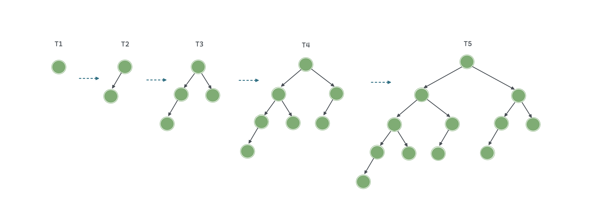


## AVL 树旋转

AVL 树的独特之处在于「旋转 Rotation」的操作，其可 **在不影响二叉树中序遍历序列的前提下，使失衡结点重新恢复平衡。** 换言之，旋转操作既可以使树保持为「二叉搜索树」，也可以使树重新恢复为「平衡二叉树」。

将平衡因子的绝对值 $>1$ 的结点称为「失衡结点」。根据结点的失衡情况，旋转操作分为 **右旋、左旋、先右旋后左旋、先左旋后右旋**.

### 右旋 (顺时针)

如下图所示（结点下方为「平衡因子」），从底至顶看，二叉树中首个失衡结点是 **结点 3** 。聚焦在以该失衡结点为根结点的子树上，将该结点记为 `node` ，将其左子结点记为 `child` ，执行「右旋」操作。完成右旋后，该子树已经恢复平衡，并且仍然为二叉搜索树。

:::tabs

@tab step1

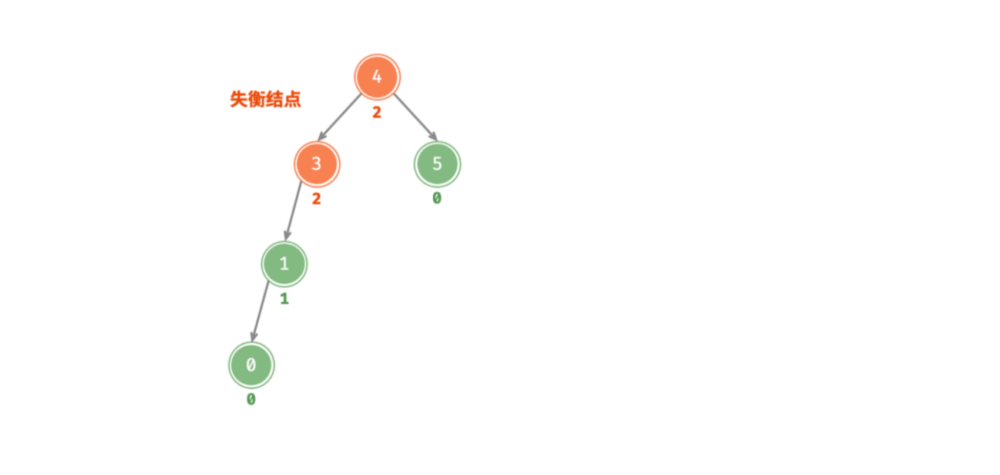

@tab step2    

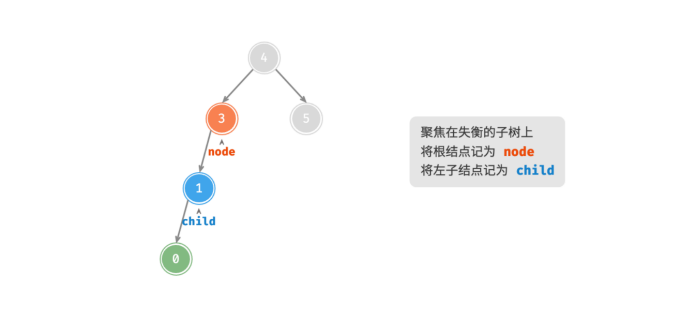


@tab step3

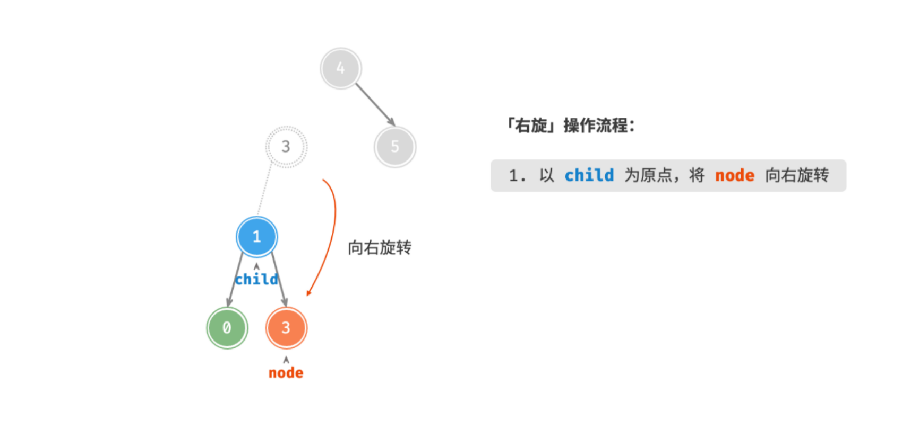


@tab step4

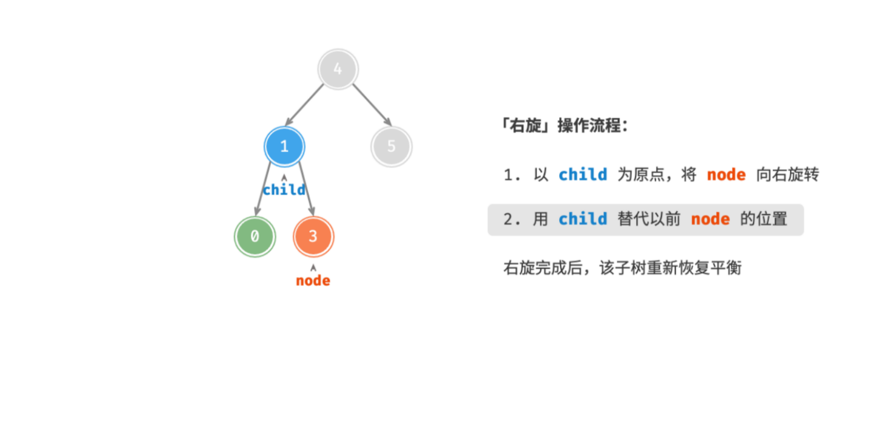

:::

:::code-tabs#language

@tab rust#rust

```rust
impl<T: Ord + Clone> AVLNode<T> {
  // 执行左旋 / 右旋
  fn rotate(&mut self, side: Side) {
    // 左旋 / 右旋 时获取 右子结点 / 左子结点 (该点为旋转时的基准原点)
    let mut subtree = self.child_mut(!side).take().unwrap();
    *self.child_mut(!side) = subtree.child_mut(side).take(); // 将旋转时被替换的结点的子树接到新的结点上
    self.update_height();
    mem::swap(self, subtree.as_mut()); // 在内存中交换 “根结点” 和子结点
    *self.child_mut(side) = Some(subtree); // 将 “根结点” 作为左子结点 / 右子结点的右子结点 / 左子结点
    self.update_height();
  }
}
```

@tab java#java

```java
/**
 * 右旋操作
 * @param node 失衡结点
 * @return 右转后该子树的根结点
 */
private TreeNode<T> rightRotate(TreeNode<T> node) {
  TreeNode<T> child = node.left;
  TreeNode<T> grandChild = child.right;
  // 以 child 为原点, 将 node 向左旋转
  child.right = node;
  node.left = grandChild;
  // 更新结点高度
  updateHeight(node);
  updateHeight(child);
  // 返回旋转后子树的根结点
  return child;
}
```

@tab c++#c++

```cpp
/**
 * 右旋
 * @param node 失衡结点
 * @return 调正之后的最小不平衡子树的根结点
 */
TreeNode<T>* right_rotate(TreeNode<T>* node) {
  TreeNode<T>* child = node->left;
  TreeNode<T>* grandChild = child->right;
  child->right = node;
  node->left = grandChild;
  update_height(node);
  update_height(child);
  return child;
}
```

:::

### 左旋 (逆时针)

类似地，如果将取上述失衡二叉树的“镜像”，那么则需要「左旋」操作。观察发现，**「左旋」和「右旋」操作是镜像对称的，两者对应解决的两种失衡情况也是对称的**。

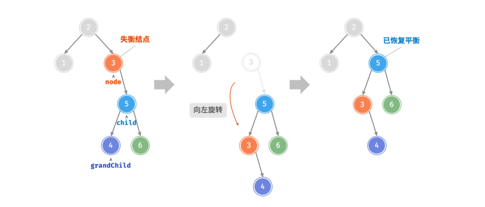

:::code-tabs#language

@tab rust#rust

```rust
impl<T: Ord + Clone> AVLNode<T> {
  // 执行左旋 / 右旋
  fn rotate(&mut self, side: Side) {
    // 左旋 / 右旋 时获取 右子结点 / 左子结点 (该点为旋转时的基准原点)
    let mut subtree = self.child_mut(!side).take().unwrap();
    *self.child_mut(!side) = subtree.child_mut(side).take(); // 将旋转时被替换的结点的子树接到新的结点上
    self.update_height();
    mem::swap(self, subtree.as_mut()); // 在内存中交换 “根结点” 和子结点
    *self.child_mut(side) = Some(subtree); // 将 “根结点” 作为左子结点 / 右子结点的右子结点 / 左子结点
    self.update_height();
  }
}
```

@tab java#java

```java
/**
 * 左旋操作
 * @param node 失衡结点
 * @return 左旋后该子树的根结点
 */
private TreeNode<T> leftRotate(TreeNode<T> node) {
  TreeNode<T> child = node.right;
  TreeNode<T> grandChild = child.left;
  // 以 child 为原点将 node 向左旋转
  child.left = node;
  node.right = grandChild;
  // 更新结点高度
  updateHeight(node);
  updateHeight(child);
  // 返回旋转后子树的根结点
  return child;
}
```

@tab c++#c++

```cpp
/**
 * 左旋
 * @param node 失衡结点
 * @return 调正之后的最小不平衡子树的根结点
 */
TreeNode<T>* left_rotate(TreeNode<T>* node) {
  TreeNode<T>* child = node->right;
  TreeNode<T>* grandChild = child->left;
  child->left = node;
  node->right = grandChild;
  update_height(node);
  update_height(child);
  return child;
}
```

:::              

### 先左后右

对于下图的失衡结点 3 ，**单一使用左旋或右旋都无法使子树恢复平衡**，此时需要「先左旋后右旋」，即先对 `child` 执行「左旋」，再对 `node` 执行「右旋」.

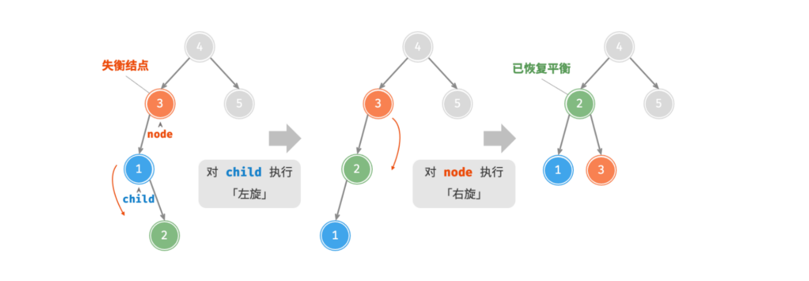


### 先右后左

同理，取以上失衡二叉树的镜像，则需要「先右旋后左旋」，即先对 `child` 执行「右旋」，然后对 `node` 执行「左旋」。

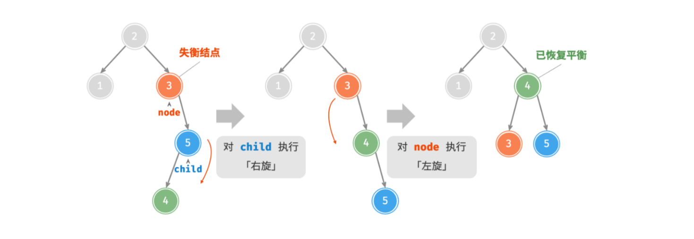

### 旋转的选择

下图描述的四种失衡情况：

| 代称 |            情况            |   采取措施   |
| :--: | :------------------------: | :----------: |
|  LL  | 左子结点的左子树中插入结点 |     右旋     |
|  LR  | 左子结点的右子树中插入结点 | 先左旋后右旋 |
|  RL  | 右子结点的左子树中插入结点 | 先右旋后左旋 |
|  RR  | 右子结点的右子树中插入结点 |     左旋     |

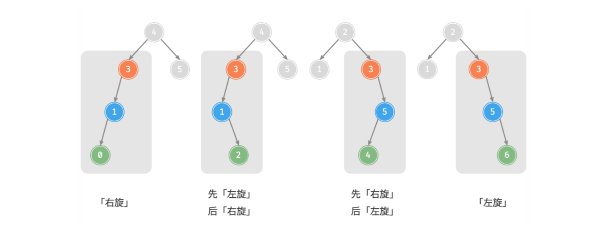

具体地，需要使用 **失衡结点的平衡因子、较高一侧子结点的平衡因子** 来确定失衡结点属于上图中的哪种情况。

| 失衡结点的平衡因子 | 子结点的平衡因子 | 应采用的旋转方法 |
| :----------------: | :--------------: | :--------------: |
|   $>0$ (左偏树)    |       $≥0$       |       右旋       |
|   $>0$ (左偏树)    |       $<0$       |   先左旋后右旋   |
|   $<0$ (右偏树)    |       $≤0$       |       左旋       |
|   $<0$ (右偏树)    |       $>0$       |   先右旋后左旋   |

:::code-tabs#language

@tab rust#rust

```rust
impl<T: Ord + Clone> AVLTree<T> {
  /// 调整该结点的子树使其 “平衡”
  fn rebalance(&mut self) {
    self.update_height();
    let side = match self.balance_factor() {
      2 => Side::Right,   // 右偏树 (RR[左旋] / RL[先右后左])  
      -2 => Side::Left,   // 左偏树 (LL[右旋] / LR[先左后右])
      _ => return,
    };

    let subtree = self.child_mut(side).as_mut().unwrap();
    // 等于 1 时为LR 型第一步左旋 或者 等于 -1 时为RL 型第一步右旋
    if let (Side::Left, 1) | (Side::Right, -1) = (side, subtree.balance_factor()) {
      subtree.rotate(side);
    }
    // LR 型第二步右旋 或者 RL 型第二步左旋
    // LL型 右旋 或者 RR型 左旋 
    self.rotate(!side);
  }
}
```

@tab java#java

```java
/**
 * 根据结点的平衡因子和子结点的平衡因子选择对应的旋转方式
 * @param node 失衡结点
 * @return 已经平衡的树的根结点
 */
private TreeNode<T> rotate(TreeNode<T> node) {
  // 获取结点 node 的失衡因子
  int balanceFactor = balanceFactor(node);
  // 左偏树
  if (balanceFactor > 1) {
    if (balanceFactor(node.left) >= 0) {
      // 右旋
      return rightRotate(node);
    } else {
      // 先左旋后右旋
      node.left = leftRotate(node.left);
      return rightRotate(node);
    }
  }
  // 右偏树
  if (balanceFactor < -1) {
    if (balanceFactor(node.right) <= 0) {
      // 左旋
      return leftRotate(node);
    } else {
      // 先右旋后左旋
      node.right = rightRotate(node.right);
      return leftRotate(node);
    }
  }
  // 已经旋转为平衡树, 直接返回
  return node;
}
```

@tab c++#c++

```cpp
/**
 * 根据结点的平衡因子和子结点的平衡因子选择对应的旋转方式
 * @param node 失衡结点
 * @return 调正之后的子树的根结点
 */
TreeNode<T>* rotate(TreeNode<T> * node) {
  int balance_factor = get_balance_factor(node);
  // 左偏树  LL[右旋] / LR[先左后右]
  if (balance_factor > 1) {
    if (get_balance_factor(node->left) >= 0) {  // LL[右旋]
      return right_rotate(node);
    }else {                                     // LR[先左后右]
      node->left = left_rotate(node->left);
      return right_rotate(node);
    }
  }
  // 右偏树  RR[左旋] / RL[先右后左]
  if (balance_factor < -1) {
    if (get_balance_factor(node->right) <= 0) {  //  RR[左旋]
      return left_rotate(node);
    }else {                                      //  RL[先右后左]
      node->right = right_rotate(node->right);
      return left_rotate(node);
    }
  }
  return node;
}
```

:::

## AVL 树常用操作

### 插入结点

「AVL 树」的结点插入操作与「[二叉搜索树-插入](./3.md#插入结点)」主体类似。不同的是，在插入结点后，从该结点到根结点的路径上会出现一系列「失衡结点」。所以，**需要从最底层失衡结点开始，从底至顶地执行旋转操作，使所有失衡结点恢复平衡**。实际上在调整完**最小不平衡子树**时就可以使得整颗树达到平衡。

【具体思路】

采用递归策略进行插入操作；这样的做的好处是不需要记录父结点，在上面的[「旋转操作」](#右旋-顺时针)都是对最小不平衡子树进行调整，然后返回调整后的根结点；

:::code-tabs#language

@tab rust#rust

```rust {31}
/// AVL 树
pub struct AVLTree<T: Ord + Clone> {
    root: Option<Box<AVLNode<T>>>,
    length: usize,
}

impl<T: Ord + Clone> AVLTree<T> {
  /// 创建一个空的二叉树
  pub fn new() -> Self {
    AVLTree {
      root: None,
      length: 0,
    }
  }

  /// 插入结点
  pub fn insert(&mut self, value: T) -> bool {
    let inserted = insert(&mut self.root, value);
    if inserted { self.length += 1; }
    inserted
  }
}
/// 递归的插入结点
fn insert<T: Ord + Clone>(tree: &mut Option<Box<AVLNode<T>>>, value: T) -> bool {
  if let Some(node) = tree {
    let inserted = match value.cmp(&node.value) {
      Ordering::Equal => return false,
      Ordering::Less => insert(&mut node.left, value),
      Ordering::Greater => insert(&mut node.right, value),
    };
    if inserted { node.rebalance(); }
    inserted
  } else {
    *tree = Some(Box::new(AVLNode {
      value,
      height: 1,
      left: None,
      right: None,
    }));
    true
  }
}
```

@tab java#java

```java {26,28}
/**
 * 插入结点
 * @param node 待插入结点
 * @return 插入后 AVL 树的根结点
 */
public TreeNode<T> insert(TreeNode<T> node) {
  root = insertHelper(this.root, node);
  return root;
}

/**
 * 递归的插入结点 (辅助函数)
 * @param node   子树的根结点
 * @param i_node 待插入结点
 * @return 返回子树的根结点
 */
private TreeNode<T> insertHelper(TreeNode<T> node, TreeNode<T> i_node) {
  if (node == null) return i_node;         // 树为空, 插入结点直接作为根结点
  // 1. 查找插入位置，并插入结点
  if (i_node.value.compareTo(node.value) < 0)
    node.left = insertHelper(node.left, i_node);
  else if (i_node.value.compareTo(node.value) > 0)
    node.right = insertHelper(node.right, i_node);
  else
    return node;           // 重复结点不插入，直接返回
  updateHeight(node);      // 更新结点高度
  // 2. 执行旋转操作, 使子树重新恢复平衡
  node = rotate(node);
  return node;              // 返回子树的根结点
}
```

@tab c++#c++

```cpp {15,16}
TreeNode<T>* insert(T value) {
  this->root = insert_helper(this->root, value);
  return root;
}

TreeNode<T>* insert_helper(TreeNode<T>* node, T value) {
  auto* i_node = new TreeNode<T>(value);
  if (node == nullptr) return i_node;
  if (value > node->value)
    node->right = insert_helper(node->right, value);
  else if (value < node->value)
    node->left = insert_helper(node->left, value);
  else
    return node;
  update_height(node);
  node = rotate(node);
  return node;
}
```

:::

### 删除结点

「AVL 树」删除结点操作与「[二叉搜索树-删除](./3.md#删除结点)」操作总体相同。类似地，**在删除结点后，也需要从底至顶地执行旋转操作，使所有失衡结点恢复平衡**。实际上在调整完**最小不平衡子树**后就可以使得整颗树达到平衡。

:::code-tabs#language

@tab rust#rust

```rust {24,43}
impl<T: Ord + Clone> AVLTree<T> {
  /// 删除结点
  pub fn remove(&mut self, value: &T) -> bool {
    let removed = remove(&mut self.root, value);
    if removed { self.length -= 1;}
    removed
  }
}
/// 递归的删除结点
fn remove<T: Ord + Clone>(tree: &mut Option<Box<AVLNode<T>>>, value: &T) -> bool {
	if let Some(node) = tree {
		let removed = match value.cmp(&node.value) {
			Ordering::Less => remove(&mut node.left, value),
			Ordering::Greater => remove(&mut node.right, value),
			Ordering::Equal => {
				*tree = match (node.left.take(), node.right.take()) {
					(None, None) => None,
					(Some(b), None) | (None, Some(b)) => Some(b),
					(Some(left), Some(right)) => Some(merge(left, right)),
				};
				return true;
			}
		};
		if removed { node.rebalance(); }
		removed
	}else {
		false
	}
}
/// 合并左右子树
fn merge<T: Ord + Clone>(left: Box<AVLNode<T>>, right: Box<AVLNode<T>>) -> Box<AVLNode<T>> {
	let mut op_right = Some(right);
	let mut root = take_min(&mut op_right).unwrap();
	root.left = Some(left);
	root.right = op_right;
	root.balance_factor();
	root
}
/// 找最小值
fn take_min<T: Ord + Clone>(tree: &mut Option<Box<AVLNode<T>>>) -> Option<Box<AVLNode<T>>> {
	if let Some(mut node) = tree.take() {
		if let Some(small) = take_min(&mut node.left) {
			node.rebalance();
			*tree = Some(node);
			Some(small)
		}else {
			*tree = node.right.take();
			Some(node)
		}
	}else {
		None
	}
}
```

@tab java#java

```java {38,40}
/**
 * 删除结点
 * @param node 待删除结点
 * @return 删除后 AVL 树的根结点
 */
public TreeNode<T> remove(TreeNode<T> node) {
  root = removeHelper(this.root, node);
  return root;
}
/**
 * 递归地删除结点 (辅助函数)
 * @param node 子树的根结点
 * @param r_node 待删除结点
 * @return 返回子树的根结点
 */
private TreeNode<T> removeHelper(TreeNode<T> node, TreeNode<T> r_node) {
  if (node == null) return null;
  // 1. 查找结点, 并删除
  if (r_node.value.compareTo(node.value) < 0)
    node.left = removeHelper(node.left, r_node);
  else if (r_node.value.compareTo(node.value) > 0)
    node.right = removeHelper(node.right, r_node);
  else {
    if (node.left == null || node.right == null) {
      TreeNode<T> child = node.left != null ? node.left : node.right;
      if (child == null)    // 子结点数量 = 0 ，直接删除 node 并返回
        return null;
      else                  // 子结点数量 = 1 ，直接删除 node
        node = child;
    }else {
      // 子结点数量 = 2 ，则将中序遍历的下个结点删除，并用该结点替换当前结点
      TreeNode<T> next = inOrderNext(node.right);
      T tmp = next.value;
      node.right = removeHelper(node.right, new TreeNode<>(tmp));
      node.value = tmp;
    }
  }
  updateHeight(node);       // 更新结点高度
  // 2. 执行旋转操作，使该子树重新恢复平衡
  node = rotate(node);
  return node;              // 返回子树的根结点
}
/**
 * 获取待删除结点在中序遍历下的后继结点
 * @param node 待删除结点的右子结点
 * @return 待删除结点在中序遍历下的后继结点
 */
private TreeNode<T> inOrderNext(TreeNode<T> node) {
  if (node == null) return null;
  // 循环访问左子结点,直到叶结点时为最小结点,跳出循环
  while (node.left != null) {
    node = node.left;
  }
  return node;
}
```

@tab c++#c++

```cpp {29,30}
TreeNode<T>* remove(T value) {
  this->root = remove_helper(this->root, value);
  return root;
}

TreeNode<T>* remove_helper(TreeNode<T>* node, T value) {
  if (node == nullptr) return nullptr;
  if (value < node->value)
    node->left = remove_helper(node->left, value);
  else if (value > node->value)
    node->right = remove_helper(node->right, value);
  else {
    if (node->left == nullptr || node->right == nullptr) {
      // 当子结点数量 = 0 / 1 时， child = nullptr / 该子结点
      TreeNode<T> *child = node->left != nullptr ? node->left : node->right;
      if (child == nullptr)
        return nullptr;
      else
        node = child;
    }
    // 子结点数量 = 2
    else {
      TreeNode<T>* next = take_min(node->right);
      T tmp = next->value;
      node->right = remove_helper(node->right, tmp);
      node->value = tmp;
    }
  }
  update_height(node);
  node = rotate(node);
  return node;
}

/**
 * @brief 获取最小结点
 * @param root 所要寻找结点的右子结点
 * @return TreeNode<T>* 右子树上的最小结点
 */
TreeNode<T>* take_min(TreeNode<T>* root) {
  if (root == nullptr) return root;
  // 循环访问左子结点，直到叶结点时为最小结点返回
  while (root->left != nullptr) {
    root = root->left;
  }
  return root;
}
```

:::

### 查找结点

在 AVL 树中查找的过程与二叉搜索树相同，假设 $n_h$ 表示深度为 $h$ 的平衡树中含有的**最少结点数**，显然有 $n_0=0,n_1=1,n_2=2$ ，并且有 $n_h=n_{h-1}+n_{h-2}+1$ .

:::code-tabs#language

@tab rust#rust

```rust
impl<T: Ord + Clone> AVLTree<T> {
  /// 查找结点值
  pub fn search(&self, value: T) -> bool {
    let mut cur = &self.root;
    while let Some(node) = cur {
      cur = match value.cmp(&node.value) {
        Ordering::Equal => return true,
        Ordering::Less => &node.left,
        Ordering::Greater => &node.right,
      }
    }
    false
  }
}
```

@tab java#java

```java
/**
 * 查找结点
 * @param node 带查找的结点
 * @return 目标结点
 */
public TreeNode<T> search(TreeNode<T> node) {
  TreeNode<T> cur = root;
  while (cur != null) {
    if (cur.value.compareTo(node.value) < 0)       // 目标结点在 root 的右子树中
      cur = cur.right;
    else if (cur.value.compareTo(node.value) > 0)  // 目标结点在 root 的左子树中
      cur = cur.left;
    else             // 找到目标结点，跳出循环
      break;
  }
  return cur;
}
```

@tab c++#c++

```cpp
/**
 * 查找结点
 * @param value 结点值
 * @return 结点信息
 */
TreeNode<T> *search(T value) {
  TreeNode<T> *cur = root;
  while (root != nullptr) {
    if (value > root->value) cur = cur->right;
    else if (value < root->value)
      cur = cur->left;
    else
      break;
  }
  return cur;
}
```

:::

#### 调整平衡练习

【RR型】

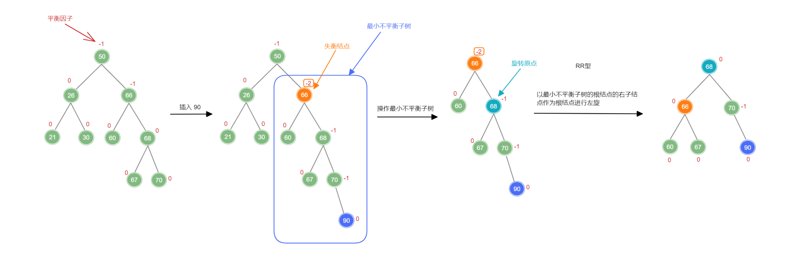

【RL型】

先以失衡结点的右孩子的左孩子为原点进行右旋，将原点转为失衡结点的右孩子，变为 RR 型，然后再通过左旋将其调整平衡.

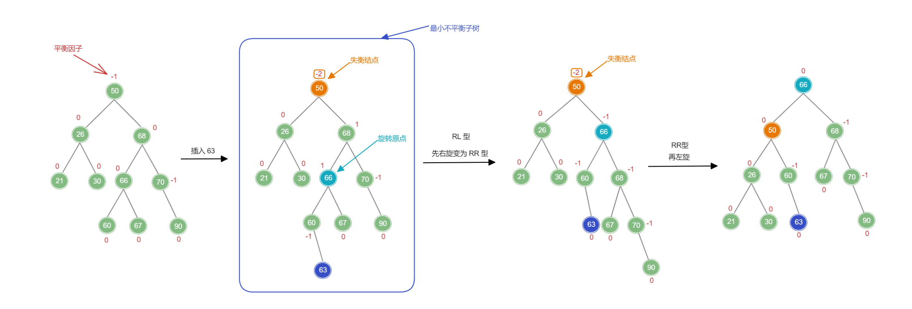

【LR型】

先以失衡结点的左孩子的右孩子为原点进行左旋，将原点转为失衡结点的左孩子，变为 LL 型，然后再通过右旋将其调整平衡.

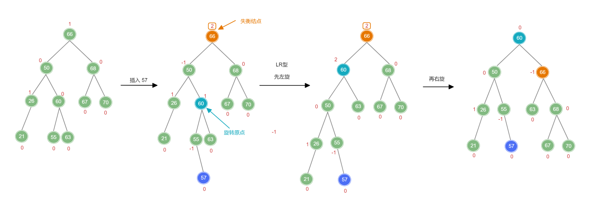


