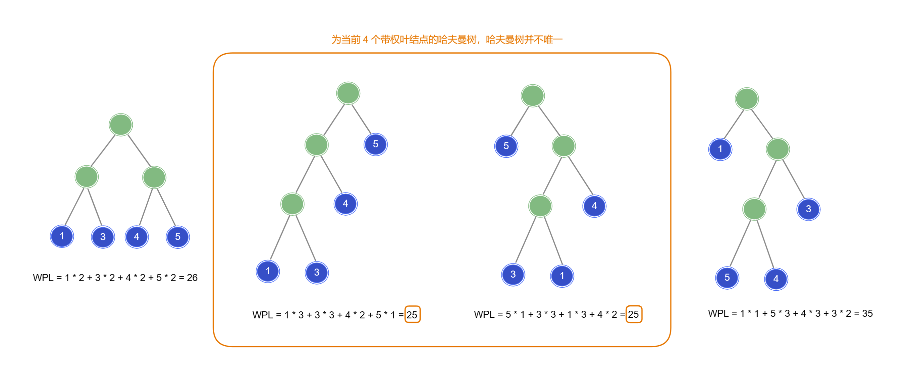
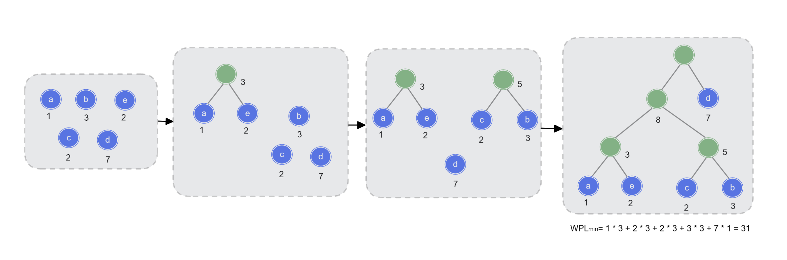
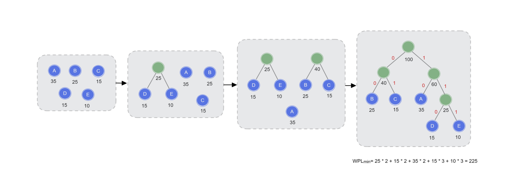

「哈夫曼树 Huffman Tree」

<!-- more -->

「哈夫曼树」也称「最优二叉树」，在含有 $n$ 个带权叶结点的二叉树中，其中带权路径长度 ( WPL ) **最小**的二叉树就是哈夫曼树。

## 哈夫曼树相关术语

- 结点的权值 (weight)：有某种现实含义的数值 (如: 表示结点的重要性)
- 结点的「**带权路径长度 weighted path length**」(WPL)：从树的根结点到该结点的路径长度 (经过的边数) 与该结点上权值的乘积
- **树的**带权路径长度：树中所有**叶结点**的带权路径长度之**和**：

$$
WPL = \sum_{k=1}^{n}w_k \ l_k
$$

其中，$w_k$ 为第 $k$ 个叶子结点的权值，$l_k$ 为从根结点到第 $k$ 个叶子结点的路径长度（经过的边数）.

::: info

从上图中可以看出，当叶子结点权值越大并且距离根结点越近时，可以使整颗树的 WPL 更小，这也符合哈夫曼树的定义. 

:::

## 哈夫曼树的构造

给定 $n$ 个权值分别为 $w_1$ ，$w_2$ ，…  ，$w_n$ 的结点，构造哈夫曼树的过程如下：

1. 将这 $n$ 个结点分别作为 $n$ 颗仅含一个结点的二叉树，构成森林 $F$ ；
2. 构造一个新结点，从 $F$ 中选取两颗根结点权值最小的树作为新结点的左、右子树，并且将新结点的权值置为左、右子树上根结点的权值之和；
3. 从 $F$ 中删除已选择的树，同时将新得到的树加入 $F$ 中；
4. 重复步骤 `2.` `3.` ，直至 $F$ 中只剩下一颗树。

**构造之后的哈夫曼树的性质**：

1. 每个初始结点最终都成为叶结点，且权值越小的结点到根结点的路径长度越长
2. 哈夫曼树的结点总数为 $2n-1$ 
3. 哈夫曼树中不存在度为 $1$ 的结点

例如：使用下列结点构造哈夫曼树，结点下方为其权值

:::warning

构造的哈夫曼树并不唯一，只要是根据上述要求进行构造的且 WPL都是最小且一致的都是哈夫曼树.

:::

## 哈夫曼树的应用

### 哈夫曼编码

「等长编码」是指表示字符的编码都是等长的，那么表示 $n$ 个不同字符需要 $⌈log_2 \ n⌉$ 位，例如：如果使用等长编码表示 ASCII 字符集，每个字符需要 $log_2 \ 128=8$ 位编码；

当每个字符的使用频率相等时，则「等长编码」是一种**空间效率最高**的编码方式，但是当频率不同时，等长编码往往不是最优选择，此时可采用「不等长编码」，将使用频率高的字符使用更少的编码表示，将使用频率低的字符使用更多的编码表示，以此来获得更好的空间效率。

::: warning

对于不等长编码的设计需要谨慎，因为其可能导致歧义，例如：用 `0` 表示 `A`，`1` 表示 `B` ，用 `10` 表示 `C` ，此时发来编码 `1010` ，则对其的解码可以为 `BABA` 或者 `CC` ，这就产生了歧义。

:::

「**前缀编码 prefix code** 」是指一组编码中任一编码都不是其他任何一个编码的前缀。  —— 这就保证了解码时不会出现歧义。

而「哈夫曼编码」就是一种「前缀编码」，其是**最短的**不等长编码方案。也即有最好的空间效率 (占用最少的空间)。

### 哈夫曼编码的构造过程

其构造过程就是构造哈夫曼树的过程，将字符出现的频率替换为权值，即可得到哈夫曼编码，如下图：

| 字符 | 频率 | 编码  |
| :--: | :--: | :---: |
|  A   |  35  | `10`  |
|  B   |  25  | `00`  |
|  C   |  15  | `01`  |
|  D   |  15  | `110` |
|  E   |  10  | `111` |

