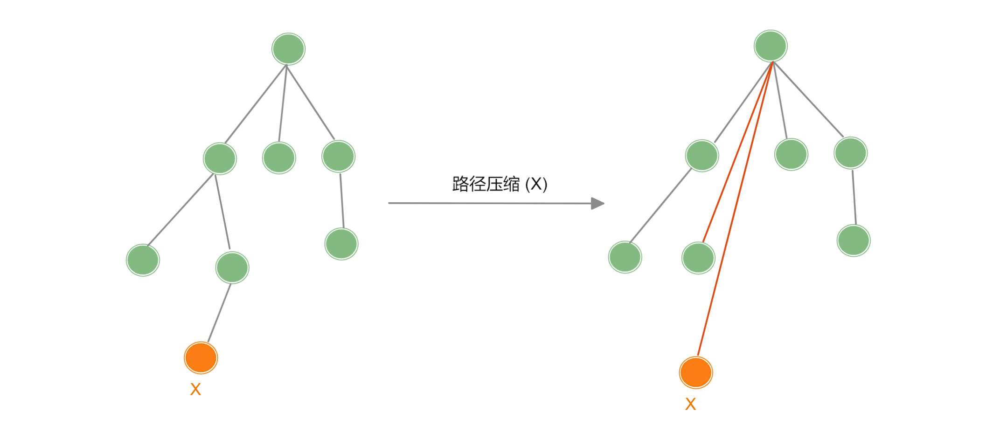

「并查集 Union Find」

<!-- more -->

并查集是一种可以动态维护若干个不重叠的集合，并支持查询与合并的数据结构.

- 查询操作：查询某个元素属于哪个集合
- 合并操作：将两个集合合并为一个集合

并查集中，每个集合以 “根结点” 作为代表，所以并查集的本质就是一个森林 (由若干个树 (集合) 组成).

## 路径压缩

如果将并查集的每个集合以 “树” 的形式进行存储，这棵树在极端形况下可以会退化成一个链表，此时如果若要执行查询操作，时间复杂度为 $O(n)$ ，这并不理想，在并查集中并不关心树的形状，其关键在于集合的代表：【根结点】，也即下面两个树是等价的.



【路径压缩】在每次执行**查询操作**的同时，将访问过的每个结点 (也就是所查询元素的全部祖先) 都直接指向根结点。此时平均时间复杂度会降到 $O(log \ n)$ 

:::code-tabs#language

@tab rust#rust

```rust

```

@tab java#java

```java

```

@tab c++#c++

```cpp
// 保存每个元素的父结点, 根结点的父结点为自己
int fa[N];

// 并查集的初始化： 初始化的并查集中每个结点都是都是单独的集合,因此根结点就是他本身.
void init(int n) {
  for(int i = 1 ; i <= n ; i++) 
    fa[i] = i;
}

// 查询操作: 若 x 为树根, 则 x 代表集合, 否则递归访问 fa[x] 直至根结点
int find(int x) {               // 返回 x 所在集合的代表元素
  if(x == fa[x]) return x;
  return fa[x] = find(fa[x]);   // 路径压缩, fa直接赋值为根结点
}

// 合并操作: 合并元素 x 和 元素 y 所在的集合
void merge(int x, int y) {
  fa[find[x]] = find(y);        // 直接将集合的根结点插入到
}

// 查询操作 (非递归)
int nr_find(int x) {
  int root = x;
  while(fa[root] != root) root = fa[root];   // 找到 x 所在集合的根结点
  
  int i = x;
  int j;
  while(i != root) {
    j = fa[i];             
    fa[i] = root;          // 将 x 的所有祖先结点直接指向根节点
    i = j;
  }
  return root;
}
```

:::


## 按秩合并

对秩的定义有很多，例如：树高 / 集合的大小，按秩合并是一种启发式合并，将 “小的结构” 合并到 “大的结构” 上，这是使用树高作为秩的定义，也即将较矮的树合并到较高的树，直接将较低的树的根节点的父节点赋值为较高的树的根节点，这样合并后，较低的树每次合并后树高 +$1$ 。这样在平均情况下，整体的时间复杂度会更小，对于一般的并查集，只使用按秩合并的话，将所有集合合并到一起的时间复杂度是 $O(nlog \ n)$ 那么每次**查询操作**的时间复杂度为 $O(log \ n)$.

:::info

同时采用 “路径压缩” 和 “按秩合并” 时，时间复杂度会降到 $O(α(n))$ ，其增长比 $log \ n$ 更慢，所以  $O(α(n))$ 是**近似于常数阶**的时间复杂度.

:::

:::code-tabs#language

@tab rust#rust

```rust

```

@tab java#java

```java

```

@tab c++#c++

```cpp
// 保存每个元素的父结点, 根结点的父结点为自己
int fa[N];
// 每个集合的秩 (这里用树高表示秩)
int rank[N]; 

// 并查集的初始化： 初始化的并查集中每个结点都是都是单独的集合,因此根结点就是他本身.
void init(int n) {
  for(int i = 1 ; i <= n ; i++) {
    fa[i] = i;
    rank[i] = 1;
  }
}

// 查询操作: 若 x 为树根, 则 x 代表集合, 否则递归访问 fa[x] 直至根结点
int find(int x) {               // 返回 x 所在集合的代表元素
  if(x == fa[x]) return x;
  return fa[x] = find(fa[x]);   // 路径压缩, fa直接赋值为根结点
}

// 合并操作: 合并元素 x 和 元素 y 所在的集合
void merge(int x, int y) {
  int fx = find(x), fy = find(y);
 	
  if (fx == fy) return ;       // 在同一集合中,无需合并
  
  if (rank[fx] > rank[fy]) {   // fx 所在树高于 fy, 将 fy 合并到 fx
    fa[fy] = fx;
  }else {
    fa[fx] = fy;
    if (rank[fx] == rank[fy])  // 树高相同且不是同一集合, 树高 + 1 
      rank[fy] ++;
  }
}
```

:::

## 并查集的应用

在一般应用中，并查集中的每个集合往往需要维护更多的信息来解决更为复杂的问题，以下是两种常见的应用.

### 维护集合的大小

在按秩合并中，即可使用树高，也能使用集合大小 (集合中元素的个数)，下面为同时维护集合大小的并查集.

:::code-tabs#language

@tab rust#rust

```rust

```

@tab java#java

```java

```

@tab c++#c++

```cpp
// 保存每个元素的父结点, 根结点的父结点为自己
int fa[N];
// 每个集合中元素的个数
int size[N]; 

// 并查集的初始化： 初始化的并查集中每个结点都是都是单独的集合,因此根结点就是他本身.
void init(int n) {
  for(int i = 1 ; i <= n ; i++) {
    fa[i] = i;
    size[i] = 1;
  }
}

// 查询操作: 若 x 为树根, 则 x 代表集合, 否则递归访问 fa[x] 直至根结点
int find(int x) {               // 返回 x 所在集合的代表元素
  if(x == fa[x]) return x;
  return fa[x] = find(fa[x]);   // 路径压缩, fa直接赋值为根结点
}

// 合并操作: 合并元素 x 和 元素 y 所在的集合
void merge(int x, int y) {
  int fx = find(x), fy = find(y);
 	if (size[fx] > size[fy]) {
    fa[fy] = fx;                      // 将 fy 合并到 fx 集合 
 		size[fx] += size[fy];             // fx 集合数量增加
  }else {
    fa[fx] = fy;                      // 将 fx 合并到 fy 集合 
    size[fy] += size[x];              // fy 集合数量增加
  }
}
```

:::


维护每个结点到


