「B 树」

<!-- more -->

## B树的基本概念

「B 树 」又称「多路平衡查找树」，B 树 中所有结点的子结点个数的最大值称为 B 树的阶，通常使用 $m$ 来表示，一颗 $m$ 阶 B 树或为**空树**，或为满足下列条件的 $m$ 叉树：

1. 树中每个结点**至多**有 $m$ 颗子树，即**至多**包含 $m-1$ 个关键字；
2. 对于任意结点，其所有子树高度都相同；【保证 B 树 的平衡，防止其退化为左偏树或者右偏树，即防止层数过多】
3. 若根结点不是终端结点，则至少有两颗子树；
4. 除根结点外的所有非叶结点至少有 $⌈\frac{m}{2}⌉$ 颗子树，即至少含有 $⌈\frac{m}{2}⌉-1$ 个关键字；【防止 B 树 退化为二叉树，使得层数过多，效率降低】
5. 所有的叶结点都出现在同一层次上，并且**不带信息** (可视为外部结点或者类似于折半查找判定树的查找失败结点，实际这些结点并不存在，**指向这些结点的指针为空**)

例如下图为一颗 $5$ 阶 B 树 .

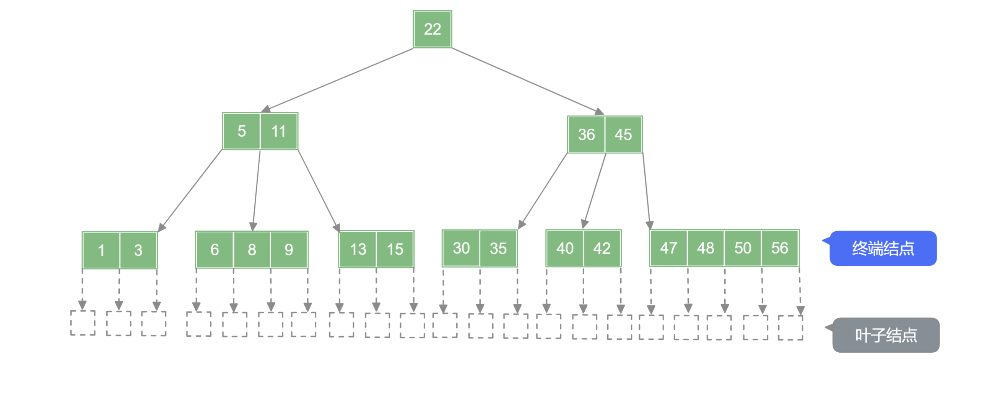

:::warning 注意

计算高度时并不包含 “叶子结点” ，即不带信息的结点不会被计算到高度中。

:::

含有 $n$ 个关键字的 $m$ 阶 B 树，最小高度，最大高度是多少？
$$
log_m(n+1)≤h≤log_{⌈\frac{m}{2}⌉} \frac{n+1}{2} + 1
$$

- **最小高度**——让每个结点尽可能的满，即每个结点有 $m-1$ 个关键字，$m$ 个分叉，则有 $n≤(m-1)(1+m+...+m^{h-1}=m^h-1$ .

也即 :
$$
h≥log_m(n+1)
$$
- **最大高度**——让各层的分支尽可能的少，即根结点只有 $2$ 个分支，其他结点只有 $⌈\frac{m}{2}⌉$ 个分支，各层结点至少有：第一层 $1$ 个、第二层 $2$ 个、第三层 $2⌈\frac{m}{2}⌉$ 个 … 第 $h$ 层 $2(⌈\frac{m}{2}⌉)^{h-2}$ ，第 $h+1$ 层共有 “叶子结点” $2(⌈\frac{m}{2}⌉)^{h-1}$ 个 .

:::details 计算最大高度的另一种思路

记 $k=⌈\frac{m}{2}⌉$ .

|         | 最少结点数 |  最少关键字数   |
| :-----: | :--------: | :-------------: |
| 第一层  |    $1$     |       $1$       |
| 第二层  |    $2$     |    $2(k-1)$     |
| 第三层  |    $2k$    |    $2k(k-1)$    |
| 第四层  |   $2k^2$   |   $2k^2(k-1)$   |
|    …    |     …      |        …        |
| 第 h 层 | $2k^{h-2}$ | $2k^{h-2}(k-1)$ |

$h$ 层的 $m$ 阶 B 树 至少包含关键字总数为 $1+2(k-1)(k^0+k^1+k^2+...+k^{h-2})=1+2(k^{h-1}-1)$ ，如果关键字总数少于这个值，则高度一定小于 $h$ ，因此 $n≥1+2(k^{h-1}-1)$ ，化简之后得：
$$
h≤log_{k} \frac{n+1}{2}+1=log_{⌈\frac{m}{2}⌉} \frac{n+1}{2}+1
$$

:::

## B树的添加操作

在 B 树 中进行添加操作需要在添加后仍然满足 B 树 的特性，B 树 的特性的关键为：

1. 对于 $m$ 阶 B 树 ——除根结点外，结点中关键字个数为 $⌈\frac{m}{2}⌉-1≤n≤m-1$ ；
2. B 树 也是一个 “排序树” ，子树 0 < 关键字 1 < 子树 1 < 关键字 2 …

**向 B 树 中添加关键字时必须添加到【终端结点】层** ，再用 “查找” 找到该添加到结点关键字中的哪个位置，然后判断添加后是否符合 B 树 性质，若不符合，需要进行调整：

- 添加后当前结点关键字总数大于 $m-1$ 时，需将该结点中第 $⌈\frac{m}{2}⌉$ 个关键字 “上移” 到其父结点中 ，同时被添加的结点分裂为两个结点，接受“上移” 关键字的父结点按照此操作递归地进行添加操作.

在下列 B 树 中添加 $73$ 号关键字：

:::tabs

@tab step1

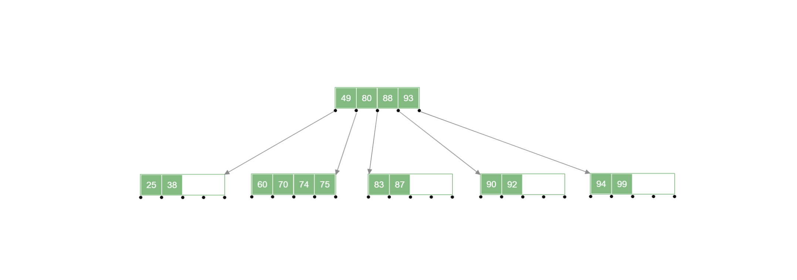

@tab step2

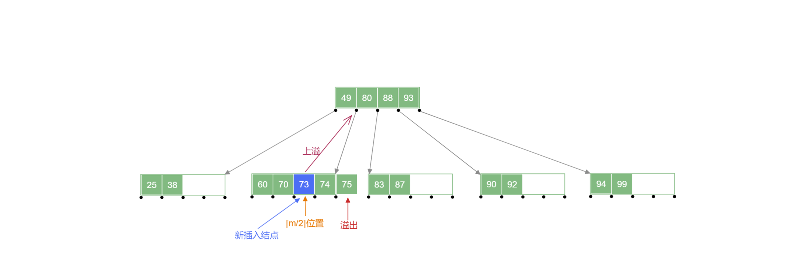

@tab step3

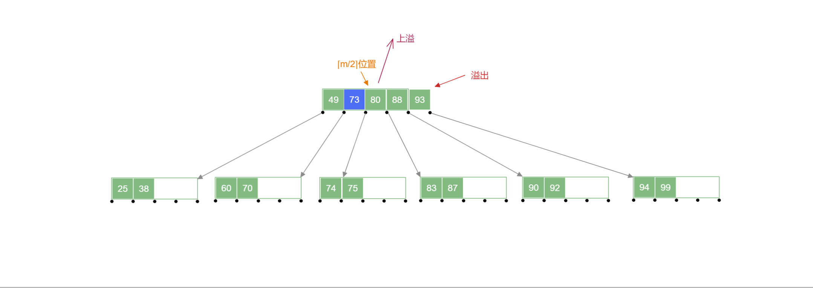

@tab step4

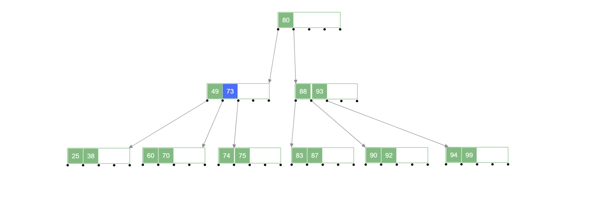

:::

## B树的删除操作

在 B 树 中进行删除操作需要在删除结点后仍然符合 B 树 的性质，B 树 特性的关键为：

1. 对于 $m$ 阶 B 树 ——除根结点外，结点中关键字个数为 $⌈\frac{m}{2}⌉-1≤n≤m-1$ ；
2. B 树 也是一个 “排序树” ，子树 0 < 关键字 1 < 子树 1 < 关键字 2 …

### 1.删除终端关键字

#### 1.1. 含有的关键字的个数在 $(⌈\frac{m}{2}⌉-1,m-1]$ 区间内

此时直接删除该终端关键字即可，例如下面 B 树 中删除 $77$ 号关键字.

:::tabs

@tab step1

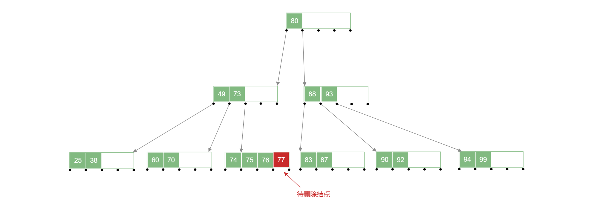

@tab step2

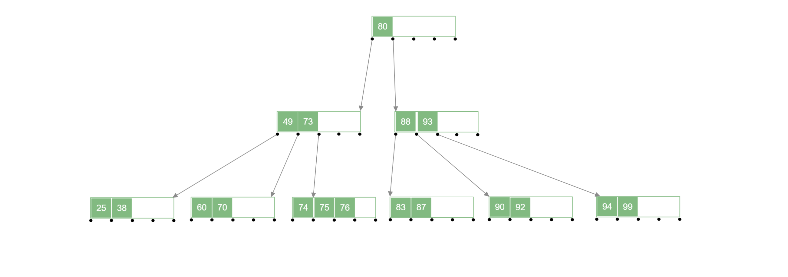

:::

#### 1.2.含有的关键字的个数 $=⌈\frac{m}{2}⌉-1$ 

此时如果删除其中某个关键字，将会导致该结点不符合 B 树 的性质，此时需要该关键字所在结点的**父结点**和**兄弟结点**来修复，此时的**兄弟结点中的关键字要够借**才行，左兄弟或者右兄弟中关键字个数需要 $>⌈\frac{m}{2}⌉-1$ 才行

例如：删除下面 B 树 中的 $70$ 号关键字:

:::tabs

@tab step1

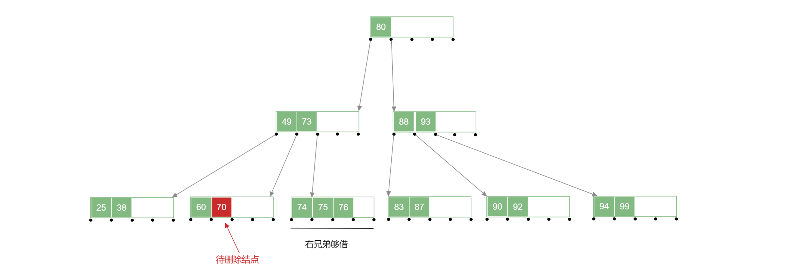

@tab step2

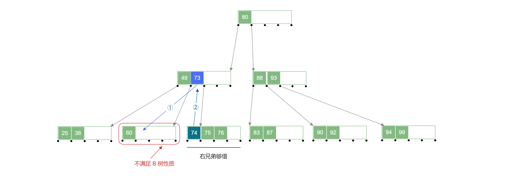

@tab step3

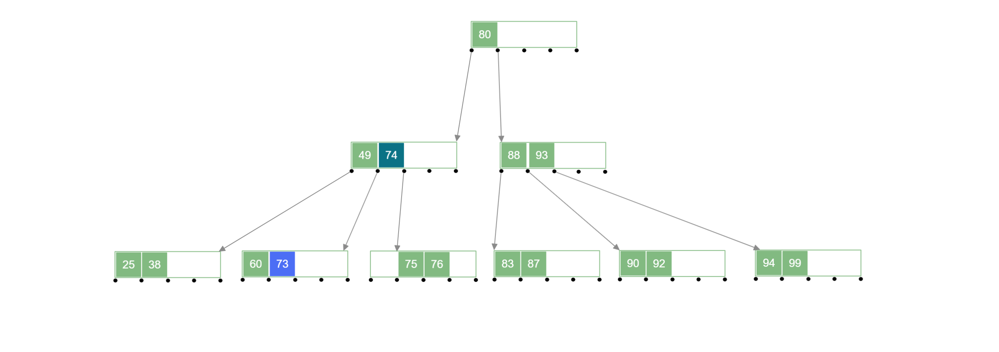

:::

#### 1.3.兄弟结点中关键字不够借

左右兄弟结点含有的关键字的个数 $=⌈\frac{m}{2}⌉-1$ ，此时他们不够借，因为他们借出自己的结点的话会导致自己不满足 B 树 的性质，此时需要另一种解决方案；

删除待删除关键字后，将其所在结点与 左 (或右) 兄弟结点及双亲结点中的关键字进行合并，合并后需要对下放关键字的双亲结点进行判断，若不满足 B 树 性质，递归地进行合并操作即可。

例如：删除下面 B 树 中的 $73$ 号关键字:

:::tabs

@tab step1

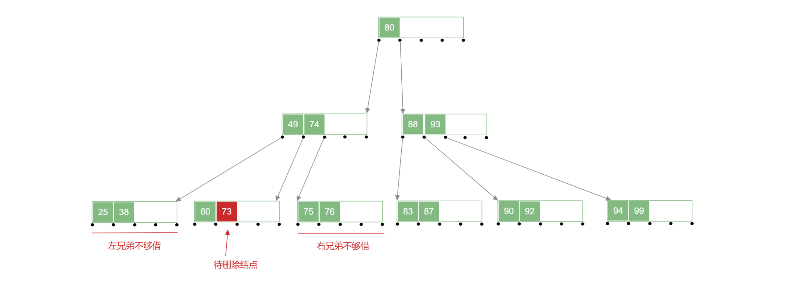

@tab step2

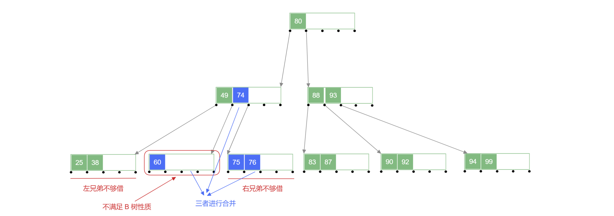

@tab step3

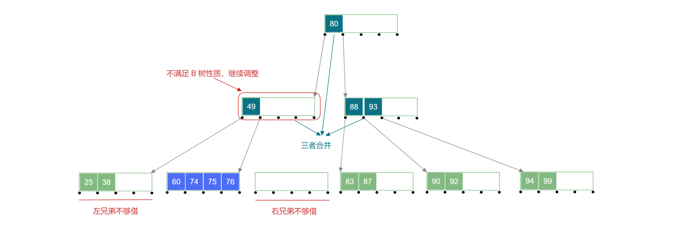

@tab step4

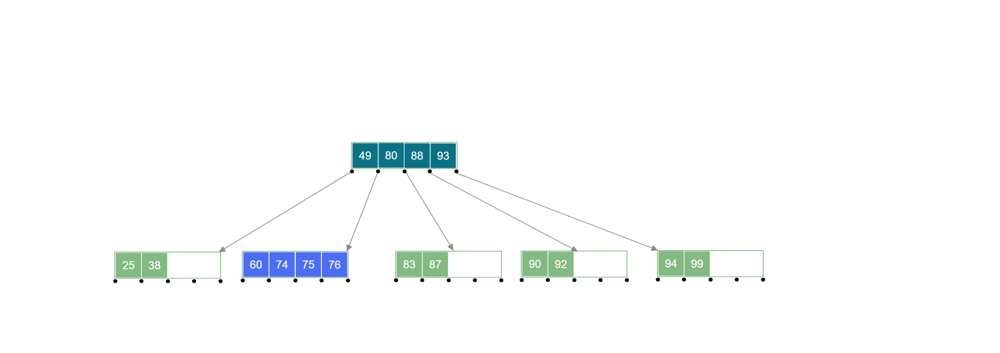

:::

### 2.删除非终端关键字

首先通过寻找其中序遍历的直接前驱关键字或者直接后继关键字来进行替代，因为直接前驱或者直接后继关键字都在 “终端结点层” ，所以也就转换为 “终端结点” 中关键字的删除，再按照对应操作进行即可。

【**转换过程**】

在下列 B 树 中删除 $80$ 号关键字：

- 使用直接前驱结点代替被删除的结点

:::tabs

@tab step1

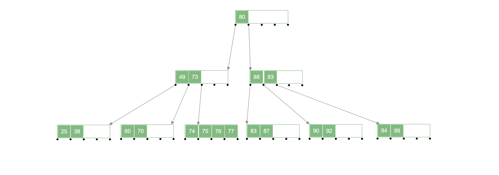

@tab step2

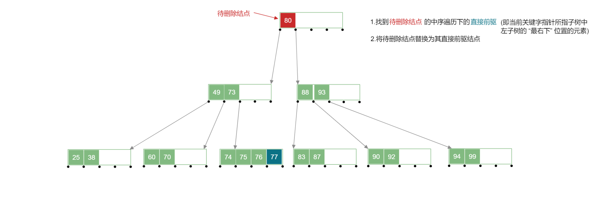

@tab step3

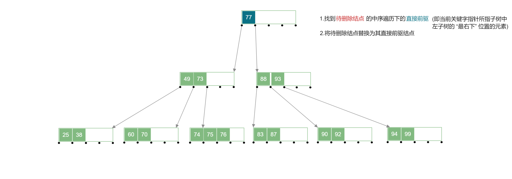

:::

在下列 B 树 中删除 $80$ 号关键字：

- 使用直接后继结点代替被删除的结点

:::tabs

@tab step1

@tab step2

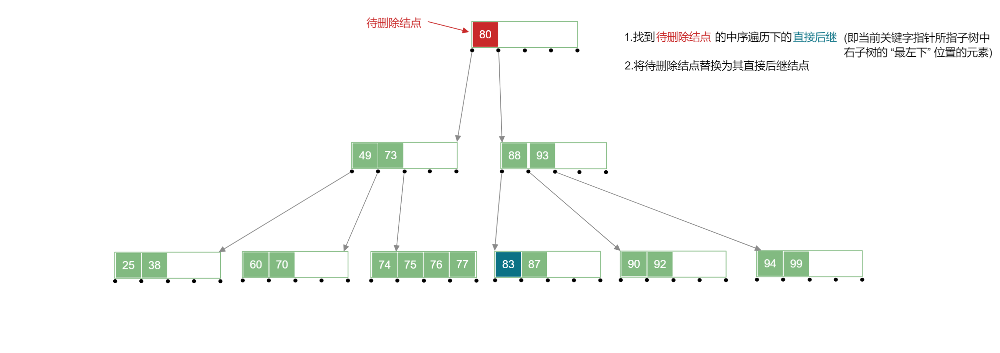

@tab step3

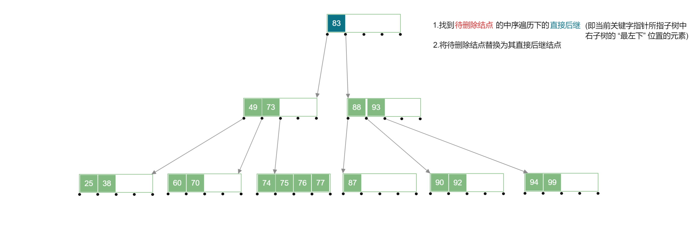

:::

## B+ Tree 的基本概念

一颗 $m$ 阶的 b+ Tree 需要满足的条件：

1. 每个分支结点最多有 $m$ 颗子树；
2. **非叶根**结点至少有两颗子树，其他每个分支结点至少有 $⌈\frac{m}{2}⌉$ 颗子树；
3. **结点的子树个数与关键字个数相等** (注意与 B 树 的区别)；
4. 所有的**叶子结点**包含全部关键字及指向相应记录的指针，叶结点中将关键字按大小顺序排序，并且相邻叶结点按照大小顺序相互连接起来. (即支持顺序查找)
5. 所有**分支结点**中仅包含它的各个子结点中关键字的最大值及指向其子结点的指针.(不包含该关键字对应记录的存储地址，目的减少该关键字的空间占用，以**让更多关键字可以存入固定的磁盘空间中**，使得 b+ Tree 的阶树更大，树更矮，**读盘次数更少，查找更快**)

一颗 $4$ 阶 b+ Tree 如下：

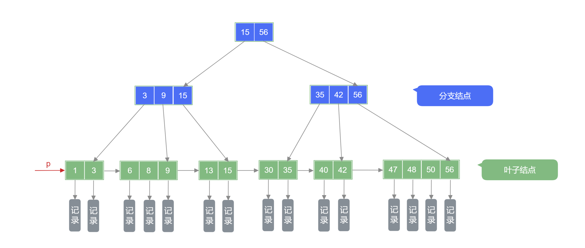

:::warning

注意 B 树 与 b+ Tree 有本质的不同，B 树 是多叉平衡查找树，其每个结点都存储着对应记录的指针；而 b+ Tree 本质是一颗索引树，上层分支结点存储索引关系，最下层叶子结点存储指向记录的指针，以此来获得更快的查找速度.

:::

