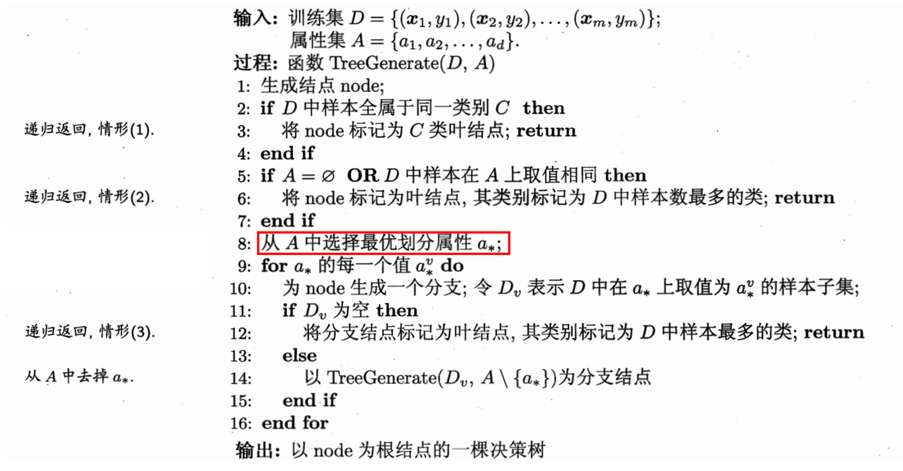

决策树算法

<!-- more -->

# 决策树

Decision Tree — 非参数的有监督学习

基本流程：

:::info

三种情况导致递归返回：

1. 当前结点包含的样本全属于同一类别，无需划分；
2. 当前**属性集为空**，或是所有样本在所有属性上取值相同，无法划分；
   - 将该节点标记为叶节点，并将其**类别设定为【该节点】所含样本最多的类别**。—— 后验分布
3. 当前结点包含的**样本集合为空**，不能划分
   - 将该节点标记为叶节点，但将其**类别设定为【其父节点】所含样本最多的类别**。——先验分布

:::

#### 划分选择

​		算法关键在于选择【最优划分属性】，一个好的属性可以将对类别进行明确的划分。随着划分过程的不断进行，希望决策树的分支节点所包含的样本尽可能的属于同一类别。即该节点的 “**纯度**” 越来越高。

​		与纯度相反的一个概念是 **熵**。

:::info

熵：熵是描述信息的不确定度的，是随机变量不确定度的度量。熵越大，信息的不确定度越大，信息越”混乱”，越不符合决策树分类的需求。

:::

信息熵:
$$
Ent(D)=-\sum_{k=1}^{|y|}p^k \ × \ log_2p_k
$$

<PDF url="/ml.pdf" page="73"/>

