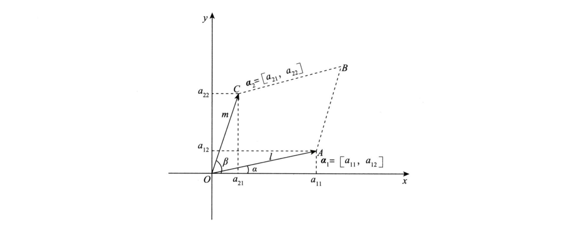

<!-- more -->

## 行列式的定义及性质

### 第一种定义 (本质定义)

对于一个二阶行列式，如下：
$$
D_2 = \left|
\begin{array}
{cc}
a_{11} & a_{12} \\
a_{21} & a_{22} \\
\end{array}
\right| = a_{11}a_{22}-a_{12}a_{21}
$$
分别将第一行的的两个元素 $[a_{11} , a_{12}]$ 看作是一个二维向量 $\boldsymbol{α_1}$  ，同样可以将 $[a_{21},a_{22}]$ 看作是一个二维向量 $\boldsymbol{α_2}$ .

设 $\boldsymbol{α_1}$ 的长度（模）为 $l$ ，$\boldsymbol{α_2}$ 的长度（模）为 $m$，$\boldsymbol{α_1}$ 与 $x$ 轴正向的夹角为 $α$ ，$\boldsymbol{α_2}$   与 $x$ 轴正向的夹角为 $β$ ，如下图所示：

可见图中由 $α_1$ ,$α_2$ 向量组成图形的面积：
$$
\begin{aligned}
S_{\square O A B C} & =l \cdot m \cdot \sin (\beta-\alpha) \\
& =l \cdot m(\sin \beta \cos \alpha-\cos \beta \sin \alpha) \\
& =l \cos \alpha \cdot m \sin \beta-l \sin \alpha \cdot m \cos \beta \\
& =a_{11} a_{22}-a_{12} a_{21},
\end{aligned}
$$
 所以有：
$$
D_2=
\left|\begin{array}{ll}
a_{11} & a_{12} \\
a_{21} & a_{22}
\end{array}\right|=a_{11} a_{22}-a_{12} a_{21}=S_{\square O A B C} .
$$
继续推广到 $3$ 阶，那么 $3$ 阶行列式的值就等于由三维向量组成的平行六面体的**体积**：

所以对于 $n$ 阶行列式的定义为：

**$n$ 阶行列式是由 $n$ 个 $n$ 维向量 $\boldsymbol{\alpha}_{1}=\left[a_{11}, a_{12}, \cdots, a_{1 n}\right], \boldsymbol{\alpha}_{2}=\left[a_{21}, a_{22}, \cdots, a_{2 n}\right], \cdots, \boldsymbol{\alpha}_{n}=\left[a_{n 1}, a_{n 2}, \cdots, a_{nn}\right]$ 组成的，其 (运算规则的) 结果为以这 $n$ 个向量为邻边的 $n$ 维图形的体积。**

:::info 重要理解

:::

### 第二种定义 (逆序数法定义)

### 第三种定义 (展开定理)

### 行列式的性质

