「字符串处理」

<!-- more -->

## Kmp 算法

KMP 算法是一种改进的「字符串模式匹配算法」，其可以在 $O(N+M)$ 的时间复杂度下定位「子串」在「主串」中的位置。

:::details 朴素模式匹配算法

​		设主串为 $S$ ，子串为 $P$ ，定义两个指针 $i$ 和 $j$ ，分别指向 $S$ 和 $P$ 的开头，然后开始一一比较 $S[i]$ 和 $P[j]$ ，当匹配到 $S[i] \neq P[j]$ 时，

- 将 $j$ 置为 $0$ ; 
- $i$ 置为 $i-j+1$ ( $i$  返回到上一轮匹配时  $i$  再加 $1$) 。

然后继续下一轮匹配，直到主串和子串都匹配完，若最后循环结束之后指针 $j < P.size()$ 的话，说明子串还未被匹配完，也即主串中没有子串相匹配的子串。这样的匹配时间复杂度为 $O(NM)$。

```cpp
/* 返回子串在主串中的起始索引；若不匹配，则返回 -1 */
int bf(string s, string p) {
  int n = s.size();
  int m = p.size();
  int i = 0, j = 0;
  while (i < n && j < m) {
    if (s[i] == p[j]) i++, j++;
    else i = i - j + 1, j = 0;
  }
  if (j == m) return i - j;
  else return -1;
}
```

下面为极端情况下的效率最差的朴素匹配。

朴素模式匹配算法效率低下的原因**主要在于其每轮匹配都是独立的，当前匹配没有从上轮匹配中得到任何有用的信息**。

:::center

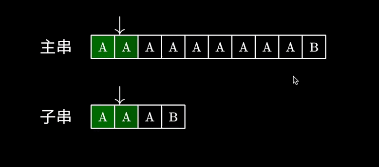

:::

「**前缀和后缀**」

例如：字符串 `S = "ababaacaba"` 的：

- 字符前缀集合：`{a, ab, aba, abab, ababa, ababaa, ababaac, ababaaca, ababaacab}`
- 字符后缀集合：`{a, ba, aba, caba, acaba, aacaba, baacaba, abaacaba, babaacaba}`

:::warning

字符串前缀和后缀集合都不包含**字符串本身**。

:::

「**$next$ 数组**」

### 1.索引从 0 开始的 next 数组， $next[0] = 0$ 

​	设主串为 $S$，子串为 $P$，「$next[i]$」  表示的含义：

- 表示 $P[0]$ ~ $P[i]$ 中**相同的 “子串前缀” 和 “子串后缀” 的最大长度**，可表示为如下式子：

$$
next[i] = 
\begin{cases}
0 & i=0 \\
max\{ \ j \ \} + 1 & j < i \ , \ P[0\thicksim j]=P[i-j \thicksim i] \\
\end{cases}
$$

:::warning

- $j$ 是指向 “前缀” 末尾字符的指针，由于子串索引从 $0$ 开始，所以 $P[0\thicksim j]$  为前缀，长度为 $j+1$ 。
- $j < i$   的原因是串的前缀和后缀不能是串本身。

:::

「**$next$ 数组的初始化**」

1. 暴力枚举所有的子串的所有前后缀进行比较，时间复杂度为 $O(n^2)$

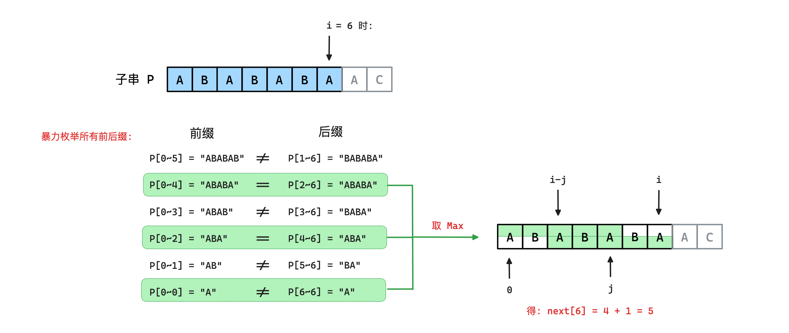

:::details 暴力求解 next 数组

时间复杂度： $\ge O(m^2)$

```cpp
/* 暴力枚举所有前后缀求解 next 数组 */
void get_next(const string& p, int next[]) {
  next[0] = 0;
  for (int i = 1 ; i < p.size(); i++) {
    for (int j = i-1 ; j < i && j >= 0; j--) {
      // 前缀: p[0~j]  后缀: p[i-j,i]
      if (p.substr(0, j+1) == p.substr(i-j, j+1)) {
        next[i] = max(next[i], j + 1);
      }
    }
  }
}
```

:::

2. 优化求解 $next$ 数组

​	在暴力求解 $next$ 数组的过程中，没有充分利用已知信息，导致计算 “相同前后缀” 的最大长度时出现了重复计算，而这里没有利用的信息就是在计算 $next[i]$ 时， $next[0]$  ~  $next[i-1]$ 是已知的。


> 如何利用 $next[0]$ ~ $next[i-1]$ 来计算 $next[i]$ 呢 —— 本质就是 Kmp 算法的思想

$$
next[i-1] = Max\{next[i-1] \ , \ next[next[i-1]] \ , \ next[next[next[i-1]]] \ ... \}
$$

其中 $next[i-1] > next[next[i-1]] > ...$ 。

当  $j$  是满足 $P[0 \thicksim j] = P[i-j \thicksim i]$  且 $j > 0$ 时，那么 $j-1$ 时必然满足 $P[0 \thicksim j-1] = P[i-j \thicksim i-1]$ ，所以就有：
$$
next[i] = Max\{next[i-1]+1 \ , \ next[next[i-1]]+1 \ , \ next[next[next[i-1]]]+1 \ ... \}
$$
如下图：

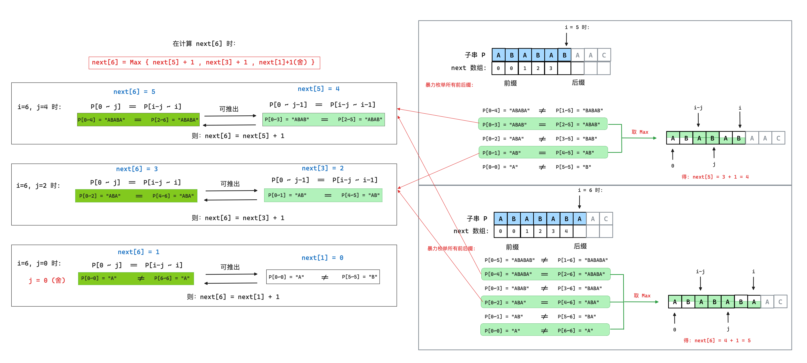

则已知的 $next[0]$ ~ $next[i-1]$ 计算 $next[i]$ ，可以分为两种情况：

- 若 `P[0 ~ i-1]` 的前缀向后扩展的一位字符 `p[j] ` **等于** `P[0 ~ i-1]` 的后缀扩展的一位字符 `p[i]` 时，即 `P[j] == P[i]` 时，则 `P[i]` 对应的 `next[i] = j + 1` 。
- 若不相等，即 `P[j] != P[i]` 时，则需要重新寻找 “相同的前后缀”，此时就可以借助已知的 `next[0~ i-1]` 信息，让指针 `j` 回退到 `next[j-1]` 处继续寻找 “相同的前后缀”，而不是从头开始，则：令 `j = next[j-1]` 。循环此操作，直到找到 “相同的前后缀” 或没有相同的前后缀`j=0` 时结束此操作。

> 在遍历 $P$ 的过程中，`j`  表示什么？

-  用 `j+1`  表示当前位置  `i` 处的前缀和后缀的最长公共串长度。即： **`p[0]` 到 `p[i]` 之间的字符串的前后缀的最长公共串长度**为 `j+1` 。

下图演示了 $next$ 数组初始化的过程 (下图中一直处于变换的 前缀长度就是 $j$  ):

:::center

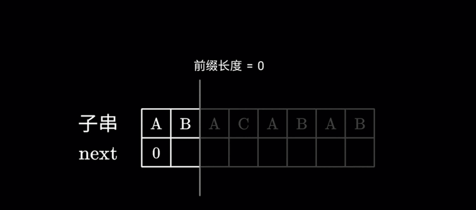

:::

:::code-tabs#language

@tab rust#rust

```rust

```

@tab java#java

```java

```

@tab c++#c++

```cpp
/* 递推求解 next 数组, 时间复杂度 O(m) */
void get_next(const string& p, int* next) {
  next[0] = 0; 
  for(int i = 1, j = 0; i < p.size(); i++) {
    while (p[i] != p[j] && j > 0) j = next[j-1]; 
    if (p[i] == p[j]) j ++;   // 若下一字符匹配，先 j++
    next[i] = j;              // 再赋给 next[i]
  }
}
```

:::

「KMP 算法实现」

​	那么有了 $next$  数组之后，当子串与主串不匹配的时候，指向主串的指针  $i$ 不动，让指向子串的指针  $j$  回退到子串的**第  $next[j-1]$  个位置**继续进行比较。

即：某次**匹配失败**之后子串 $P$ 中指针 $j$ 的移动如下，指针  $j$  需要从子串的 第  $next[j-1]$  个字符处再继续开始匹配，如下图：

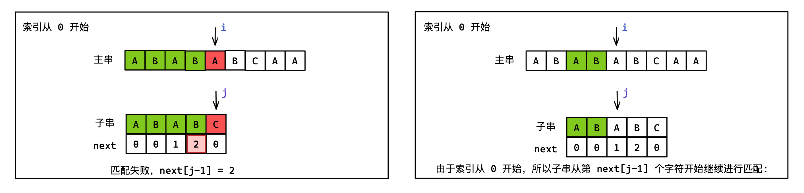

:::code-tabs#language

@tab rust#rust

```rust

```

@tab java#java

```java

```

@tab c++#c++

```cpp
/* Kmp: 返回 子串p 在 主串s 中第一次出现的位置, 时间复杂度 O(n+m) */
int kmp(const string& s, const string& p) {
  int next[p.size()];
  for (int i = 0 ; i < p.size() ; i++) next[i] = 0;
  get_next(p, next);
  int i = 0, j = 0;
  while (i < s.size()) {
    if (s[i] == p[j]) i++, j++;       
    else if (j > 0 && s[i] != p[j]) j = next[j-1];
    else i ++;
  }
  if (j == p.size()) return i-j;
  else return -1;
}
```

:::

:::details 三种情况分析

```
第一种情况: s[i] == p[j]:

                      i                                                  i
主串：       a  b  a  "c"  a  b  a     -->        主串：       a  b  a  c  a  b  a

                      j                                                  j
子串：             a  "c"  a  b        -->        子串：             a  c  a  b
next数组：         0   0   1  0                   next数组：         0  0  1  0

操作： i ++ , j ++; 也即继续向后逐一匹配
--------------------------------------------------------------------
第二种情况: s[i] != p[j] && j > 0 :
                i                                       i
主串：       a  "b"  a  c  a  b  a   -->      主串：   a  b  a  c  a  b  a

                j                                       i
子串：       a  "c"  a  b            -->      子串：      a  c  a  b
next数组：   0   0   1  0                     next数组：  0  0  1  0

操作： i 指针不动，j = next[j - 1];
不匹配时，利用已被匹配的部分子串留下的信息，即 next 数组，将 j 指针置为最佳位置 next[j-1]; 
此时便可以不再去匹配 “已匹配的部分子串” 中 “相等的前后缀”。
--------------------------------------------------------------------
第三种情况: s[i] != p[j] && j == 0:
                i                                          i
主串：       a  "b"  a  c  a  b  a   -->        主串： a  b  a  c  a  b  a

                j                                          j
子串：          "a"  c  a  b         -->        子串：       a  c  a  b
next数组：       0   0  1  0                    next数组：   0   0  1  0

操作： i ++;
j 被赋值为 0 ，此时在已知的 next 数组中，没有可以利用的信息，并且此时主串中向后扩展的一位
和字符串的首位不匹配时，从主串的下一个字符 和 字符串的开头继续匹配。
--------------------------------------------------------------------
```

:::


下面是完整的一个 KMP 算法演示：

:::center

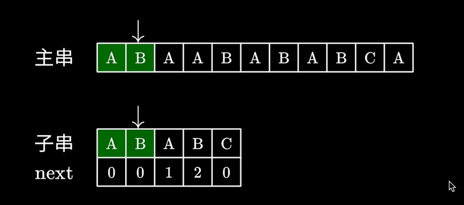

:::

:::details 优化求解 next 数组本质就是 Kmp 算法

​	Kmp 算法和求解 $next$ 数组的过程，本质都是模式匹配，在 $next$ 数组的求解中，是子串的 “前缀 和 后缀” 的模式匹配，而在 Kmp 中，是 “主串 和 子串” 的匹配。

设主串为 $S[0\thicksim n]$ ，子串为 $P[0\thicksim m]$ ，

1. 根据子串的自我匹配，求解 $next$ 数组，$next[i]$ 表示 $P[0\thicksim i]$ 中 相同前后缀的最大长度。即：

$$
next[i] = 
\begin{cases}
0 & i=0 \\
max\{ \ j \ \} + 1 & j < i \ , \ P[0\thicksim j]=P[i-j \thicksim i] \\
\end{cases}
$$

2. 根据主串和子串的匹配，求解 $k$ 数组，$k[i]$ 表示 $S[0\thicksim i]$ 与 $P[0\thicksim j]$ 的前缀中能够匹配的最大长度。即： 

$$
k[i] = 
\begin{cases}
0 & i=0 \\
max\{ \ j \ \} + 1 & j \le i \ , \ P[0\thicksim j]=S[i-j \thicksim i] \\
\end{cases}
$$

上面递推式的区别在于 $j$  是否可以等于 $i$ ；

- 子串的前后缀不能等于串本身，所以必须有 $j < i$ ；
- 子串和主串可以完全相等，并且匹配过程中需要匹配完整个子串才行，所以需要 $j\le i$ 。

所以 $next$ 数组的优化求解过程本质就是 Kmp 算法，只有在匹配过程中对串的限制而已。所以Kmp 算法实现方式也可以是 $next$ 数组的实现方式，只有初始 $i$ 和 $j$ 的区别：

```cpp
/* Kmp: 返回 子串p 在 主串s 中第一次出现的位置, 时间复杂度 O(n+m) */
int kmp(const string& s, const string& p) {
  int next[p.size()];
  get_next(p, next);
  /* 开始匹配 */
  for(int i = 0, j = 0; i < s.size() ; i++) {
    while (j > 0 && s[i] != p[j]) j = next[j-1];
    if (s[i] == p[j]) j ++;
  /*
    k[i] = j; 
    if (k[i] == p.size()) { ... }   // 表示 子串p 在 主串s 中第一次出现
  */   
    if (j == p.size()) {            // 子串p 在 主串s 中第一次出现
      return i-j+1;         
      j = next[j-1];        
    }
  }
  return -1;
} 
```

:::


:::

例题：[acw831. KMP 字符串](https://www.acwing.com/problem/content/description/833/)

:::details 解答

```cpp
#include <iostream>
#include <string>
#include <vector>
using namespace std;

/* 初始化 next 数组 */
void get_next(const string& p, int* next) {
  int prefix_len = 0;     
  next[0] = 0;            
  for(int i = 1; i < p.size(); i++) {
    while (p[i] != p[prefix_len] && prefix_len > 0) {
      prefix_len = next[prefix_len - 1];  
    }
    if (p[i] == p[prefix_len]) prefix_len += 1; 
    next[i] = prefix_len;   
  }
}
/* kmp 算法: 寻找匹配串p 在 主串s 中出现的位置 */
void kmp(const string& s, const string& p) {
  int next[p.size()];
  get_next(p, next);
  int i = 0, j = 0;
  while (i < s.size()) {
    if (s[i] == p[j]) {
      i++, j++; 
      /* 匹配完成一次铺助串之后，继续向后匹配 */
      if (j == p.size()) {   
        cout << i-j << " ";
        j = next[j-1];  
      }
    }        
    else if (j > 0) j = next[j-1];       
    else i += 1;                         
  }
}
int main() {
  int n, m;
  string p, s;
  cin >> m;
  cin >> p;
  cin >> n;
  cin >> s;
  kmp(s, p);
  return 0;
}
```

:::


### 2.索引从 1 开始的 next 数组，$next[1]=0$

Kmp 算法和求解 $next$ 数组的过程，本质都是模式匹配，在 $next$ 数组的求解中，是子串的 “前缀 和 后缀” 的模式匹配，而在 Kmp 中，是 “主串 和 子串” 的匹配。

设主串为 $S[1\thicksim n]$ ，子串为 $P[1\thicksim m]$ ，

1. 根据子串的自我匹配，求解 $next$ 数组，$next[i]$ 表示 $P[1\thicksim i]$ 中 相同前后缀的最大长度。即：

$$
next[i] = 
\begin{cases}
0 & i=1 \\
max\{ \ j \ \} & j < i \ , \ P[1\thicksim j]=P[i-j+1 \thicksim i] \\
\end{cases}
$$

2. 根据主串和子串的匹配，求解 $k$ 数组，$k[i]$ 表示 $S[1\thicksim i]$ 与 $P[1\thicksim j]$ 的前缀中能够匹配的最大长度。即： 

$$
k[i] = 
\begin{cases}
0 & i=1 \\
max\{ \ j \ \} & j \le i \ , \ P[1\thicksim j]=S[i-j+1 \thicksim i] \\
\end{cases}
$$

其本质和 $next$ 数组从 $0$ 开始是一样的。

```cpp
/* 递推求解 next 数组, 时间复杂度 O(m) */
void get_next(const string& p, int* next) {
  next[0] = -1;
  next[1] = 0;
  for (int i = 2 ,j = 0 ; i <= p.size() ; i++) {
    while(j > 0 && p[i] != p[j+1]) j = next[j];
    if (p[i] == p[j+1]) j ++;
    next[i] = j;
  }
}
```

```cpp
/* Kmp: 返回 子串p 在 主串s 中第一次出现的位置, 时间复杂度 O(n+m) */
int kmp(const string& s, const string& p) {
  int next[p.size()];
  get_next(p, next);
  for (int i = 1 ,j = 0 ; i <= s.size() ; i++) {
    while(j > 0 && s[i] != p[j+1]) j = next[j];
    if (s[i] == p[j+1]) j ++;
  /*
    k[i] = j; 
    if (k[i] == p.size()) { ... }   // 表示 子串p 在 主串s 中第一次出现
  */   
    if (j == p.size()-1) {          // 子串p 在 主串s 中第一次出现
      return i-j;
      j = next[j];
    }
  }
  return -1;
}
```


### 3.索引从 1 开始的 next 数组，$next[1]=0,next[2]=1$

设子串为 $P[1 \thicksim m]$ ，主串为 $S[1 \thicksim n]$ ；

​	定义 $next[j]$ 表示当子串中第  $j$  个字符与主串中相应字符 “不相等” 时，在**子串**中需要和主串中该字符进行比较的字符**的位置**。
$$
next[j] = 
\begin{cases}
0 & i=1 \\
max\{ \ k \ \} & 1 < k < j \ , \ P[1\thicksim k-1]=P[i-k+1 \thicksim j-1] \\
1 & k=1(不存在相同子串,下一步进行 \ P[1] \ 和 \ S[i] \  的比较)
\end{cases}
$$

```cpp
/* 递推求解 next 数组, 时间复杂度 O(m) */
void get_next(const string& p, int next[]) {
  next[1] = 0;
  int i = 1, j = 0;
  while (i < p.size()) {
    if (j == 0 || p[i] == p[j]) { i++, j++; next[i] = j; }
    else { j =  next[j]; }
  }
}
```

```cpp
/* Kmp: 返回 子串p 在 主串s 中第一次出现的位置, 时间复杂度 O(n+m) */
void kmp(const string& s, const string& p) {
  int next[p.size()];
  int i = 1, j = 1;
  get_next(p, next);
  while(i <= s.size()) {
    if (j == 0 || s[i] == p[j]) i ++, j ++;
    else j = next[j];
    if (j == p.size()) {      // 子串p 在 主串s 中第一次出现
      cout << i-j œ<< " ";
      j = next[j];
    }
  }
}
```

相较于上面另一种有效索引从 $1$ 开始的  $next$ 数组的定义，区别如下：

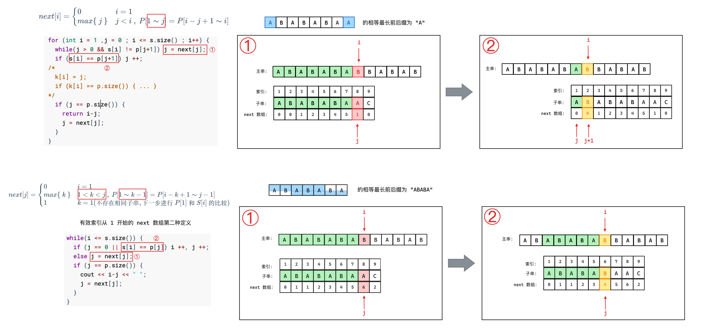

> $nextval$ 数组

前面定义的 $next$ 数组在某些情况下有缺陷，例如子串 `"aab"` 在和主串 `"aaabaaaab"` 匹配时:

:::tabs

@tab1 

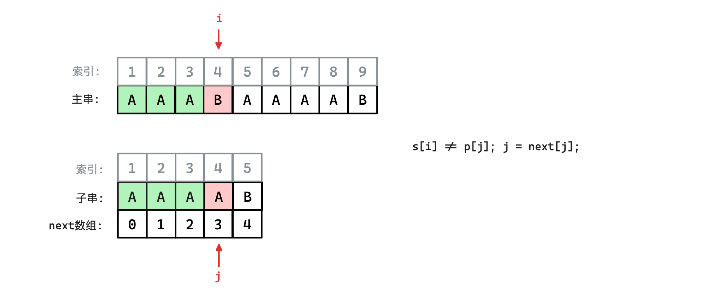

@tab2 

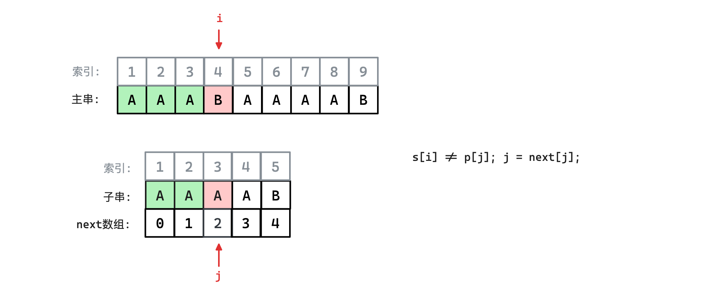

@tab3 

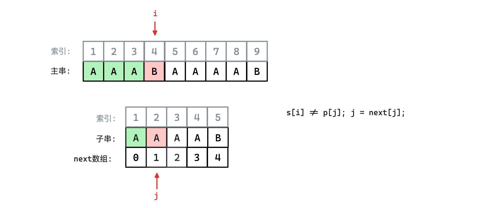

@tab4 

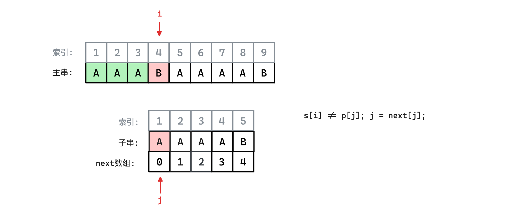

@tab5 

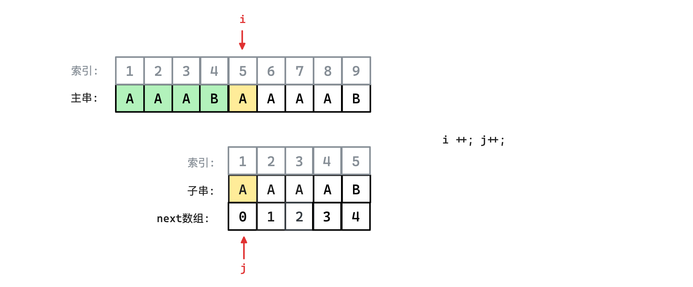

:::

​	由于子串中第 $1$  ~  $3$ 个字符和第 $4$ 个字符都相等，所以不需要再和主串中的第 $4$ 个字符相比较，而是将子串**连续向右滑动** $4$ 个字符的位置直接进行 $S[5]$ 和 $P[1]$ 的比较。

上述 $next$ 数组存在的问题就是当 $P[j] \neq S[j]$  时，Kmp 算法会令 $j = next[j]$ ，此时：

- 若 $P[j] = P[next[j]]$ 时，则必有 $P[next[j]] \neq S[j]$ ，那么这次比较就是无意义；

​	为了避免这种问题，可以对已有的 $next$ 数组初始化时做一下修改，就是在 $j=next[j]$ 之后，若有 $P[j] = P[next[j]]$ ，则继续调用 $j=next[j]$ ，循环下去，直到两者不等 或 $j=0$ 为止。

```cpp
/* p 的索引从 1 开始， nextval 的索引从 1 开始，修正之后的 next 数组 */
void get_nextval(const string& p, int* nextval) {
  nextval[1] = 0;
  int i = 1, j = 0;
  while (i < p.size()) {
    if (j == 0 || p[i] == p[j]) {
      i ++, j ++;
      if (p[i] != p[j]) nextval[i] = j;
      else nextval[i] = nextval[j];    // p[i] == p[j] 时，循环 j = next[j];
    }
    else j = nextval[j];
  }
}
```

​	虽然这种优化对 kmp 算法有用，但是这种只是将多次重复的循环放在 $next$ 数组的初始化中，所以 $next$ 数组的初始化会相应减慢，而 kmp 又必须依赖于 $next$ 数组，所以这个优化意义不大。 

手算三种 $next$ 数组以及 $nextval$ 快速手算

<BiliBili bvid="BV1tW41157tv" ratio="16:9" low-quality no-danmaku />

