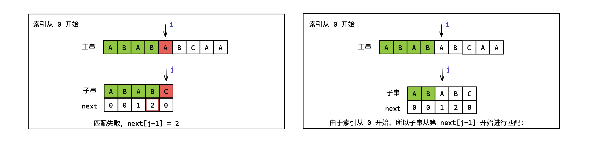
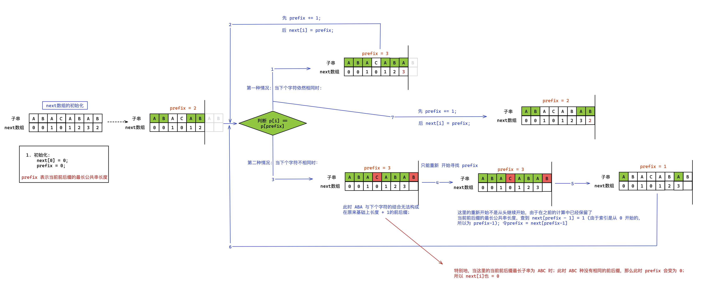

「字符串处理」

<!-- more -->

## Kmp 算法

KMP 算法是一种改进的「字符串模式匹配算法」，其可以在 $O(N+M)$ 的实现定位「子串」在「主串」中的位置。

:::details 朴素模式匹配算法

主串为 $S$ ，子串为 $P$ ，定义两个指针 $i$ 和 $j$ ，分别指向 $S$ 和 $P$ 的开头，然后开始一一比较 $S[i]$ 和 $P[j]$ ，当匹配到 $S[i] \neq P[j]$ 时，

- 将 $j$ 置为 0;
- $i$ 置为 $i-j+1$ ($i$ 返回到上一轮匹配时 $i$ 再加 $1$) 。

然后继续下一轮匹配，直到主串和子串都匹配完，若最后循环结束之后指针 $j < P.size()$ 的话，说明子串还未被匹配完，也即主串中没有子串相匹配的子串。这样的匹配时间复杂度为 $O(NM)$。

```cpp
int bf(string s, string p) {
  int n = s.size();
  int m = p.size();
  int i = 0, j = 0;
  while (i < n && j < m) {
    if (s[i] == p[j]) i++, j++;
    else i = i - j + 1, j = 0;
  }
  if (j == m) return i - j;
  else return 0;
}
```

下f面为极端情况下的效率最差的朴素匹配。

朴素模式匹配算法效率低下的原因**主要在于其每轮匹配都是独立的，当前匹配没有从上轮匹配中得到任何有用的信息**。

:::center


:::

「**前缀和后缀**」

例如：字符串 `S = "ababaacaba"` 的：

- 字符前缀集合：`{a, ab, aba, abab, ababa, ababaa, ababaac, ababaaca, ababaacab}`
- 字符后缀集合：`{a, ba, aba, caba, acaba, aacaba, baacaba, abaacaba, babaacaba}`

:::warning

字符串前缀和后缀集合都不包含**字符串本身**。

:::

「**$next$ 数组**」

> 一. 有效索引从 $0$ 开始的 $next$ 数组, $next[0] ≠ -1$ 

设主串为 $B$，子串为 $A$，$next[j]$ 表示当前 $A[j]$ ~ $A[0]$ 中前缀子串和后缀子串相同的最大长度；也代表着某次匹配失败之后，指针 $j$ 需要跳过 $next[j-1]$ 个字符后再继续开始匹配，如下图：



「**$next$ 数组的初始化**」

使用递推的思维初始化 $next$ 数组:
$$
next[i] = 
\begin{cases}
0 \\
max{}
\end{cases}
$$





下面为 $next$ 数组初始化的过程:

:::center


:::

:::code-tabs#language

@tab rust#rust

```rust

```

@tab java#java

```java

```

@tab c++#c++

```cpp
void get_next(int* next) {
  int prefix_len = 0;
  next[0] = 0;
  for(int i = 1; i < p.size(); i++) {
    // 向前寻找不匹配时，寻找已匹配的前后缀中的 相等的前后缀，然后从其重新开始寻找新的前后缀
    while (p[i] != p[prefix_len] && prefix_len > 0) {
      prefix_len = next[prefix_len - 1];
    }
    if (p[i] == p[prefix_len]) prefix_len += 1;
    next[i] = prefix_len;
  }
}
int kmp(string s, string p) {
  int next[m];
  get_next(p, next);
  int i , j = 0;
  while (i < s.size() && j < p.size()) {
    if (s[i] = p[j]) i++, j++;        // 匹配时,两个指针都向前走 
    else if (j > 0) j = next[j-1];    // 不匹配时, i 指针不同, j 指针撤回到 next[j-1] 处
    else i += 1;                      // j == 0, 不存在 j-1 索引, 此时 i 指针向前走
  }
  if (j == m) return i - j;
  else return -1;
}
```

:::

:::details 三种情况分析

```
            i
主串：       a  b  a  c  a  b  a

            j
子串：       a  c  a  b
next数组：   0  0  1  0

第一种情况: s[i] == s[j];  操作： i ++ , j ++; 也即继续向后逐一匹配
--------------------------------------------------------------------

               i
主串：       a  b  a  c  a  b  a

               j
子串：       a  c  a  b
next数组：   0  0  1  0

第二种情况: s[i] != s[j] && j > 0; 操作： i 指针不动，j = next[j - 1];
不匹配时，利用已被匹配的部分子串留下的信息，即 next 数组，将 j 指针置为最佳位置 next[j-1]; 
此时便可以不再去匹配 “已匹配的部分子串” 中 “相等的前后缀”。
--------------------------------------------------------------------


               i
主串：       a  b  a  c  a  b  a

            	 j
子串：          a  c  a  b
next数组：      0  0  1  0

第三种情况: s[i] != s[j] && j == 0; 操作： i ++;
j == 0 ，此时还只有一个字符，没有 next 数组，所以向前需要移动主串的指针。
--------------------------------------------------------------------


                  i
主串：       a  b  a  c  a  b  a

                  j
子串：             a  c  a  b
next数组：         0  0  1  0

第一种情况: s[i] == s[j], 操作： i ++, j++;
--------------------------------------------------------------------
...
```

:::


:::center


:::

> 二. 有效索引从 $1$ 开始的 $next$ 数组，$next[0] = -1,next[1]=0$ 

设主串为 $B[1$~$i]$， 子串为 $A[1$~$j]$ ，KMP 算法分为两步：

1. 对子串 $A$ 进行自我匹配：求出 $next$ 数组，其中 $next[i]$ 表示 “ $A$ 中以 $A[i]$ 结尾的非前缀字符串” 与 “$A$ 的前缀” **能够相匹配的最大长度**。

:::center

$next[i] = max\{j\}$ ，其中 $j < i$ ，并且 「$A[i-j+1]$ ~ $A[i]$ == $A[1]$ ～ $A[j]$」

:::

特别地，规定 $next[1]=0$ 。

2. 对子串 $A$ 和 主串 $B$ 进行匹配，求出一个数组


二. 索引从 $0$ 开始的 $next$ 数组

<BiliBili bvid="BV1tW41157tv" ratio="16:9" low-quality no-danmaku />


## 字符串哈希


## Manacher 算法


:::code-tabs#language

@tab rust#rust

```rust

```

@tab java#java

```java

```

@tab c++#c++

```cpp

```

:::