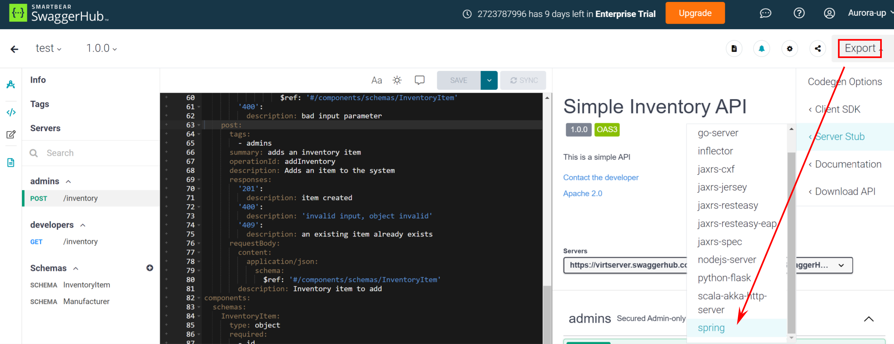
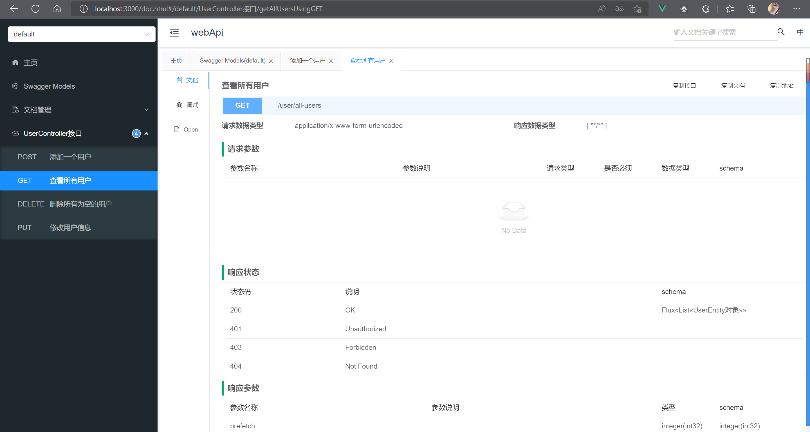
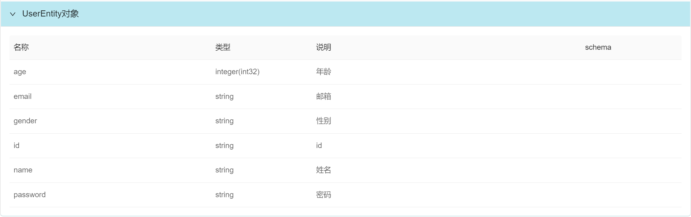

springboot 整和 Swagger

<!-- more -->


【[Swagger 官网](https://swagger.io/)】

其是一个使用文档快速生成 API 接口文档的工具，既可以使用 [Swagger Editor](https://editor.swagger.io/) 去生成 API 接口文档，也可以使用在各种语言或者框架中对 Swagger 的集成。


[SwaggerHub](https://app.swaggerhub.com)  可以在线编写 API 文档，并且可以生成不同语言的的版本. 




[Springfox](http://springfox.github.io/springfox/) 是在 Spring 中的对 Swagger 的集成. Swagger 同时还支持自定义 UI 界面. [Knife4j](https://doc.xiaominfo.com/) 是一个开源的 Swagger UI


>  🚀 实例：在 Springboot 项目中使用 Springfox 和 Knife4j 生成 OpenAPI3 规范的 API 接口文档。

导入相关依赖:

:::tabs 

@tab Springfox 

[Maven Repository: io.springfox » springfox-boot-starter (mvnrepository.com)](https://mvnrepository.com/artifact/io.springfox/springfox-boot-starter)

```xml
<dependency>
  <groupId>io.springfox</groupId>
  <artifactId>springfox-boot-starter</artifactId>
  <version>3.0.0</version>
</dependency>
```

@tab Knife4j

[Maven Repository: com.github.xiaoymin » knife4j-springdoc-ui (mvnrepository.com)](https://mvnrepository.com/artifact/com.github.xiaoymin/knife4j-springdoc-ui)

```xml
<dependency>
  <groupId>com.github.xiaoymin</groupId>
  <artifactId>knife4j-springdoc-ui</artifactId>
  <version>3.0.3</version>
</dependency>
```

:::

配置相关：

:::tabs

@tab java 配置类

```java
@Configuration
@EnableOpenApi
public class SwaggerConfig {

  @Value("${knife4j.enable}")
  private Boolean swaggerEnabled;

  @Bean
  public Docket createRestApi(){
    return new Docket(DocumentationType.OAS_30)
            .apiInfo(apiInfo())
            // 是否开启
            .enable(swaggerEnabled)
            .select()
            // 扫描的路径使用 @Api 的 controller
            .apis(RequestHandlerSelectors.withMethodAnnotation(ApiOperation.class))
            // 指定路径处理, PathSelectors.any() 代表所有的路径
            .paths(PathSelectors.any())
            .build();
  }
  public ApiInfo apiInfo() {
    return new ApiInfoBuilder()
            .title("webApi")
            .description("测试webAPI")
            //作者信息
            .contact(new Contact("HDD", "https://aurora-up.gitee.io/aurora-blog/", "2723787996@qq.com"))
            .version("1.0.0")
            .build();
  }
}
```

@tab yaml 配置文件

```yaml
spring:
	mvc:
		pathmatch:
			# 配置策略
      matching-strategy: ant-path-matcher
      
 knife4j:
  enable: true
```

:::

:::info

配置文件中主要使用的两个 API：

- [Docket](http://springfox.github.io/springfox/javadoc/current/springfox/documentation/spring/web/plugins/Docket.html)

- [ApiSelectorBuilder](http://springfox.github.io/springfox/javadoc/current/springfox/documentation/spring/web/plugins/ApiSelectorBuilder.html)

可以通过其中的方法进行更多的配置.

:::


使用相关：

:::tabs

@tab Controller 

```java {3,16}
@RestController
@RequestMapping("/user")
@Api(tags = "UserController接口")
public class UserHandler {

  private final UserMapper userMapper;

  public UserHandler(@Autowired UserMapper userMapper) {
    this.userMapper = userMapper;
  }

  /**
   * @return 返回所有用户信息
   */
  @GetMapping("/all-users")
  @ApiOperation(value = "查看所有用户")
  public ResponseEntity<Flux<List<User>>> getAllUsers() {
    List<User> allUser = userMapper.getAllUser();
    return ResponseEntity.ok()
            .contentType(MediaType.valueOf(MediaType.APPLICATION_JSON_VALUE))
            .body(Flux.just(allUser));
  }
}
```

@tab Entity

```java {5,14,20,26,32,38,44}
@Data
@EqualsAndHashCode(callSuper = false)
@Builder
@TableName("user")
@ApiModel(value = "UserEntity对象", description = "用户表")
public class User implements Serializable {

  private static final long serialVersionUID = 1L;

  /**
   * 主键ID
   */
  @TableId(value = "id", type = IdType.AUTO)
  @ApiModelProperty(value = "id")
  private String id;

  /**
   * 用户名称
   */
  @ApiModelProperty(value = "姓名")
  private String name;

  /**
   * 用户年龄
   */
  @ApiModelProperty(value = "年龄")
  private Integer age;

  /**
   * 用户性别
   */
  @ApiModelProperty(value = "性别")
  private String gender;

  /**
   * 用户密码
   */
  @ApiModelProperty(value = "密码")
  private String password;

  /**
   * 用户邮箱
   */
  @ApiModelProperty(value = "邮箱")
  private String email;
}
```

:::

效果如下: 






