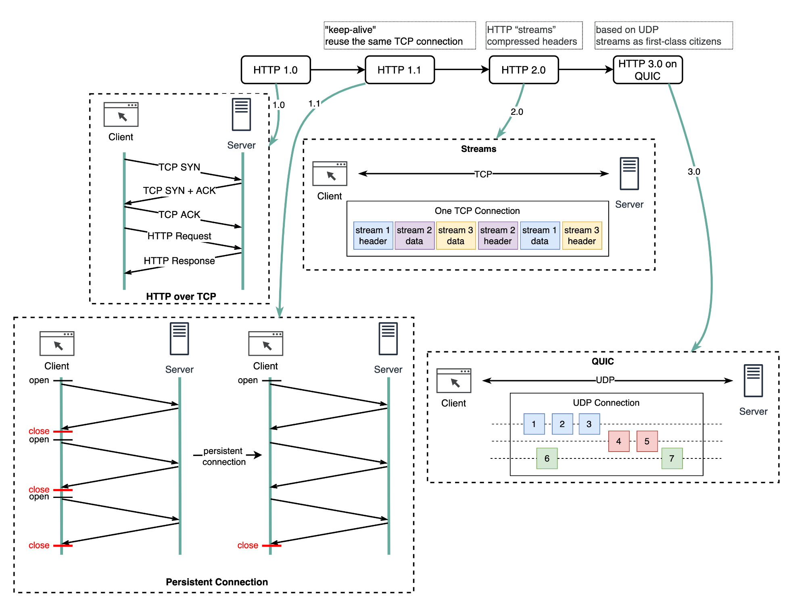
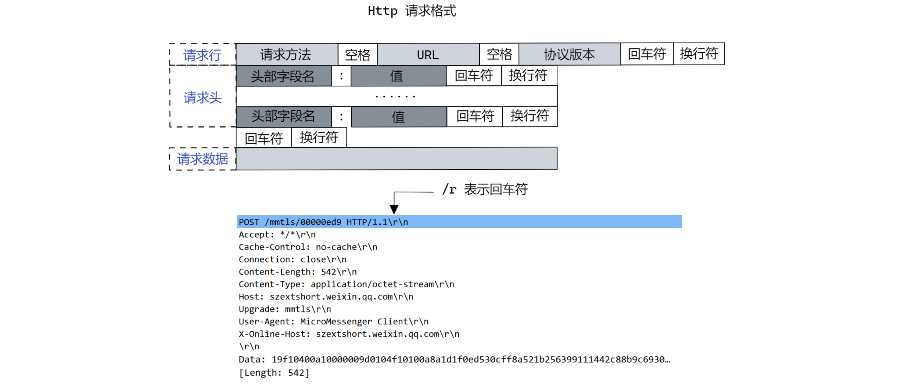
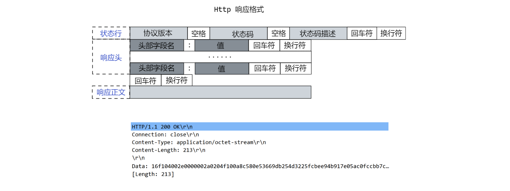

应用层协议 —— HTTP 协议

<!-- more -->

## HTTP 协议的发展概述

HTTP 1.0 到 HTTP 3.0 的发展：

- HTTP 1.0 对同一服务器的每个请求都需要单独的 TCP 连接。
- HTTP 1.1 中 TCP 连接可以保持打开状态以供重用（持久连接），但它不能解决 HOL（行头）阻塞问题。

::: info HOL 阻塞

HOL 阻塞 - 当浏览器中允许的并行请求数用完时，后续请求需要等待前一个请求完成。

:::

- HTTP 2.0 通过请求多路复用解决了 HOL 问题，从而消除了应用层的 HOL 阻塞，但是 HOL 阻塞仍然存在于传输层（TCP）中。

::: info HTTP Streams

在上图中可以看到，HTTP 2.0 引入了 “ HTTP Streams ” 的概念，其是对允许多个不同的 HTTP 请求多路复用到同一个 TCP 连接上的一种抽象，每个流不需要按照顺序去发送。

:::

- HTTP 3.0 底层使用 QUIC 而不是 TCP 作为底层传输协议，从而消除了传输层中的 HOL 阻塞。

::: info QUIC协议

QUIC 基于 UDP，其将 “Streams” 作为一等公民引入传输层。QUIC Steams 共享相同的 QUIC 连接，因此不需要额外的握手和缓慢启动来创建新的 Stream，但 QUIC Streams 是独立交付的，因此在大多数情况下，一个 Stream 的数据包丢失不会影响其他的 Stream。

:::

## HTTP 请求

​		HTTP 协议的请求格式如下图所示：

### 常用请求方法

|  方法名  |             用法             |                             备注                             |
| :------: | :--------------------------: | :----------------------------------------------------------: |
|  `GET`   |           获取资源           | 其没有请求体，但有请求参数，虽然请求参数可以向服务器传送信息，但是请求参数只能明文传输，有安全隐患 |
|  `POST`  |       向服务器发送数据       | 没有请求参数，但有请求体，可以通过加密算法对请求体加密，相较于直接使用 `GET` 请求修改服务器中的数据更加安全 |
|  `PUT`   | 向指定资源位置上传其最新内容 |                                                              |
| `DELETE` |   请求服务器删除指定的内容   |                                                              |
|  `HEAD`  |         获取报文首部         | 与 `GET` 方法一样，只是不返回报文主体部分，通常用于确认 `URI` 的有效性及资源更新的日期时间等 |

### 请求首部字段

|     首部字段名      |           说明           |
| :-----------------: | :----------------------: |
|      `Accept`       | 用户代理可处理的媒体类型 |
|  `Accept-Charset`   |       优先的字符集       |
|  `Accept-Encoding`  |      优先的内容编码      |
|  `Accept-Language`  |   优先的语言(自然语言)   |
|   `Authorization`   |       Web 认证信息       |
|      `Expect`       |   期待服务器的特定行为   |
|       `Host`        |    请求资源所在服务器    |
|     `If-Match`      |    比较实体标记(ETag)    |
| `If-Modified-Since` |    比较资源的更新时间    |

##  HTTP 响应

## URI
