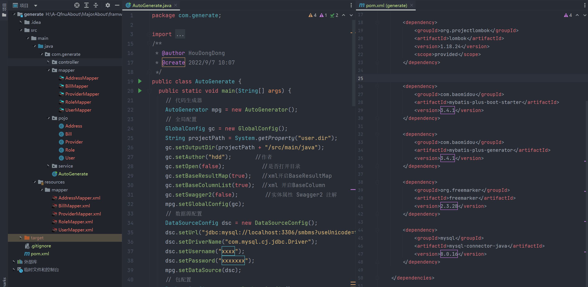

在项目中使用 mybatis

<!-- more -->

### 在项目使用 mybatis

在不同的项目中使用需要在 `pom.xml`  文件中引入不同的依赖：

:::tabs

@tab maven 中使用 

【Maven 项目使用】[Maven Repository: org.mybatis » mybatis (mvnrepository.com)](https://mvnrepository.com/artifact/org.mybatis/mybatis)

```xml
<dependency>
  <groupId>org.mybatis</groupId>
  <artifactId>mybatis</artifactId>
  <version>x.x.x</version>
</dependency>
```

@tab springboot 中使用

【SpringBoot 项目使用】[Maven Repository: org.mybatis.spring.boot » mybatis-spring-boot-starter (mvnrepository.com)](https://mvnrepository.com/artifact/org.mybatis.spring.boot/mybatis-spring-boot-starter)

```xml
<dependency>
    <groupId>org.mybatis.spring.boot</groupId>
    <artifactId>mybatis-spring-boot-starter</artifactId>
    <version>x.x.x</version>
</dependency>
```

@tab mysql 驱动

【mysql驱动】[Maven Repository: mysql » mysql-connector-java (mvnrepository.com)](https://mvnrepository.com/artifact/mysql/mysql-connector-java)

```xml
<dependency>
  <groupId>mysql</groupId>
  <artifactId>mysql-connector-java</artifactId>
  <version>x.x.x</version>
</dependency>
```

> 同时注意在项目中引入对应数据库的驱动； eg: 连接 mysql 的驱动 (注意与数据库版本的一致性)

:::

### xml 基本配置文件

- 配置数据源
- 引入映射文件

::: tabs

@tab xml

```xml
<!-- mybatis-config.xml  -->
<?xml version="1.0" encoding="UTF-8" ?>
<!DOCTYPE configuration 
PUBLIC "-//mybatis.org//DTD Config 3.0//EN" "http://mybatis.org/dtd/mybatis-3-config.dtd">
<configuration>
  <properties resource="jdbc.properties"/>

  <!--设置连接数据库的环境-->
  <environments default="development">
    <environment id="development">
      <transactionManager type="JDBC"/>  <!-- 使用 JDBC 作为底层-->

      <dataSource type="POOLED">  <!-- 使用连接池 -->
        <property name="driver" value="${jdbc.driver}"/>
        <property name="url" value="${jdbc.url}"/>
        <property name="username" value="${jdbc.username}"/>
        <property name="password" value="${jdbc.password}"/>
      </dataSource>

    </environment>
  </environments>

  <!--引入映射文件—逐个引入 -->
  <mappers>
    <mapper resource="mappers/UserMapper.xml"/>
  </mappers>
</configuration>
```

@tab properties

```properties
# jdbc.properties
jdbc.driver=com.mysql.cj.jdbc.Driver   
jdbc.url=jdbc:mysql://localhost:3306/<数据库名称>?serverTimezone=GMT%2B8&zeroDateTimeBehavior=convertToNull
jdbc.username=xxxx
jdbc.password=xxxxxx
```

:::


::: info url 相关

- `serverTimezone=GMT%2B8` ：是配置时区
- `zeroDateTimeBehavior=convertToNull` ：是防止数据库中出现 `00:00:00` 的时间样式导致的无法解析

:::


### 完整的 XML 配置文件

关于 mybatis 的完整配置文件可以参见官网，当需求需要配置对应的配置时，便可以参考: [mybatis – MyBatis 3 | 配置](https://mybatis.org/mybatis-3/zh/configuration.html)


### 其他常用配置

#### 类型别名


#### 懒加载配置

```xml
<settings>
 <!-- 延迟加载全局开启，开启时，所有关联对象都会延迟加载-->
 <setting name="lazyLoadingEnabled" value="true"/>

  <!-- 当开启时，任何方法的调用都会加载该对象的所有属性。否则就会按需加载，其在 3.4.1 之后默认为 false 
	所有高于 3.4.1 可以不写。
	-->
 <setting name="aggressiveLazyLoading" value="false"/>
</settings>
```


### 逆向工程

直接使用 mybatis-plus 的生成器更加快捷。[mybatis-plus](https://baomidou.com/)

下面是旧生成器的一个代码模板，官方又出了[代码生成器（新）](https://baomidou.com/pages/779a6e/)，更加强大。根据需要进行选择。



:::tabs 

@tab java

```java
package com.generate;

import com.baomidou.mybatisplus.core.exceptions.MybatisPlusException;
import com.baomidou.mybatisplus.core.toolkit.StringPool;
import com.baomidou.mybatisplus.core.toolkit.StringUtils;
import com.baomidou.mybatisplus.generator.AutoGenerator;
import com.baomidou.mybatisplus.generator.InjectionConfig;
import com.baomidou.mybatisplus.generator.config.*;
import com.baomidou.mybatisplus.generator.config.po.TableInfo;
import com.baomidou.mybatisplus.generator.config.rules.NamingStrategy;
import com.baomidou.mybatisplus.generator.engine.FreemarkerTemplateEngine;
import java.util.ArrayList;
import java.util.List;
import java.util.Scanner;
/**
 * @author HouDongDong
 * @create 2022/9/7 10:07
 */
public class AutoGenerate {
  public static void main(String[] args) {
    // 代码生成器
    AutoGenerator mpg = new AutoGenerator();
    // 全局配置
    GlobalConfig gc = new GlobalConfig();
    String projectPath = System.getProperty("user.dir");
    gc.setOutputDir(projectPath + "/src/main/java");
    gc.setAuthor("hdd");       //作者
    gc.setOpen(false);           //是否打开目录
    gc.setBaseResultMap(true);   //xml 映射文中开启BaseResultMap
    gc.setBaseColumnList(true);  //xml 开启BaseColumn
    gc.setSwagger2(false);       //实体属性 Swagger2 注解
    mpg.setGlobalConfig(gc);
    // 数据源配置
    DataSourceConfig dsc = new DataSourceConfig();
    dsc.setUrl("jdbc:mysql://localhost:3306/smbms?useUnicode=true&characterEncoding=UTF-8&serverTimezone=Asia/Shanghai");
    dsc.setDriverName("com.mysql.cj.jdbc.Driver");
    dsc.setUsername("xxxx");
    dsc.setPassword("xxxxxx");
    mpg.setDataSource(dsc);
    // 包配置
    PackageConfig pc = new PackageConfig();
    // pc.setModuleName(scanner("模块名"));
    // 在这里设置要生成的文件所有在的文件
    pc.setParent("com.generate")
            .setEntity("pojo")                // 实体类所在包
            .setMapper("mapper")              // 接口所在包
            .setService("service")            // 服务类所在包 (根据具体业务选择)
            .setServiceImpl("service.impl")   // 服务实现类所在包 (根据具体业务选择)
            .setController("controller");     // controller 器所在包 (根据具体业务选择)
    mpg.setPackageInfo(pc);

    // 自定义配置
    InjectionConfig cfg = new InjectionConfig() {
      @Override
      public void initMap() {
        // to do nothing
      }
    };

    // 如果模板引擎是 freemarker
    String templatePath = "/templates/mapper.xml.ftl";
    // 如果模板引擎是 velocity
    // String templatePath = "/templates/mapper.xml.vm";

    // 自定义输出配置
    List<FileOutConfig> focList = new ArrayList<>();
    // 自定义配置会被优先输出
    focList.add(new FileOutConfig(templatePath) {
      @Override
      public String outputFile(TableInfo tableInfo) {
        // 自定义输出文件名 ， 如果你 Entity 设置了前后缀、此处注意 xml 的名称会跟着发生变化！！
        return projectPath + "/src/main/resources/mapper/" + pc.getModuleName()
                + "/" + tableInfo.getEntityName() + "Mapper" + StringPool.DOT_XML;
      }
    });
    cfg.setFileOutConfigList(focList);
    mpg.setCfg(cfg);

    // 配置模板
    TemplateConfig templateConfig = new TemplateConfig();

    // 配置自定义输出模板
    //指定自定义模板路径，注意不要带上.ftl/.vm, 会根据使用的模板引擎自动识别
    // templateConfig.setEntity("templates/entity2.java");
    // templateConfig.setService();
    // templateConfig.setController();

    templateConfig.setXml(null);
    mpg.setTemplate(templateConfig);

    // 策略配置
    StrategyConfig strategy = new StrategyConfig();
    //数据库表映射到实体的命名策略 
    strategy.setNaming(NamingStrategy.underline_to_camel);
    //数据库表字段映射到实体的命名策略
    strategy.setColumnNaming(NamingStrategy.no_change);
    //strategy.setSuperEntityClass("你自己的父类实体,没有就不用设置!");
    //lombok模型
    strategy.setEntityLombokModel(true);
    //生成RestController
    strategy.setRestControllerStyle(true);
    // 公共父类
    //strategy.setSuperControllerClass("你自己的父类控制器,没有就不用设置!");
    // 写于父类中的公共字段
    //strategy.setSuperEntityColumns("id");
    strategy.setInclude(scanner("表名，多个英文逗号分割").split(","));
    strategy.setControllerMappingHyphenStyle(true);
    //表前缀
    strategy.setTablePrefix("smbms_");
    mpg.setStrategy(strategy);
    mpg.setTemplateEngine(new FreemarkerTemplateEngine());
    mpg.execute();
  }
  /**
   * 读取控制台内容
   */
  public static String scanner(String tip) {
    Scanner scanner = new Scanner(System.in);
    StringBuilder help = new StringBuilder();
    help.append("请输入你想逆向的表名" + tip + "：");
    System.out.println(help.toString());
    if (scanner.hasNext()) {
      String ipt = scanner.next();
      if (StringUtils.isNotBlank(ipt)) {
        return ipt;
      }
    }
    throw new MybatisPlusException("请输入正确的" + tip + "！");
  }
}
```

@tab xml

```xml
<!-- pom.xml 配置 中依赖的配置 -->
<dependencies>

  <dependency>
    <groupId>org.projectlombok</groupId>
    <artifactId>lombok</artifactId>
    <version>1.18.24</version>
    <scope>provided</scope>
  </dependency>


  <dependency>
    <groupId>com.baomidou</groupId>
    <artifactId>mybatis-plus-boot-starter</artifactId>
    <version>3.4.1</version>
  </dependency>

  <dependency>
    <groupId>com.baomidou</groupId>
    <artifactId>mybatis-plus-generator</artifactId>
    <version>3.4.1</version>
  </dependency>

  <dependency>
    <groupId>org.freemarker</groupId>
    <artifactId>freemarker</artifactId>
    <version>2.3.28</version>
  </dependency>

  <dependency>
    <groupId>mysql</groupId>
    <artifactId>mysql-connector-java</artifactId>
    <version>8.0.16</version>
  </dependency>

</dependencies>
```

:::


