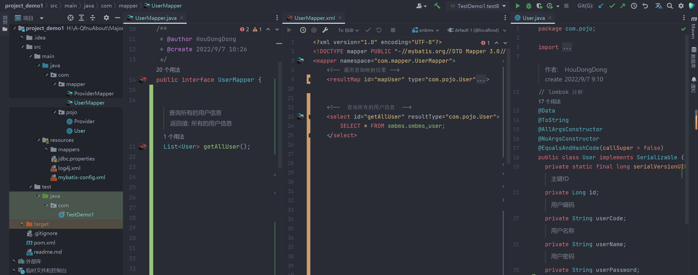

mybatis 的基本使用

<!-- more -->


【官网】[mybatis – MyBatis 3 | 官网](https://mybatis.org/mybatis-3/zh/index.html)

【github】 [mybatis/mybatis-3: MyBatis SQL mapper framework for Java (github.com)](https://github.com/mybatis/mybatis-3)


ORM（Object Relationship Mapping）对象关系映射。 

- 对象：Java的实体类对象 
- 关系：关系型数据库 
- 映射：二者之间的对应关系

### mapper 接口与对应的 xml 文件

> 例子： 查询所有用户的信息

::: tabs

@tab java

```java
package com.mapper;
import com.pojo.User;

public interface UserMapper {
   /**
   * 查询所有的用户信息
   * @return 所有的用户信息
   */
   List<User> getAllUser();
}
```

@tab xml

```xml
<?xml version="1.0" encoding="UTF-8"?>
<!DOCTYPE mapper PUBLIC "-//mybatis.org//DTD Mapper 3.0//EN" "http://mybatis.org/dtd/mybatis-3-mapper.dtd">
<mapper namespace="com.mapper.UserMapper">
  <!--  查询所有的用户信息  -->
  <select id="getAllUser" resultType="com.pojo.User">
    SELECT * FROM smbms.smbms_user;
  </select>
<mapper>
```

@tab java

```java
//  smbms_user 对应的 java 类 
package com.pojo;

import lombok.*;
import java.io.Serializable;
import java.time.LocalDateTime;

/**
 * @author HouDongDong
 * @create 2022/9/7 9:10
 */
@Data
@ToString
@AllArgsConstructor
@NoArgsConstructor
@EqualsAndHashCode(callSuper = false)
public class User implements Serializable {
  private static final long serialVersionUID = 1L;
  /**
   * 主键ID
   */
  private Long id;
  /**
   * 用户编码
   */
  private String userCode;
  /**
   * 用户名称
   */
  private String userName;
  /**
   * 用户密码
   */
  private String userPassword;
  /**
   * 更新时间
   */
  private LocalDateTime modifyDate;
}
```

:::




