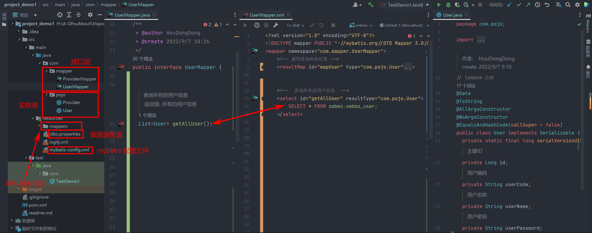

mybatis 的基本使用

<!-- more -->


【官网】[mybatis – MyBatis 3 | 官网](https://mybatis.org/mybatis-3/zh/index.html)

【github】 [mybatis/mybatis-3: MyBatis SQL mapper framework for Java (github.com)](https://github.com/mybatis/mybatis-3)


ORM（Object Relationship Mapping）对象关系映射。 

- 对象：Java的实体类对象 
- 关系：关系型数据库 
- 映射：二者之间的对应关系

# XML 映射

​	mybatis 中使用 接口与XML形成映射关系，接口中定义方法，便于应用层调用，XML 文件中书写 sql 语句，便于操作数据库，由于直接书写 sql 语句，所以 mybatis 更加易于精细的优化。


> 简单实例： 查询所有用户的信息: 




::: tabs

@tab java接口

```java
public interface UserMapper {
   /**
   * 查询所有的用户信息
   * @return 所有的用户信息
   */
   List<User> getAllUser();
}
```

@tab XML

```xml
<?xml version="1.0" encoding="UTF-8"?>
<!DOCTYPE mapper PUBLIC "-//mybatis.org//DTD Mapper 3.0//EN" "http://mybatis.org/dtd/mybatis-3-mapper.dtd">
<mapper namespace="com.mapper.UserMapper">
  <!--  查询所有的用户信息  -->
  <select id="getAllUser" resultType="com.pojo.User">
    SELECT * FROM smbms.smbms_user;
  </select>
<mapper>
```

@tab java实体类

```java
//  smbms_user 对应的 java 类 
public class User implements Serializable {
  private static final long serialVersionUID = 1L;
  /**
   * 主键ID
   */
  private Long id;
  /**
   * 用户编码
   */
  private String userCode;
  /**
   * 用户名称
   */
  private String userName;
  /**
   * 用户密码
   */
  private String userPassword;
  /**
   * 更新时间
   */
  private LocalDateTime modifyDate;
}
```

@tab SQL

```sql
# smbms.smbms_user 表
create table smbms_user
(
    id           bigint auto_increment comment '主键ID'primary key,
    userCode     varchar(15) null comment '用户编码',
    userName     varchar(15) null comment '用户名称',
    userPassword varchar(15) null comment '用户密码',
    modifyDate   datetime    null comment '更新时间'
);
```

:::

::: info 映射关系

- 接口 `getAllUser` 和 `<select id="getAllUser" resultType="com.pojo.User"></select>` 相映射
- 实体类 `User` 和 `smbms_user` 表相映射。

:::

## XML 映射文件中内容

以下标签都是可选的，需要使用对应的功能时引入。

- `cache` – 该命名空间的缓存配置。
- `cache-ref` – 引用其它命名空间的缓存配置。
- `resultMap` – 描述如何从数据库结果集中加载对象，是最复杂也是最强大的元素。
- `sql` – 可被其它语句引用的可重用语句块。
- `insert` – 映射插入语句。
- `update` – 映射更新语句。
- `delete` – 映射删除语句。
- `select` – 映射查询语句。


## 参数相关

在 mapper 接口中传递参数可以在对应的 `xml` 文件中获取。`xml` 文件中主要有两种获取参数的方式：

- `#{argument}`：本质就是占位符赋值
- `${argument}`：本质就是字符串拼接

::: info 注意

- `${}` 使用字符串拼接的方式拼接 sql，若为字符串类型或日期类型的字段进行赋值时，需要**手动加单引号**；
- `#{}` 使用占位符赋值的方式拼接 sql，此时为字符串类型或日期类型的字段进行赋值时，可以**自动添加单引号**。

:::

### 单个参数

如果在 mapper 接口中只有一个参数，那么在 `xml` 可用【**任意名称变量**】接受这个参数来赋值。

:::tabs

@tab java

```java
public interface UserMapper {
  /**
   * 根据用户 Id 查询用户信息
   * @param userId 用户 Id
   * @return 返回用户信息
   */
  List<User> getAllUserById(int userId);
}
```

@tab xml

```xml
<?xml version="1.0" encoding="UTF-8"?>
<!DOCTYPE mapper PUBLIC "-//mybatis.org//DTD Mapper 3.0//EN" "http://mybatis.org/dtd/mybatis-3-mapper.dtd">
<mapper namespace="com.mapper.UserMapper">
  <!--  根据用户 Id 查询用户信息  -->
  <!--  这里的 #{userID} 中的 userId 可以是 任意名称变量 ,eg: 可以是 x, _y 等 -->
  <select id="getAllUserById" resultMap="mapUser">
    SELECT * FROM smbms.smbms_user where id = #{userId};
  </select>
<mapper>
```

:::

### 多个参数

​		若 mapper 接口中的方法参数为多个时，此时 MyBatis 会自动将这些参数放在一个map集合中：

会有两种形式

- 以 `arg0,arg1, ...`为键，以参数为值；
- 以 `param1,param2,...`为键，以参数为值；

例如通过 `#{arg0}` 或者 `#{param1}` 来获取第一个参数的值。

::: warning 注意

例如：若有两个参数，**不要**以这样的组合获取：`#{arg0}, #{param2}` 

:::

### 使用 `@Param()` 注解标识参数

在 mapper 接口中为每个参数标注 `@Param("参数名")` 注解，然后在 `xml` 文件中就可以通过 `#{参数名}` 来获取参数值。例如：

:::tabs

@tab java

```java
public interface UserMapper {
  /**
   * 更新用户信息 (根据用户名和旧密码更新密码)
   * @param userName     用户名
   * @param oldUserPwd   旧密码
   * @param newUserPwd   新密码
   * @return 影响的行数
   */
  int updateUserPasswordInt(@Param("userName") String userName,
                            @Param("oldUserPwd") String oldUserPwd,
                            @Param("newUserPwd") String newUserPwd);
}
```

@tab xml

```xml
<?xml version="1.0" encoding="UTF-8"?>
<!DOCTYPE mapper PUBLIC "-//mybatis.org//DTD Mapper 3.0//EN" "http://mybatis.org/dtd/mybatis-3-mapper.dtd">
<mapper namespace="com.mapper.UserMapper">
    <!--  更新用户信息  -->
    <update id="updateUserPasswordInt">
      UPDATE smbms.smbms_user SET userPassword = #{newUserPwd}
      WHERE userName = #{userName}
      AND userPassword = #{oldUserPwd};
    </update>
<mapper>
```

:::

### 其他参数

#### 实体类类型的参数

可以通过传入的实体类对象利用**点操作符**获取对应的属性值来赋值。例如：

:::tabs

@tab java

```java
public interface UserMapper {
  /**
   * 增加用户
   * @return 影响的行数
   */
  int insertUser(@Param("UserMsg") User UserMsg);
}
```

@tab xml

```xml
<?xml version="1.0" encoding="UTF-8"?>
<!DOCTYPE mapper PUBLIC "-//mybatis.org//DTD Mapper 3.0//EN" "http://mybatis.org/dtd/mybatis-3-mapper.dtd">
<mapper namespace="com.mapper.UserMapper">
    <!--  增加用户  -->
    <insert id="insertUser">
        insert into smbms.smbms_user values (
            #{UserMsg.id},#{UserMsg.userCode},#{UserMsg.userName},
      			#{UserMsg.userPassword},#{UserMsg.modifyDate}
        );
    </insert>
<mapper>
```

:::

#### `Map` 类型的参数

传多个参数的另一种解决方案，将这些参数封装到 `Map` 集合中，然后在通过**对应的键**获取参数值，例如：

:::tabs

@tab java

```java
public interface UserMapper {
    /**
   * 查询用户
   * @param infoMap 传入的 Map
   * @return 用户信息
   */
  List<User> getUserByMap(Map<String,Object> infoMap);
}
```

@tab xml

```xml
<?xml version="1.0" encoding="UTF-8"?>
<!DOCTYPE mapper PUBLIC "-//mybatis.org//DTD Mapper 3.0//EN" "http://mybatis.org/dtd/mybatis-3-mapper.dtd">
<mapper namespace="com.mapper.UserMapper">
    <!--  增加用户  -->
    <insert id="insertUser">
        insert into smbms.smbms_user values (
            #{UserMsg.id},#{UserMsg.userCode},#{UserMsg.userName},
      			#{UserMsg.userPassword},#{UserMsg.modifyDate}
        );
    </insert>
<mapper>
```

:::

::: warning

使用 `Map` 作为参数时，不要使用 `@Param()` 注解，这会使 `Map` 中的键不能暴露在外面，就会导致 `#{key}` 失效。

:::

## 返回值相关

### 返回实体类对象

##### 以实体类对象作为返回值

需要在 `xml` 文件中指定返回值的类型；即指定对应语句的 `resultType` 属性或者 `resultMap` 属性：

1. `resultType` 属性对应某个实体类，且**该实体类中属性名与对应的表的字段名一致**才可用；
2. 若实体类中属性名与对应的表的字段名不一致时，可使用 `resultMap` 属性，具体用法在下面。

:::tabs

@tab java

```java
public interface UserMapper {
  /**
   * 返回对应用户
   * @param userName 用户名
   * @param userRole 用户角色
   * @return 用户信息
   */
  User getUserByNameRole(@Param("userName") String userName ,@Param("userRole") Integer userRole);
}
```

@tab xml

```xml
<?xml version="1.0" encoding="UTF-8"?>
<!DOCTYPE mapper PUBLIC "-//mybatis.org//DTD Mapper 3.0//EN" "http://mybatis.org/dtd/mybatis-3-mapper.dtd">
<mapper namespace="com.mapper.UserMapper">
  <!--  根据 UserName  和  UserRole 查询用户  -->
  <!-- com.pojo.User  为对应的实体类坐在路径 -->
  <select id="getUserByNameRole" resultType="com.pojo.User">
    SELECT * FROM smbms.smbms_user WHERE userName = #{userName} AND userRole = #{userRole}
  </select>
<mapper>
```

:::

##### 将实体类对象的属性以属性名，属性值的形式装入 `Map`

:::tabs

@tab java

```java
public interface UserMapper {
  /**
   * 通过用户 Id 查询用户信息
   * @param id 用户Id
   * @return 用户信息
   */
  Map<String, Object> getAllUserInMap(@Param("id") int id);
}
```

@tab xml

```xml
<?xml version="1.0" encoding="UTF-8"?>
<!DOCTYPE mapper PUBLIC "-//mybatis.org//DTD Mapper 3.0//EN" "http://mybatis.org/dtd/mybatis-3-mapper.dtd">
<mapper namespace="com.mapper.UserMapper">
  <!-- 通过用户 Id 查询用户信息 -->
  <select id="getAllUserInMap" resultType="map">
    SELECT * FROM smbms.smbms_user WHERE id = #{id}
  </select>
<mapper>
```

:::


::: info 注意

注意 `xml` 文件中 `resultType` 为 `map` 类型。

:::

##### 也可以将以主键作为 `key` ，其他字段作为 `value` 。

:::tabs

@tab java

```java
public interface UserMapper {
  /**
   * 通过用户 Id 查询用户信息
   * @param id 用户Id
   * @return 用户信息
   */
  @MapKey("id")
  Map<Long, User> getAllUserInMap(@Param("id") int id);
}
```

@tab xml

```xml
<?xml version="1.0" encoding="UTF-8"?>
<!DOCTYPE mapper PUBLIC "-//mybatis.org//DTD Mapper 3.0//EN" "http://mybatis.org/dtd/mybatis-3-mapper.dtd">
<mapper namespace="com.mapper.UserMapper">
  <!-- 通过用户 Id 查询用户信息 -->
  <select id="getAllUserInMap" resultType="map">
    SELECT * FROM smbms.smbms_user WHERE id = #{id}
  </select>
<mapper>
```

:::


::: info 注意

- `xml` 文件中 `resultType` 为 `map` 类型。
- 需要使用 `@MapKey` 指定返回 `Map` 的 `key` 值

:::


### 返回 `List`

##### 返回 `List<实体类>`

:::tabs

@tab java

```java
public interface UserMapper {
  /**
   * 根据用户 Id 查询用户信息
   * @param userId 用户 Id
   * @return 返回用户信息
   */
  List<User> getAllUserById(int userId);
}
```

@tab xml

```xml
<?xml version="1.0" encoding="UTF-8"?>
<!DOCTYPE mapper PUBLIC "-//mybatis.org//DTD Mapper 3.0//EN" "http://mybatis.org/dtd/mybatis-3-mapper.dtd">
<mapper namespace="com.mapper.UserMapper">
  <!--指定属性名和字段名对应的映射 
      id="mapUser" 表示该映射关系的名称
      type="com.pojo.User" 表示要映射哪个实体类
      column 表示表字段
      property 表示实体类属性 -->
  <resultMap id="mapUser" type="com.pojo.User">
    <id column="id" property="id" />
    <result column="userCode" property="userCode" />
    <result column="userName" property="userName" />
    <result column="userPassword" property="userPassword" />
    <result column="modifyDate" property="modifyDate" />
  </resultMap>
  
  <!--  查询所有的用户  -->
  <select id="getAllUserById" resultMap="mapUser">
    SELECT * FROM smbms.smbms_user where id = #{userId};
  </select>
<mapper>
```

:::


::: warning

虽然返回值类型是 `List<User>` ，但是只需要 `resultMap` 或者 `resultType` 指定 `List` 中元素的映射或类型即可。

:::


##### 返回 `List<Map<String, Object>>`

:::tabs

@tab java

```java
public interface UserMapper {
  /**
   * 查询所有用户, 使用 List<Map<String, Object>>
   * @return 所有用户信息
   */
  @MapKey("id")
  List<Map<String, Object>> getAllUserInList();
}
```

@tab xml

```xml
<?xml version="1.0" encoding="UTF-8"?>
<!DOCTYPE mapper PUBLIC "-//mybatis.org//DTD Mapper 3.0//EN" "http://mybatis.org/dtd/mybatis-3-mapper.dtd">
<mapper namespace="com.mapper.UserMapper">
  <!-- 查询所有用户 -->
  <select id="getAllUserInList" resultType="map">
    SELECT * from smbms.smbms_user;
  </select>
<mapper>
```

:::


::: info 注意

- 注意 `xml` 文件中 `resultType` 为 `map` 类型而非 `List`；
- `@MapKey()` 注解可用在返回值为 `List<[Object,]Map>` 的方法上的注解。它能够将存放对象的 `List` 转化为 `key` 值为对象的某一属性的 Map。属性有：`value`，填入的是对象的某个属性名，作为 `Map` 的 `key` 值。

`HashMap` 中的键是唯一的，所有选用的属性应该是表中的主键或唯一字段，`TreeMap` 中的键不唯一，可根据需要自定义键值。

:::

### 返回某个字段

根据该字段在实体类中对应的属性的返回值来决定返回值类型

:::tabs

@tab java

```java
public interface UserMapper {
  /**
   * 查询 User 的数量
   * @return User 数量
   */
  int UserCount();
}
```

@tab xml

```xml
<?xml version="1.0" encoding="UTF-8"?>
<!DOCTYPE mapper PUBLIC "-//mybatis.org//DTD Mapper 3.0//EN" "http://mybatis.org/dtd/mybatis-3-mapper.dtd">
<mapper namespace="com.mapper.UserMapper">
  <!--  查询 smbms_user 表中的用户数  -->
  <select id="UserCount" resultType="int">
    SELECT count(*) FROM smbms.smbms_user;
  </select>
<mapper>
```

:::


## 返回结果映射 (`resultMap`)

[结果映射配置](https://mybatis.org/mybatis-3/zh/sqlmap-xml.html#结果映射（resultmap）)


【普通使用】

​	当数据库中字段名称与对应的实体类属性名称不一致时，可以使用其；下面表中使用下划线连接，而实体类中使用驼峰式命名，对其进行映射。

:::tabs 

@tab XML

```xml
<!-- XML 映射文件 -->
<resultMap id="mapUser" type="com.pojo.User">
  <id column="id" property="id" />
  <result column="user_code" property="userCode" />
  <result column="user_name" property="userName" />
  <result column="user_password" property="userPassword" />
  <result column="modify_date" property="modifyDate" />
</resultMap>
```

- `resultMap-id` 表示该映射的名称，在后续使用该映射时使用，eg: `resultMap="mapUser"`
- `resultMap-type` 表示要映射的实体类

- `id` 可以对主键或唯一字段设置，可提高整体性能，但只能设置一个
- `result` 用来配置字段与属性的映射
- `result-column` 字段名
- `result-property` 属性名

@tab SQL

```sql
create table smbms_user
(
    id           bigint auto_increment comment '主键ID'primary key,
    user_code     varchar(15) null comment '用户编码',
    user_name     varchar(15) null comment '用户名称',
    user_password varchar(15) null comment '用户密码',
    modify_date   datetime    null comment '更新时间'
);
```

@tab java

```java
public class User implements Serializable {
  private static final long serialVersionUID = 1L;
  /**
   * 主键ID
   */
  private Long id;
  /**
   * 用户编码
   */
  private String userCode;
  /**
   * 用户名称
   */
  private String userName;
  /**
   * 用户密码
   */
  private String userPassword;
  /**
   * 更新时间
   */
  private LocalDateTime modifyDate;
}
```

:::

::: info 其他解决方案

​	如果表中的所有字段都是蛇形命名，而是实体类属性都是驼峰式命名，那么可以在 XML 配置文件中对齐进行配置来解决这一问题。

​	具体为配置 `<settings>` 中的 `mapUnderscoreToCamelCase` 属性。其默认值为 `false` (不开启)，配置为 `true` 时开启。

```xml
<settings>
	<setting name="mapUnderscoreToCamelCase" value="true"/>
</settings>
```

:::

### 多对一映射

因为一个表中的数据可能与其他表的数据相关，那么在数据库层面就有多对一的映射。

> 例如：有一个公司职员信息表和一个公司部门信息表。

:::tabs

@tab 公司职员信息表 (t_emp)

| 职工ID(eid) | 职工所属部门ID(departId) | 职工薪资(esalary) | 职工联系方式(email) |
| :---------: | :----------------------: | :---------------: | :-----------------: |
|      -      |            -             |         -         |          -          |

@tab 公司部门信息表 (t_dept)

| 部门ID(departId) | 部门主管(departHead) | 部门主经营方向(departResearchDirection) |
| :--------------: | :------------------: | :-------------------------------------: |
|        -         |          -           |                    -                    |

:::

::: info 问题

​		若要根据员工ID查询一个员工个人信息及其所在部门信息，那么员工这一个人就会对应它所在部门的所有信息，这就会导致 部分信息对应一个员工，即多对一。那么就需要将数据层面的多对一映射关系转换到实体类之间。

:::

> 解决方案：
>
> 1. 使用 `resultMap` 中的  `result` 的级联属性 
> 2. 使用 `resultMap` 中 `association`

:::tabs 

@tab 职员信息实体类

```java {7}
public class Employee implements Serializable{
  private String eid;
  private String departId;
  private Integer esalary;
  private String email;
  // 因为要查询其部门信息，所以要再加一个字段
  private Edepartment Edepart;
}
```

@tab 公司部门实体类

```java
public class Edepartment implements Serializable{
  private String departId;
  private String departHead;
  private String departResearchDirection;
}
```

@tab 接口

```java
public interface EmployeeMapper {
  /**
   * 查询一个员工个人信息及其所在部门信息
   */
  Edepartment getEmployeesById(@Param("eid") Integer eid);
}
```

@tab XML—级联

```xml {12-14}
<?xml version="1.0" encoding="UTF-8"?>
<!DOCTYPE mapper PUBLIC "-//mybatis.org//DTD Mapper 3.0//EN" "http://mybatis.org/dtd/mybatis-3-mapper.dtd">
<mapper namespace="com.mapper.EmployeesMapper">
  
  <!-- 1.使用 result 级联 -->
  <resuleMap id="empMapCase" type="com.pojo.Employess">
    <id column="eid" property="eid" ></id>
    <result column="edpartNameId" property="edpartNameId" ></result>
    <result column="esalary" property="esalary" ></result>
    <result column="email" property="email" ></result>
    <!-- 部门信息部分使用级联 -->
    <result column="Edepart.departId" property="departId" ></result>
    <result column="Edepart.departHead" property="departHead" ></result>
    <result column="Edepart.departResearchDirection" property="departResearchDirection" ></result>
  </resuleMap>
  
  <select id="getAllUserInList" resuleMap="empMapCase">
    SELECT * FROM t_emp 
    LEFT JOIN t_dept
    ON t_emp.departId = t.dept.departId
    WHERE t_emp.departId = #{eid};
  </select>
<mapper>
```

@tab XML-association

```xml {12-16}
<?xml version="1.0" encoding="UTF-8"?>
<!DOCTYPE mapper PUBLIC "-//mybatis.org//DTD Mapper 3.0//EN" "http://mybatis.org/dtd/mybatis-3-mapper.dtd">
<mapper namespace="com.mapper.EmployeesMapper">
  
  <!-- 2.使用 association -->
  <resuleMap id="empMap" type="com.pojo.Employess">
    <id column="eid" property="eid" ></id>
    <result column="departId" property="departId" ></result>
    <result column="esalary" property="esalary" ></result>
    <result column="email" property="email" ></result>
    
    <association property="Edepart" javatype="Edepartment">
      <id column="departId" property="departId" ></id>
      <result column="departHead" property="departHead" ></result>
      <result column="departResearchDirection" property="departResearchDirection" ></result>
    </association>
  </resuleMap>
  
  <select id="getAllUserInList" resuleMap="empMap">
    SELECT * FROM t_emp 
    LEFT JOIN t_dept
    ON t_emp.departId = t.dept.departId
    WHERE t_emp.departId = #{eid};
  </select>
<mapper>
```


:::

:::info

```xml
<association property="Edepart" javatype="Edepartment">
```

- `property` 为实体类属性。
- `javatype` 表示该属性对应的实体类。

:::


> 另一种解决方案： 分部查询 + `association`；
>
> 将根据员工ID查询一个员工个人信息及其所在部门信息分解为先根据员工ID查询个人信息，然后再使用员工的所在部门 ID 去查询对应的部门信息。


:::tabs

@tab 员工接口

```java
public interface EmployeeMapper {
  /**
   * 第一步：根据员工 ID 查询一个员工个人信息
   */
  Employee getEmployeesInfoById(@Param("eid") Integer eid);
}
```

@tab 部门接口

```java
public interface EdepartmentMapper {
  /**
   * 第二步：根据部门ID 查询对应的部门信息
   */
  Edepartment getEdeptById(@Param("did") Integer did);
}
```

@tab XML—员工 

```xml {12-15}
<?xml version="1.0" encoding="UTF-8"?>
<!DOCTYPE mapper PUBLIC "-//mybatis.org//DTD Mapper 3.0//EN" "http://mybatis.org/dtd/mybatis-3-mapper.dtd">
<mapper namespace="com.mapper.EmployeesMapper">
  
  <!-- 3.使用 分部查询 -->
  <resuleMap id="empMap" type="com.pojo.Employess">
    <id column="eid" property="eid" ></id>
    <result column="edpartNameId" property="edpartNameId" ></result>
    <result column="esalary" property="esalary" ></result>
    <result column="email" property="email" ></result>
    
   <association property="Edepart" 
                select="com.mapper.EdepartmentMapper.getEdeptById"
                column="departId">
    </association>
  </resuleMap>
  
  <!-- 根据员工 ID 查询一个员工个人信息 -->
  <select id="getEmployeesInfoById" resuleMap="empMap">
    SELECT * FROM t_emp 
    WHERE t_emp.eid = #{eid};
  </select>
<mapper>
```

- `property` 表示多对一中的那个一，即被赋值的属性。
- `select` 表示该属性的值来自哪个 SQL 查询语句，需要对应的方法名(注意路径)；
- `column` 表示传给下一步查询的条件。


@tab XML—部门

```xml
<?xml version="1.0" encoding="UTF-8"?>
<!DOCTYPE mapper PUBLIC "-//mybatis.org//DTD Mapper 3.0//EN" "http://mybatis.org/dtd/mybatis-3-mapper.dtd">
<mapper namespace="com.mapper.EdepartmentMapper">
  <!-- 根据部门ID 查询对应的部门信息 -->
  <select id="getEdeptById" resuleType="com.pojo.Edepartment">
    SELECT * FROM t_dept 
    WHERE t_dept.departId = #{did};
  </select>
<mapper>
```

:::

> 分部查询更加灵活，因为是对不同接口中功能的组合，并且各个分部语句也能实现其他所需的功能（但这个需要开启延迟加载）。

:::tabs

@tab 全局开启

```xml
<settings>
 <!-- 延迟加载全局开启，开启时，所有关联对象都会延迟加载-->
 <setting name="lazyLoadingEnabled" value="true"/>

  <!-- 当开启时，任何方法的调用都会加载该对象的所有属性。否则就会按需加载，其在 3.4.1 之后默认为 false 
	所有高于 3.4.1 可以不写。
	-->
 <setting name="aggressiveLazyLoading" value="false"/>
</settings>
```

@tab 局部可控

- 需要在开启全局延迟加载的情况下使用；

- `association-fetchType` 属性 ：  `lazy | eager`  

```xml {15}
<?xml version="1.0" encoding="UTF-8"?>
<!DOCTYPE mapper PUBLIC "-//mybatis.org//DTD Mapper 3.0//EN" "http://mybatis.org/dtd/mybatis-3-mapper.dtd">
<mapper namespace="com.mapper.EmployeesMapper">
  
  <!-- 3.使用 分部查询 -->
  <resuleMap id="empMap" type="com.pojo.Employess">
    <id column="eid" property="eid" ></id>
    <result column="edpartNameId" property="edpartNameId" ></result>
    <result column="esalary" property="esalary" ></result>
    <result column="email" property="email" ></result>
    
   <association property="Edepart" 
                select="com.mapper.EdepartmentMapper.getEdeptById"
                column="departId"
                fetchType="eager"     
                >  <!-- 立即加载 -->
    </association>
  </resuleMap>
  
  <!-- 根据员工 ID 查询一个员工个人信息 -->
  <select id="getEmployeesInfoById" resuleMap="empMap">
    SELECT * FROM t_emp 
    WHERE t_emp.eid = #{eid};
  </select>
<mapper>
```

:::


### 一对多映射

> 需要查询部门信息及其所有员工的信息

解决方案：

1. 使用 `collection`
2. 分部查询 + `collection`

> 第一种：使用 `collection`

:::tabs

@tab 公司部门实体类

```java {6}
public class Edepartment implements Serializable{
  private String departId;
  private String departHead;
  private String departResearchDirection;
  // 该部门的员工集合
  private List<Employee> employees;
}
```

@tab 接口

```java
public interface EdepartmentMapper {
  /**
   * 根据部门ID 查询部门信息及其所有员工的信息
   */
  Edepartment getEdeptAndEmpsById(@Param("did") Integer did);
}
```

@tab XML

```xml {10-15}
<?xml version="1.0" encoding="UTF-8"?>
<!DOCTYPE mapper PUBLIC "-//mybatis.org//DTD Mapper 3.0//EN" "http://mybatis.org/dtd/mybatis-3-mapper.dtd">
<mapper namespace="com.mapper.EdepartmentMapper">
  
  <resultMap id="DeptMap" type="com.pojo.Edepartment">
    <id column="departId" property="departId" ></id>
    <result column="departHead" property="departHead" ></result>
    <result column="departResearchDirection" property="departResearchDirection" ></result>
    <!-- 1.使用 collection -->
    <collection property="employees" ofType="Employee">
    	<id column="eid" property="eid" ></id>
      <result column="edpartNameId" property="edpartNameId" ></result>
      <result column="esalary" property="esalary" ></result>
      <result column="email" property="email" ></result>
    </collection>
  </resultMap>
  
  
  <!-- 根据部门ID 查询部门信息及其所有员工的信息 -->
  <select id="getEdeptAndEmpsById" resultMap="DeptMap">
    SELECT * FROM t_dept
    LEFT JOIN t_emp
    ON t_dept.departId = t_rmp.departId
    WHERE t_dept.departId = #{did}
  </select>
<mapper>
```

`<collection property="employees" ofType="Employee">`

- `property` 表示一对多里面的那个一，即员工集合属性
- `ofType` 为集合里面元素的属性，即员工(`Employee`)

:::


:::warning

在 `<collection>` 中并没有设置其属性 `Edepart` ，即部门信息，这个并不需要在这里设置，不然就成套娃了。

:::


> 第二种：分部查询:

1. 先根据部门ID 查询部门信息
2. 再根据部门ID 查询所有的员工信息

:::tabs

@tab 部门接口

```java
public interface EdepartmentMapper {
  /**
   * 第一步：先根据部门ID 查询部门信息
   */
  Edepartment getEdeptById(@Param("did") Integer did);
}
```

@tab 员工接口

```java
public interface EmployeeMapper {
  /**
   * 第二步：再根据部门ID 查询所有的员工信息
   */
  List<Employee> getEmployeesInfoByDid(@Param("did") Integer did);
}
```

@tab XML—部门

```xml {10-14}
<?xml version="1.0" encoding="UTF-8"?>
<!DOCTYPE mapper PUBLIC "-//mybatis.org//DTD Mapper 3.0//EN" "http://mybatis.org/dtd/mybatis-3-mapper.dtd">
<mapper namespace="com.mapper.EdepartmentMapper">
  
  <resultMap id="DeptMap" type="com.pojo.Edepartment">
    <id column="departId" property="departId" ></id>
    <result column="departHead" property="departHead" ></result>
    <result column="departResearchDirection" property="departResearchDirection" ></result>
    <!-- 1.使用 collection -->
    <collection property="employees" 
                select="com.mapper.EmployeesMapper.getEmployeesInfoByDid"
                column="departId"
                >
    </collection>
  </resultMap>
  
  
  <!-- 第一步：先根据部门ID 查询部门信息 -->
  <select id="getEdeptById" resultMap="DeptMap">
    SELECT * FROM t_dept WHERE t_dept.departId = #{did}
  </select>
<mapper>
```

- `property` 表示对应的集合属性
- `select` 表示该属性来自哪个查询语句
- `column` 表示查询条件


@tab XML—员工

```xml
<?xml version="1.0" encoding="UTF-8"?>
<!DOCTYPE mapper PUBLIC "-//mybatis.org//DTD Mapper 3.0//EN" "http://mybatis.org/dtd/mybatis-3-mapper.dtd">
<mapper namespace="com.mapper.EmployeesMapper">
 
  <!-- 第二步：再根据部门ID 查询所有的员工信息 -->
  <select id="getEmployeesInfoByDid" resuleType="com.pojo.Employee">
    SELECT * FROM t_emp WHERE t_emp.did = #{did};
  </select>
<mapper>
```

:::

:::info

延迟加载也同样适用于该分部查询。可在开启全局延迟加载的情况下设置 `collection-fetch` 属性决定这一分部查询是否开启延迟加载。

:::


## 缓存相关

### 一级缓存


### 二级缓存


### 第三方二级缓存


