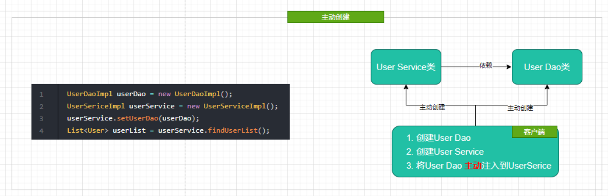
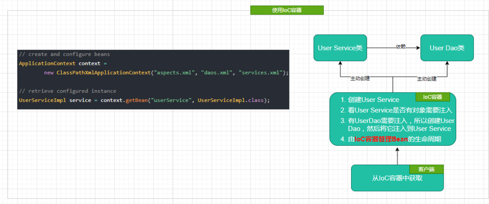
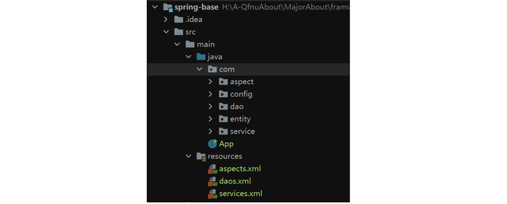

Spring IOC

<!-- more -->

## Spring IOC

​		IOC  (Inversion of Control) 控制反转，是 Spring 的核心思想之一；其可以简单理解为将你设计好的对象交给容器集中管理，而不是传统意义上的在你的对象内部直接控制。在 Spring 中这个容器就称为 【IOC 容器】.

其本质区别如下图：






## 向 IOC 容器中配置 bean

### XML 配置

XML 配置较为繁琐，大多用于不支持注解的第三方库。


### java 配置

​		是 XML 配置的一种替代方式，使用的 java 代码进行配置，灵活性更高，但是可读性较差，其【较适用】的场景是在 springboot 项目中代替 XML 配置某些第三方库的一些较为复杂的全局配置。当然在其中也可以配置自定义的 `bean` 。

> 在一个类上添加 [`@Configuration`](https://docs.spring.io/spring-framework/docs/current/javadoc-api/org/springframework/context/annotation/Configuration.html) 注解将其声明为配置类。

要想为将自定义的 `bean` 交给 IOC 容器时，可使用 [`@Bean`](https://docs.spring.io/spring-framework/docs/current/javadoc-api/org/springframework/context/annotation/Bean.html) 注解

例如：

```java
@Configuration
public class BeanConfig {
  @Bean("userDao")
  public UserDaoImpl userDao() {
    return new UserDaoImpl();
  }

  @Bean("userService")
  public UserServiceImpl userService() {
    UserServiceImpl userService = new UserServiceImpl();
    userService.setUserDao(userDao());
    return userService;
  }
}
```

### 注解配置

纯注解配置更加灵活，但需要注意其前提是必须配置注解扫描器；

#### 配置注解扫描器

> 设置`ComponentScan`的`basePackage`


例如需要扫描 `com` 包中的内容：



:::tabs

@tab XML

```xml
<!-- 用于 XML 配置文件中 -->
<context:component-scan base-package='com'>
</context:component-scan>

<!-- 扫描多个 -->
<context:component-scan base-package='com.service;com.entity'>
</context:component-scan>
```

`context:component-scan` 有两个子属性

- `context:exclude-filter` 排除

- `context:include-filter` 包含， 需要设置 `use-default-filters="false"`

可根据这两者属性进行自定义。来避免一些重复扫描的问题。


@tab 注解

[`@ComponentScan`](https://docs.spring.io/spring-framework/docs/current/javadoc-api/org/springframework/context/annotation/ComponentScan.html)

```java
// 用于 java 配置类上
@ComponentScan("com")
```

@tab java

```java
// 用于实际编写的代码中
new AnnotationConfigApplicationContext("com");
```

:::

:::warning

- 扫描包的范围并不是越大越好，过大会导致扫描过慢，根据不同情形下的需要扫描指定目录即可。
- `Springboot` 中默认使用启动类所在的目录作为扫描的目录。

:::

#### 相关注解

配置好注解扫描器之后，Spring 会自动扫描所有带有 ：

1. `@Component` : 将当前类作为 bean 添加到 IOC 容器中，用于一般组件
2. `@Controller` : 用于控制层
3. `@Service` : 用于服务层
4. `@Repository` : 用于持久层

这四个注解的类。

​		其中 `@Component` 是其他三个注解的别名，所以这四个注解的**功能都一样**，都是将当前类作为 `bean` 添加到 IOC 容器中；只有语义上的差别。

:::tabs

@tab @Component

```java
@Target({ElementType.TYPE})
@Retention(RetentionPolicy.RUNTIME)
@Documented
@Indexed
public @interface Component {
  String value() default "";
}
```

@tab @Controller

```java
@Target({ElementType.TYPE})
@Retention(RetentionPolicy.RUNTIME)
@Documented
@Component
public @interface Controller {
  @AliasFor(
    annotation = Component.class
  )
  String value() default "";
}
```

@tab @Service

```java
@Target({ElementType.TYPE})
@Retention(RetentionPolicy.RUNTIME)
@Documented
@Component
public @interface Service {
  @AliasFor(
    annotation = Component.class
  )
  String value() default "";
}
```

@tab @Repository

```java
@Target({ElementType.TYPE})
@Retention(RetentionPolicy.RUNTIME)
@Documented
@Component
public @interface Repository {
  @AliasFor(
    annotation = Component.class
  )
  String value() default "";
}
```

:::

:::info

- 使用上面注解之后，默认使用 **类名首字母小写的驼峰形式** 作为 `bean` 的 `id` 属性，

  - 例如： `@Component` 声明在 `UserService` 类上，默认的 id 就是 `userService` 

  - 也可自定义 `id` 属性。eg: `@Component("myBean")`

- `ElementType.TYPE` 表明注解可用于类，接口，注解类型，以及枚举的声明中。

:::


## 为 IOC 容器中的 bean 作依赖注入

### Setter 注入

Spring 3.x 中使用

- 在 XML 文件中配置 Setter 注入

:::tabs

@tab XML

```xml
<bean id="userService" class="com.service.UserServiceImpl">
  <property name="userDao" ref="userDao"/>
</bean>
```

@tab java

```java
public class UserServiceImpl {

  private UserDaoImpl userDao;

  public UserServiceImpl() {}

  public List<User> findUserList() {
    return this.userDao.findUserList();
  }

  /**
   * set dao.
   * @param userDao user dao
   */
  public void setUserDao(UserDaoImpl userDao) {
    this.userDao = userDao;
  }
}
```

:::

- 在注解和Java配置中配置 Setter 注入

直接在 `Setter` 方法上使用 `@Autowired` 注解即可。

```java
public class UserServiceImpl {

  private UserDaoImpl userDao;

  public UserServiceImpl() {}

  public List<User> findUserList() {
    return this.userDao.findUserList();
  }

  /**
   * set dao.
   * @param userDao user dao
   */
  @Autowired
  public void setUserDao(UserDaoImpl userDao) {
    this.userDao = userDao;
  }
}
```

### Constructor 注入

Spring 4.x 中使用

- 在 XML 文件中配置 Constructor 注入

:::tabs

@tab XML

```xml
<bean id="userService" class="com.service.UserServiceImpl">
  <constructor-arg name="userDao" ref="userDao"/>
</bean>
```

@tab java

```java
public class UserServiceImpl {

  private final UserDaoImpl userDao;

  /**
   * Constructor.
   * @param userDaoImpl user dao impl
   */
  public UserServiceImpl(UserDaoImpl userDaoImpl) {
    this.userDao = userDaoImpl;
  }

  public List<User> findUserList() {
    return this.userDao.findUserList();
  }
}
```

:::

- 在注解和Java配置中配置 Setter 注入

```java
public class UserServiceImpl {

  private final UserDaoImpl userDao;

  /**
   * Constructor.
   * @param userDaoImpl user dao impl
   */
  @Autowired     // 这里的 @Autowired 也可以省略
  public UserServiceImpl(final UserDaoImpl userDaoImpl) {
    this.userDao = userDaoImpl;
  }

  public List<User> findUserList() {
    return this.userDao.findUserList();
  }
}
```

### 基于注解的注入

以 `@Autowired`（自动注入）注解注入为例，修饰符有三个属性：`Constructor`，`byType`，`byName`。默认按照 `byType` 注入。

- **constructor**：通过构造方法进行自动注入，spring 会匹配与构造方法参数类型一致的 bean 进行注入，如果有一个多参数的构造方法，一个只有一个参数的构造方法，在容器中查找到多个匹配多参数构造方法的 bean，那么 spring 会优先将 bean 注入到多参数的构造方法中。
- **byName**：被注入 bean 的 id 名必须与 set 方法后半截匹配，并且 id 名称的第一个单词首字母必须小写，这一点与手动 set 注入有点不同。
- **byType**：查找所有的set方法，将符合符合参数类型的bean注入。

```java
public class UserServiceImpl {
	
  @Autowired
  private UserDaoImpl userDao;

  public List<User> findUserList() {
    return this.userDao.findUserList();
  }
}
```

:::warning

- 当使用 `@Autowired` 注入时，默认使用 `byType` 选择对应的 `bean` 时，如果有多个 `bean` 的对应的类型是一样的，那么 `byType` 就是失效，此时就会自动转为使用 `byName` 进行选择。
- 当上述情况无法通过 `byName` 选择时，并且此时 IOC 容器中有多个类型匹配的 `bean` ，那么此时可使用 `@Qualifier` 注解来指定 `bean` 的 `id` 即可。

:::


