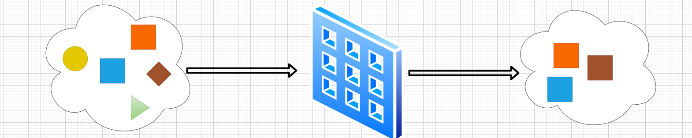
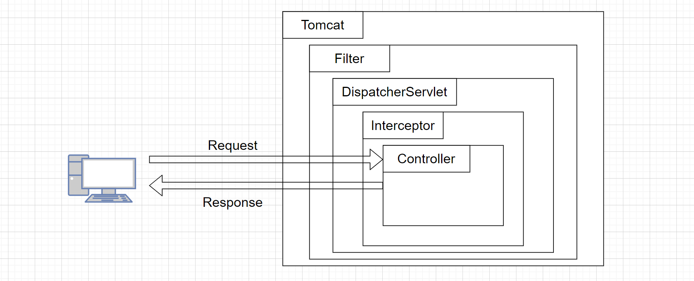
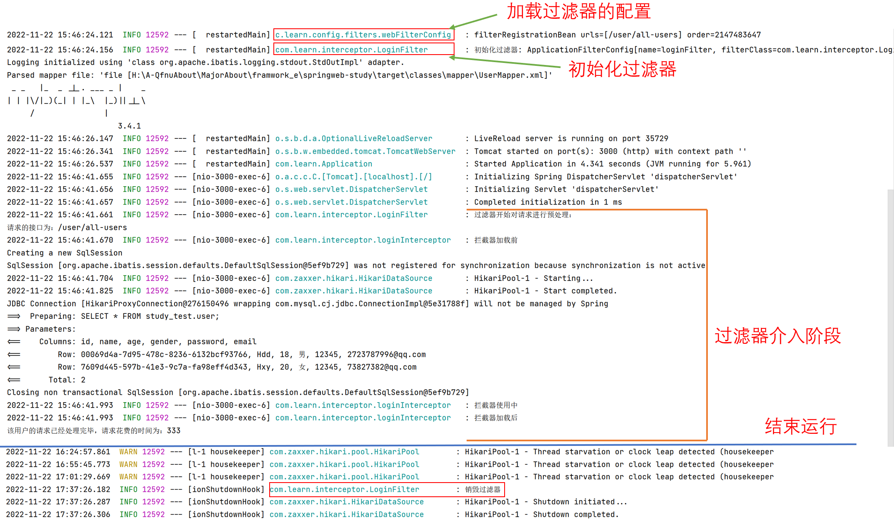
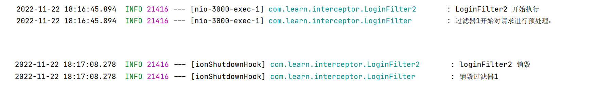
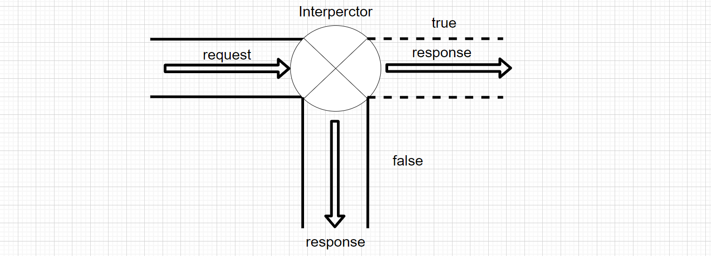
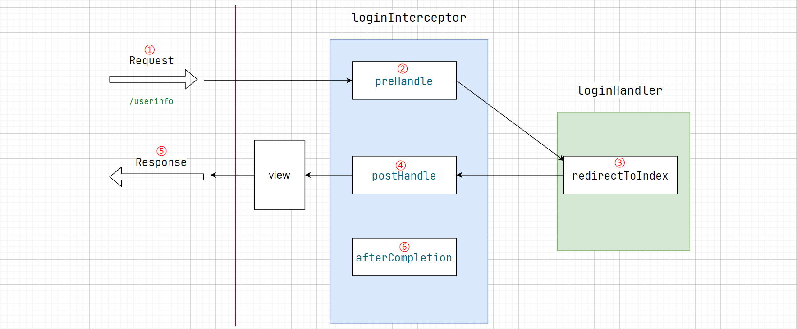
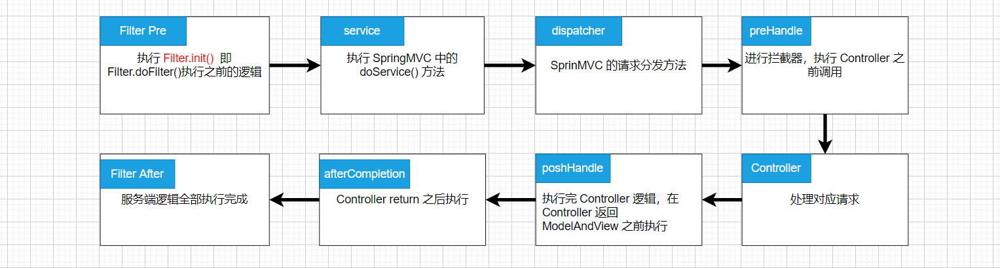

Filter ，Interceptor

<!-- more -->

`Filter` 和 `Interceptor` 都是 AOP 思想的产物，是对整个 **【请求，响应】** 过程的横向切面操作。

## Filter


【Filter 的定义】

当你有一堆东西的时候，你只希望选择符合你要求的某一些东西。定义这些要求的工具，就是过滤器。



【Filter 的一些使用实例、场景】

- 认证过滤器

- 日志记录和审核过滤器

- 图像转换过滤器 
- 数据压缩过滤器 
- 加密过滤器 
- 标记过滤器 
- 触发资源访问事件的过滤器
- 字符集统一处理，数据转换处理等等

在 SpringMVC 中并未对 `Filter` 进行重新封装，所以要想使用 `Filter`得用底层 Selvlet 的 `Filter` ，

要自定义 `Filter` 需要考虑的两个基本问题为：

1. 如何自定义 `Filter` ；
2. 如何配置 `Filter` 的相关信息。

## 在 Spring boot 中使用 Filter

`Filter` 的接口定义在 Java EE 中，[Filter (javaEE8)- javax.servlet.Filter](https://javaee.github.io/javaee-spec/javadocs/javax/servlet/Filter.html)) 那么要自定义 `Filter` 时就需要 `implements` 该接口。

>  `Filter` 接口

```java
public interface Filter {
  
  // 初始化过滤器后执行的操作
  default void init(FilterConfig filterConfig) throws ServletException {}
  
  // 对请求进行过滤
  void doFilter(ServletRequest var1, ServletResponse var2, 
                FilterChain var3) throws IOException, ServletException;
  
  // 销毁过滤器后执行的操作，主要用于对某些资源的回收
  default void destroy() {
  }
}
```

> `Filter` 在什么时候被执行？

在 Spring boot 中而言，默认使用 Tomcat 作为网络中间层，而 Tomcat 本质也是一个 Servlet 实例。

在 SpringMVC 的底层也是由 `DispatcherServlet` 来控制其整个运行的。而 `Filter` 属于 Servlet 容器的原生组件，所以可以得出 Filter 的处理 `request` 和 `response` 时的介入阶段：



### 1. 第一种方式

1. 实现 `Filter` 接口，
2. 使用 java 配置方式配置。

:::tabs

@tab 自定义的 Filter

```java
@Slf4j
@Component
public class LoginFilter implements Filter {

  @Override
  public void init(FilterConfig filterConfig) {
    log.info("初始化过滤器: {}", filterConfig);
  }

  @Override
  public void doFilter(ServletRequest servletRequest, ServletResponse servletResponse, FilterChain filterChain) throws IOException, ServletException {
    //对请求进行预处理
    log.info("过滤器开始对请求进行预处理：");
    HttpServletRequest request = (HttpServletRequest) servletRequest;
    String requestUri = request.getRequestURI();
    System.out.println("请求的接口为：" + requestUri);
    long startTime = System.currentTimeMillis();
    //通过 doFilter 方法实现过滤功能
    filterChain.doFilter(servletRequest, servletResponse);
    // 上面的 doFilter 方法执行结束后用户的请求已经返回
    long endTime = System.currentTimeMillis();
    System.out.println("该用户的请求已经处理完毕，请求花费的时间为：" + (endTime - startTime));
  }

  @Override
  public void destroy() {
    log.info("销毁过滤器");
  }
}
```

@tab Filter 配置

```java
@Configuration
@Slf4j
public class webFilterConfig {
  @Autowired
  LoginFilter loginFilter;    // 自定义的过滤器
  
  /**
   * FilterRegistrationBean<T>  
   *     FilterRegistrationBean 为 Filter 的配置 Bean
   *     T 为自定义的过滤器
   * @return 配置好的 Filter 配置 Bean
   */
  @Bean
  public FilterRegistrationBean<LoginFilter> loginFilterBean() {
    var filterBean = new FilterRegistrationBean<LoginFilter>();
    filterBean.setFilter(loginFilter);
    // 设置该过滤器要过滤的请求路径
    filterBean.setUrlPatterns(new ArrayList<>(Arrays.asList("/user/all-users")));
    log.info("{}", filterBean);
    return filterBean;
  }
}
```

:::

:::info

`Filter` 是底层 Servlet 中的组件，其生命周期与 Servlet 容器相关，但是要想在 Spring 中使用，那么就要将其作为 Bean 交给 Spring 管理，

:::

日志输出：



### 2.第二种方式

在第一种方式中使用 java 配置来配置 Filter 的相关配置，除了这种方式，还有使用注解的形式：

- 为实现 `Filter` 的类加上 [`@WebFilter`](https://docs.oracle.com/javaee/7/api/javax/servlet/annotation/WebFilter.html) 注解

```java
@WebFilter(filterName = "MyFilterWithAnnotation", urlPatterns = "/user/all-users")
public class MyFilterWithAnnotation implements Filter {

   ......
}
```

:::info

这样定义 `Filter` 之后，配置和实现都有了，但是其并不能被 Spring 发现，可以将 [`@ServletComponentScan`](https://docs.spring.io/spring-boot/docs/current/api/org/springframework/boot/web/servlet/ServletComponentScan.html)添加到启动类上。

在 SpringBootApplication 上使用 `@ServletComponentScan` 注解后，Servlet（控制器）、Filter（过滤器）、Listener（监听器）可以直接通过 [`@WebServlet`](https://docs.oracle.com/javaee/7/api/javax/servlet/annotation/WebFilter.html)、[`@WebFilter`](https://docs.oracle.com/javaee/7/api/javax/servlet/annotation/WebFilter.html)、[`@WebListener`](https://docs.oracle.com/javaee/7/api/javax/servlet/annotation/WebListener.html) 注解自动注册到Spring容器中，无需其他代码。

:::

### 多个过滤器顺序配置问题

具体实现功能时，一个过滤器可能不够，需要使用多个过滤器，那么就需要为这多个过滤器设置执行顺序问题。

### 1.第一种方式

使用 java 配置，`setOrder(int order)` 同一请求路径中，对应过滤器的设置的 order 越小优先级越高  

```java {14,24}
@Configuration
@Slf4j
public class webFilterConfig {
  @Autowired
  LoginFilter loginFilter;     

  @Autowired
  LoginFilter2 loginFilter2;

  @Bean
  public FilterRegistrationBean<LoginFilter> loginFilterBean() {
    var filterBean = new FilterRegistrationBean<LoginFilter>();
    filterBean.setFilter(loginFilter);
    filterBean.setOrder(2);
    filterBean.setUrlPatterns(new ArrayList<>(Arrays.asList("/user/all-users")));
    log.info("{}", filterBean);
    return filterBean;
  }

  @Bean
  public FilterRegistrationBean<LoginFilter2> loginFilterBean2() {
    var filterBean = new FilterRegistrationBean<LoginFilter2>();
    filterBean.setFilter(loginFilter2);
    filterBean.setOrder(1);
    filterBean.setUrlPatterns(new ArrayList<>(Arrays.asList("/user/all-users")));
    log.info("{}", filterBean);
    return filterBean;
  }
}
```

`LoginFilter2` 的 order 更小，所以先执行： 



### 2.第二种方式

可以使用 [`@Order`](https://docs.spring.io/spring-framework/docs/current/javadoc-api/org/springframework/core/annotation/Order.html) 注解来控制 `Filter Bean` 的**执行顺序**，所以前提是将 `Filter` 的添加到 IOC 容器中，同样也是设置的值越小优先级就越高。

但是这种方式并不推荐，因为有可能我们需要多条 `Filter chain` ，那么使用这个去管理就不太容易。

:::tabs

@tab LoginFilter2

```java {1,2}
@Order(1)
@Component
@WebFilter(filterName = "LoginFilter2", urlPatterns = "/user/all-users")
@Slf4j
public class LoginFilter2 implements Filter {

  @Override
  public void init(FilterConfig filterConfig) throws ServletException {
    log.info("LoginFilter2 初始化");
    Filter.super.init(filterConfig);
  }

  @Override
  public void doFilter(ServletRequest servletRequest, ServletResponse servletResponse, FilterChain filterChain) throws IOException, ServletException {
    log.info("LoginFilter2 开始执行");
    filterChain.doFilter(servletRequest, servletResponse);
  }

  @Override
  public void destroy() {
    log.info("loginFilter2 销毁");
    Filter.super.destroy();
  }
}
```

@tab LoginFilter

```java {2,3}
@Slf4j
@Order(2)
@Component
public class LoginFilter implements Filter {

  @Override
  public void init(FilterConfig filterConfig) {
    log.info("初始化过滤器: {}", filterConfig);
  }

  @Override
  public void doFilter(ServletRequest servletRequest, ServletResponse servletResponse, FilterChain filterChain) throws IOException, ServletException {
    //对请求进行预处理
    log.info("过滤器1开始对请求进行预处理：");
    HttpServletRequest request = (HttpServletRequest) servletRequest;
    String requestUri = request.getRequestURI();
    System.out.println("请求的接口为：" + requestUri);
    long startTime = System.currentTimeMillis();
    //通过 doFilter 方法实现过滤功能
    filterChain.doFilter(servletRequest, servletResponse);
    // 上面的 doFilter 方法执行结束后用户的请求已经返回
    long endTime = System.currentTimeMillis();
    System.out.println("该用户的请求已经处理完毕，请求花费的时间为：" + (endTime - startTime));
  }

  @Override
  public void destroy() {
    log.info("销毁过滤器1");
  }
}
```

:::


## Interceptor

【拦截器的定义】

在一个流程正在进行的时候，你希望干预它的进展，甚至终止它进行，这是拦截器做的事情。




【拦截器的使用场景】


SpringMVC 中有对应的拦截器接口 [HandlerInterceptor 接口](https://docs.spring.io/spring-framework/docs/current/javadoc-api/org/springframework/web/servlet/HandlerInterceptor.html) ，可通过实现该接口定制自己的拦截器。

```java {2,7,12}
public interface HandlerInterceptor {
  default boolean preHandle(HttpServletRequest request, 
                            HttpServletResponse response, Object handler) throws Exception {
    return true;
  }

  default void postHandle(HttpServletRequest request, 
                          HttpServletResponse response, Object handler, 
                          @Nullable ModelAndView modelAndView) throws Exception {
  }

  default void afterCompletion(HttpServletRequest request, 
                               HttpServletResponse response, Object handler, 
                               @Nullable Exception ex) throws Exception {
  }
}
```

一个拦截器的执行过程：



:::info

- `preHandle` 在执行对应的 `Contrlloer` 之前；
- `postHandle` 在执行对应的 `Controller` 之后；
- `afterCompletion` 在完成此次**请求**之后。 

:::


> 访问 `/userinfo` 之前必须处于登录状态，对于第一次访问将其拦截后重定向至首页，(这里省去了检查登录状态，直接重定向至首页去登录) 

:::tabs

@tab loginInterceptor

```java
@Slf4j
@Component
public class loginInterceptor implements HandlerInterceptor {

  /**
   *
   * @param request    请求体
   * @param response   响应体
   * @param handler
   * @return 布尔值:
   *   true  : 处理程序的执行链继续执行
   *   false : DispatcherServlet 假定拦截器本身已处理请求，并不再执行后续执行链中的其他的拦截器和对应Controller
   */
  @Override
  public boolean preHandle(HttpServletRequest request, 
                           HttpServletResponse response, Object handler) throws Exception {
    log.info("preHandle , 执行 Controller 之前");
    log.info("访问的当前路径必须先登录");
    // 在 Session 上下文中保存错误信息
    HttpSession session = request.getSession();
    session.setAttribute("msg", "请先登录");
    // 重定向到首页去登录
    response.sendRedirect(request.getContextPath() + "/index");
    return false;
  }


  @Override
  public void postHandle(HttpServletRequest request, 
                         HttpServletResponse response, Object handler, 
                         ModelAndView modelAndView) throws Exception {
    log.info("postHandle, 执行完 Controller 之后");
    HandlerInterceptor.super.postHandle(request, response, handler, modelAndView);
  }

  
  @Override
  public void afterCompletion(HttpServletRequest request, 
                              HttpServletResponse response, Object handler, Exception ex) throws Exception {
    log.info("afterCompletion , 本次请求结束之后");
    HandlerInterceptor.super.afterCompletion(request, response, handler, ex);
  }
}
```

@tab 配置拦截器

```java
@Configuration
@EnableWebMvc
public class adminWebConfig implements WebMvcConfigurer {

  /**
   * 配置拦截器
   * @param InterceptorRegistry 拦截器注册中心
   */
  @Override
  public void addInterceptors(InterceptorRegistry registry) {
    // 配置一个拦截器
    registry.addInterceptor(new loginInterceptor())
            .addPathPatterns("/userinfo");       //  添加要拦截的路径
    //      .excludePathPatterns("不拦截的路径")
  }
}
```

- 要为拦截器添加不拦截的路径使用 `excludePathPatterns()` 
- `/**` 默认是所有路径包括静态资源。

@tab LoginHandler

```java
@RestController
public class LoginHandler {
  
  @GetMapping("/index")
  public String indexInfo(HttpServletRequest request) {
    HttpSession session = request.getSession();
    Object msg = session.getAttribute("msg");
    return "这里是首页" + "   " + msg;
  }
}
```

:::


### 多个 Interperctor 执行顺序问题。

- 默认为配置文件中的配置顺序
- 使用 `order()` 方法，越小优先级越高

:::tabs

@tab 默认配置

```java {12,13,15,16}
//  先执行 loginInterceptor ,  再执行 authorityInterceptor 
@Configuration
public class adminWebConfig implements WebMvcConfigurer {

  /**
   * 配置拦截器
   * @param registry 拦截器注册中心
   */
  @Override
  public void addInterceptors(InterceptorRegistry registry) {

    registry.addInterceptor(new loginInterceptor())
            .addPathPatterns("/login");           

    registry.addInterceptor(new authorityInterceptor())
            .addPathPatterns("/login");
  }
}
```

@tab order()

```java {10,15}
//  先执行 authorityInterceptor  , 再执行loginInterceptor
@Configuration
public class adminWebConfig implements WebMvcConfigurer {

  @Override
  public void addInterceptors(InterceptorRegistry registry) {

    registry.addInterceptor(new loginInterceptor())
            .addPathPatterns("/login")
            .order(2);           


    registry.addInterceptor(new authorityInterceptor())
            .addPathPatterns("/login")
            .order(1);
  }
}
```

:::


过滤器，拦截器，dispatch，Controller  整个大致的执行流程：




